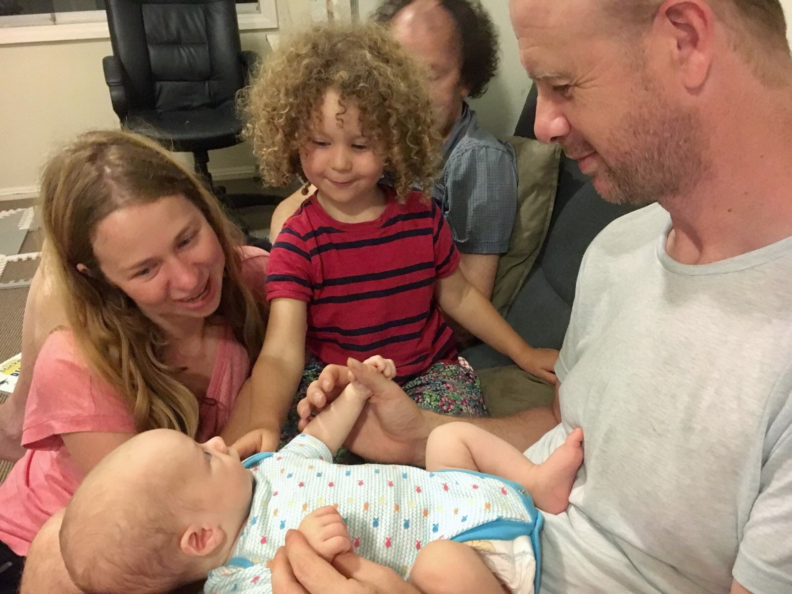
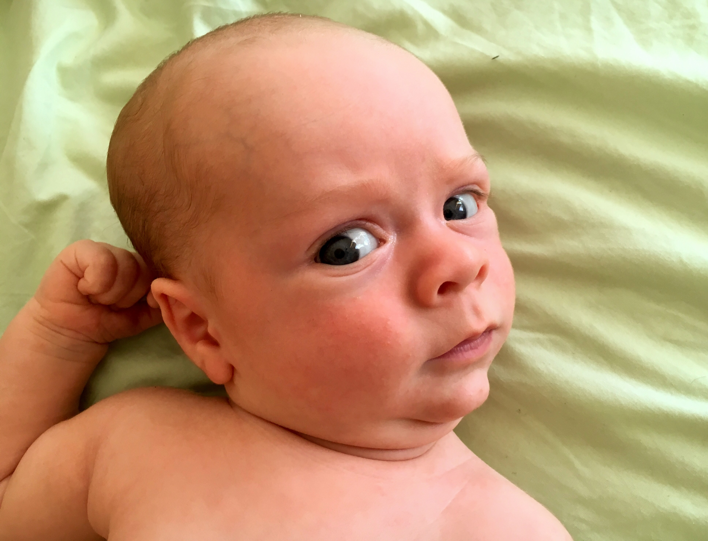
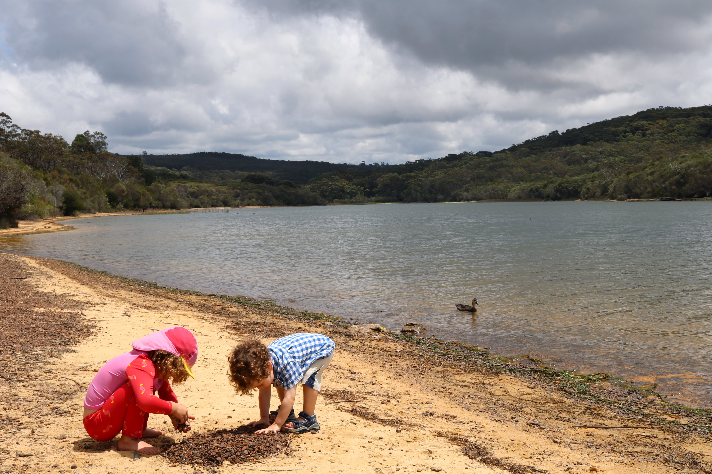
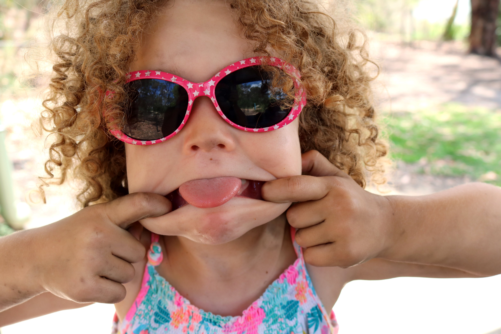
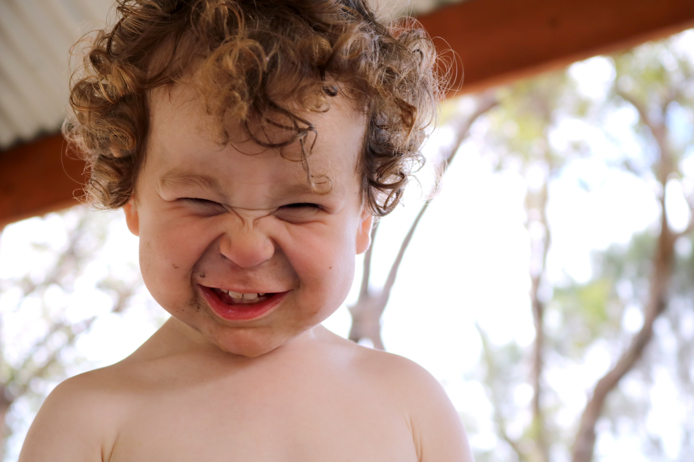
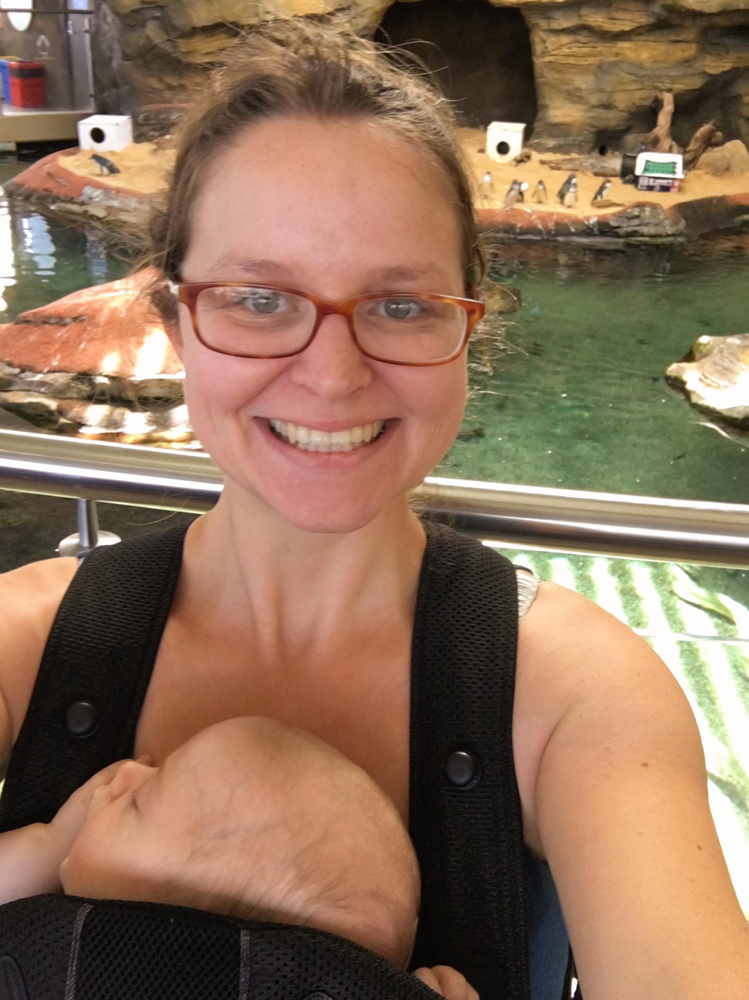
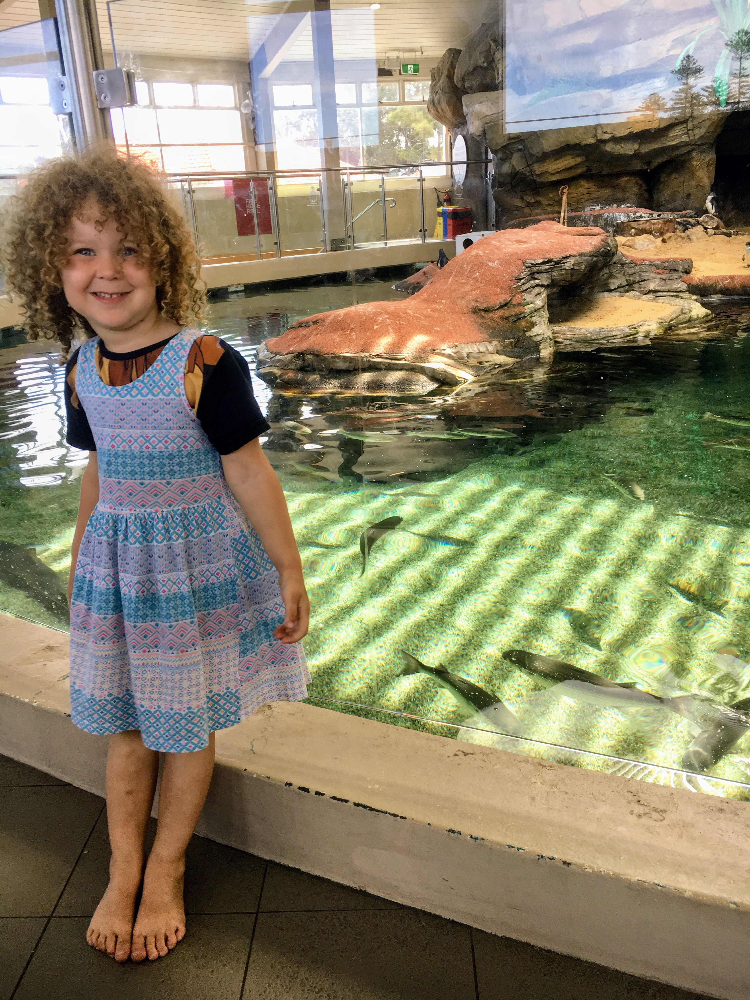
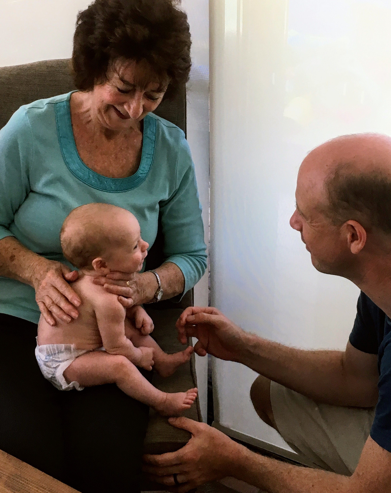

# WEEK 9 (2 MONTHS OLD)
## BRADLEY'S DEVELOPMENT
Bradley now weighs a healthy 5.45 kg and continues to brighten our day with his smile. He’s getting better at tracking our faces, swiping at objects and making a variety of noises. He is also making good progress with tummy time and is able to hold his head up a little longer now. 
Bradley has been a little fussier the last few days but he blessed me with a super long stretch of sleep last night which I’m thankful for

## BRADLEY'S FIRSTS
Bradley witnessed Christmas decorations going up for the first time this week. Although Bradley was unaware of what was going on, it was lovely getting a little festive with Paige and Doug. We put the tree up, made Christmas decorations and hung tinsel around the house. We even put up a fancy shiny silver tinsel curtain but that didn’t blast long with little Doug running around. Haha.

On a less exciting note, Bradley went to the mall for the first time. It was a super hot day on Sunday and I needed to get out the house and stretch my legs! He fussed at first but then slept the rest of the time so I managed to get a fair bit of Xmas shopping done. Bradley also had his first visit from Ray and Barbara. 

## ACTIVITIES WITH BRADLEY
Aside from the above activities, we visited the dam and local aquarium, had a visit from Angela and splashed around in the pool at home. The weeks feel like they are flying by!

