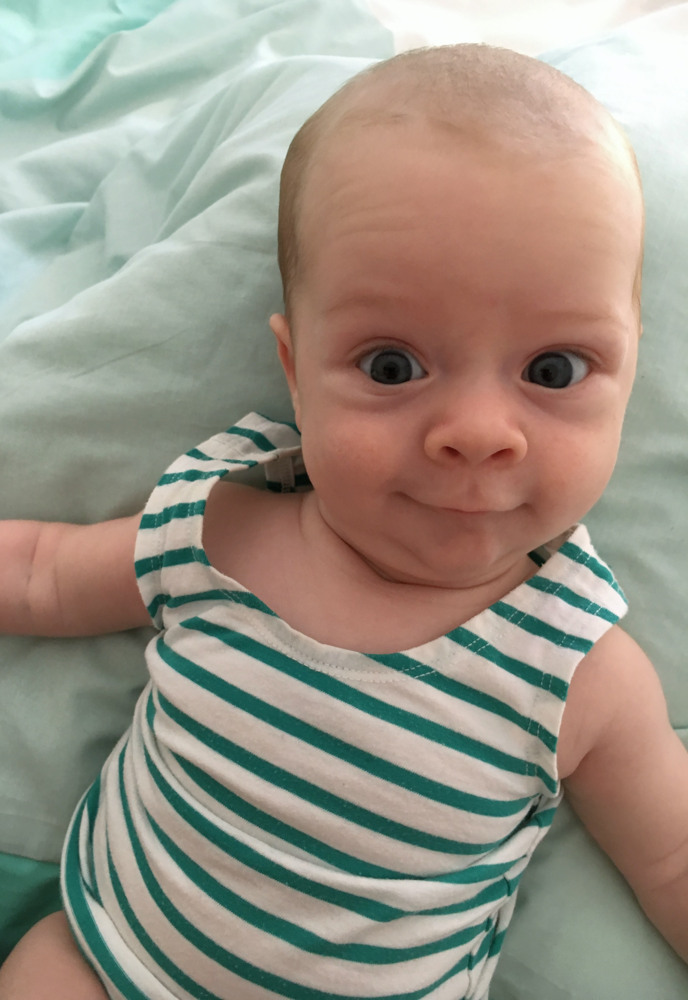
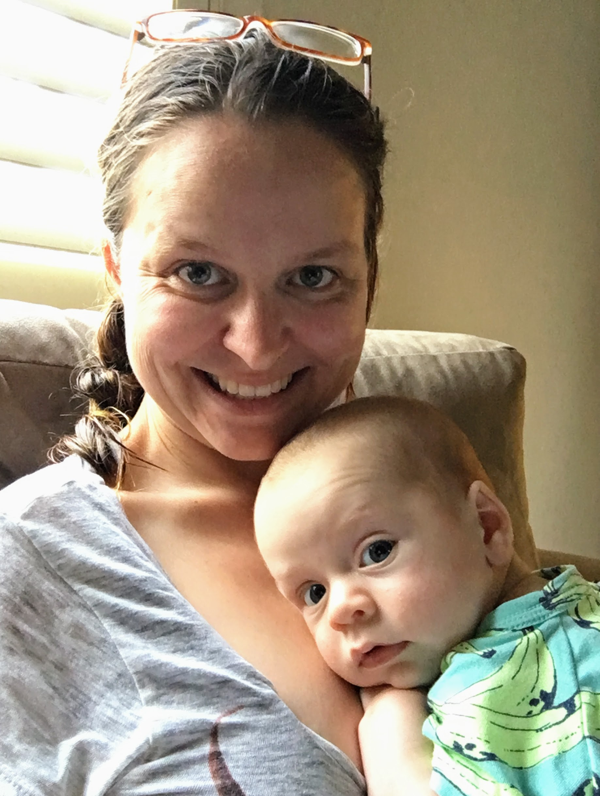
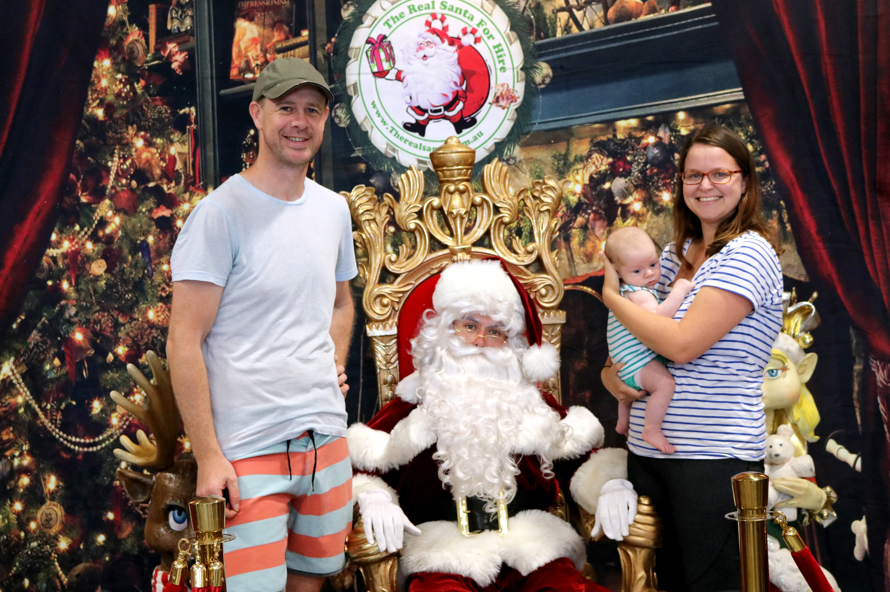
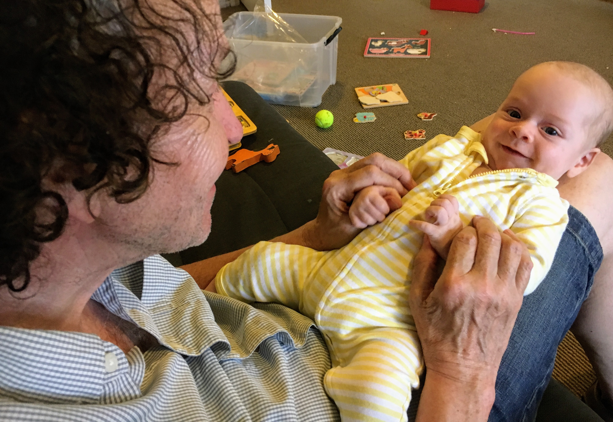
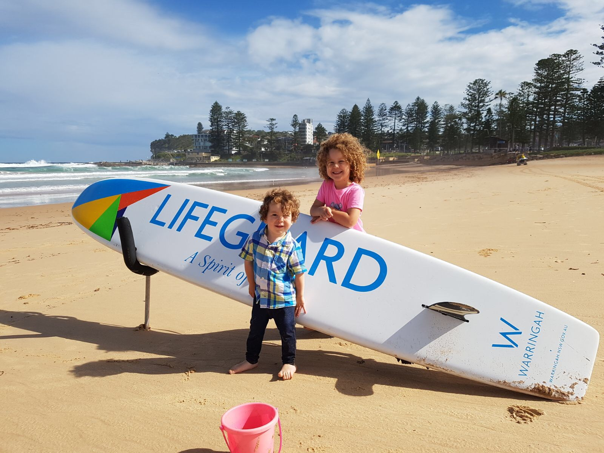
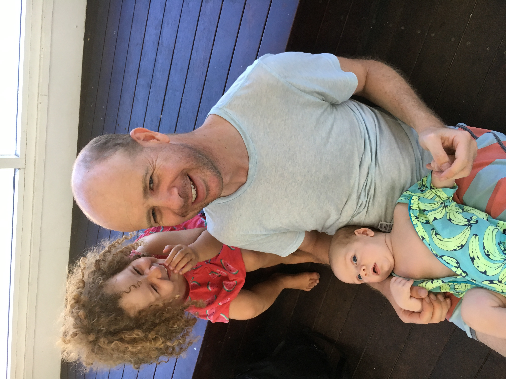

# WEEK 10 (12.12.17)
## BRADLEY'S DEVELOPMENT
We had Bradley’s final checkup this week post birth and thankfully the doctor was very happy with Bradley’s progress. They were initially concerned that he may have a clicky hip and face other problems too as he was a little stressed out at birth but he is now doing wonderfully so there is nothing to worry about. Hooray! He is now 64cm (grown 11cm from birth) and has reached 6kg. 

## BRADLEY'S FIRSTS
We had a few more exciting firsts this week. Bradley got into the Christmas spirit this week and attended his first carol concert in Manly. He also met Santa for the first time which was very sweet. At home, Bradley got his first cuddle from grandad England. 

## ACTIVITIES WITH BRADLEY
We all had a lovely time visiting the dam, Dee Why beach and Manly aquarium. 

