# WEEK 11 (19.12.17)
## AUNTY BOB'S BIRTHDAY
To celebrate Bobs 34th Birthday we all headed to Taronga Zoo! We loved the seal and bird show and enjoyed the scenic views across Sydney. 
Bradley (and Dad) did well in the heat. It was one of the hottest days so far this summer so it was a little hard staying cool. 
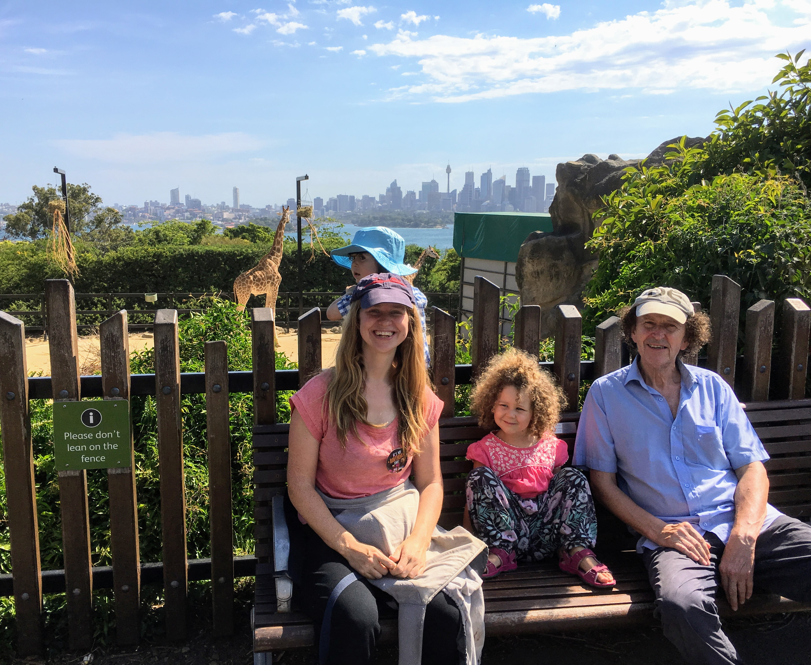

## BRADLEY'S CHRISTMAS FESTIVITIES
Christmas celebrations continued this week. We attended the Dee Why Christmas concert and Paige and Doug (and Bob and I) had a great time on the bouncy castles there. It was the biggest workout for me in a very long time! Sadly it started raining soon after we arrived so we didn’t stay too long. 
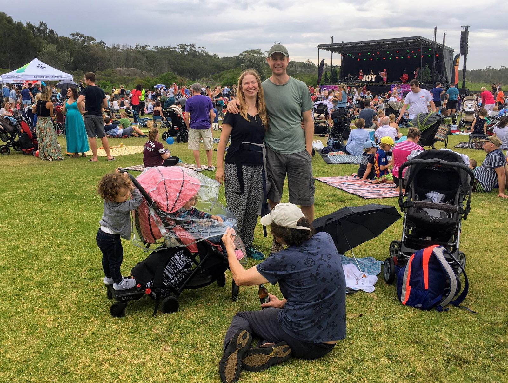
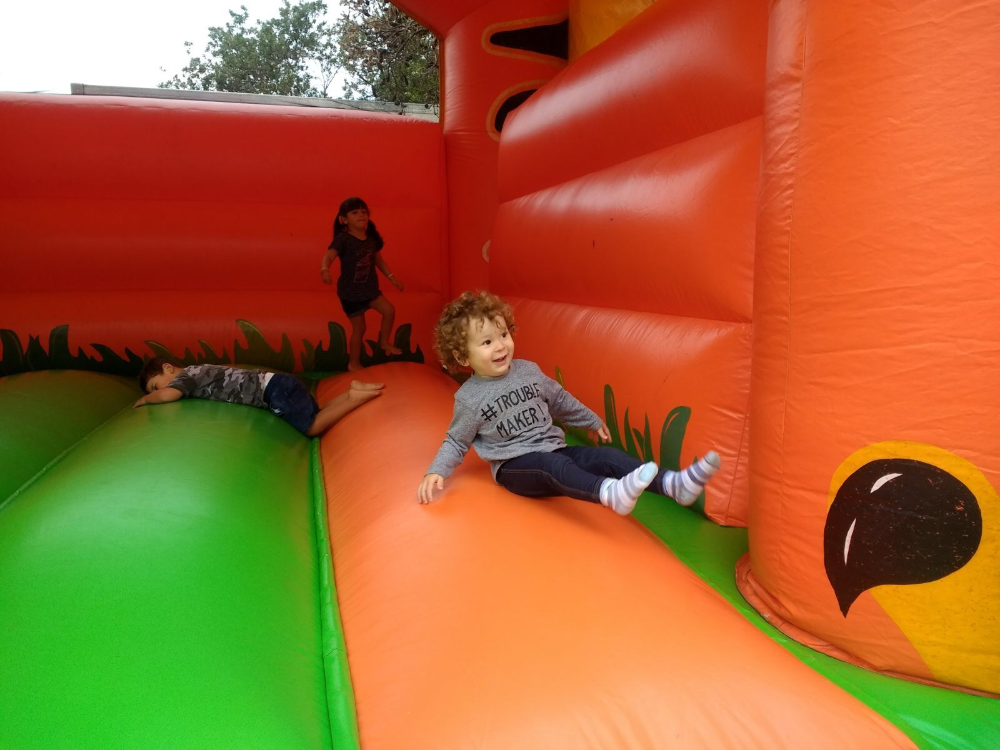
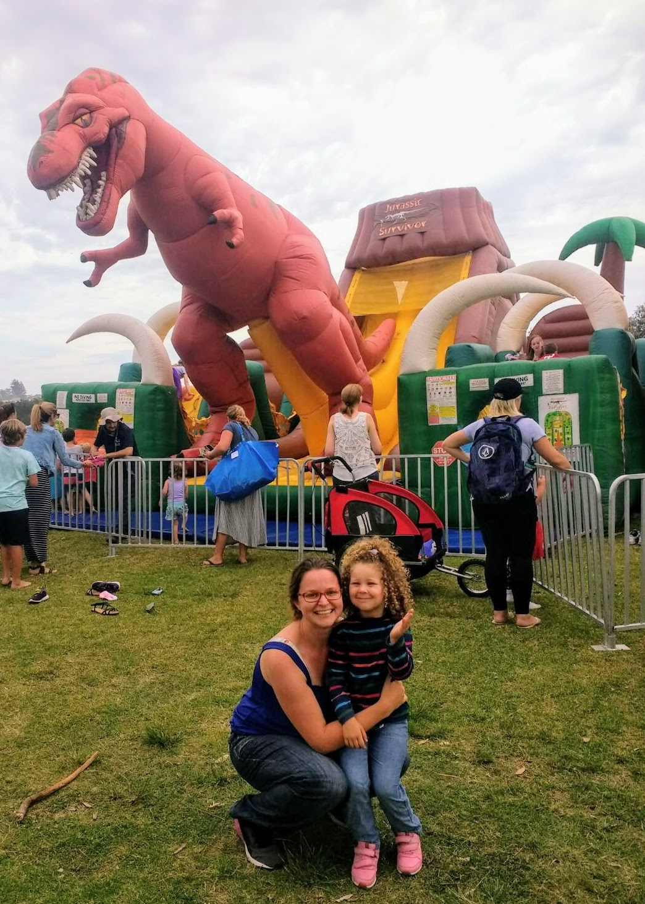
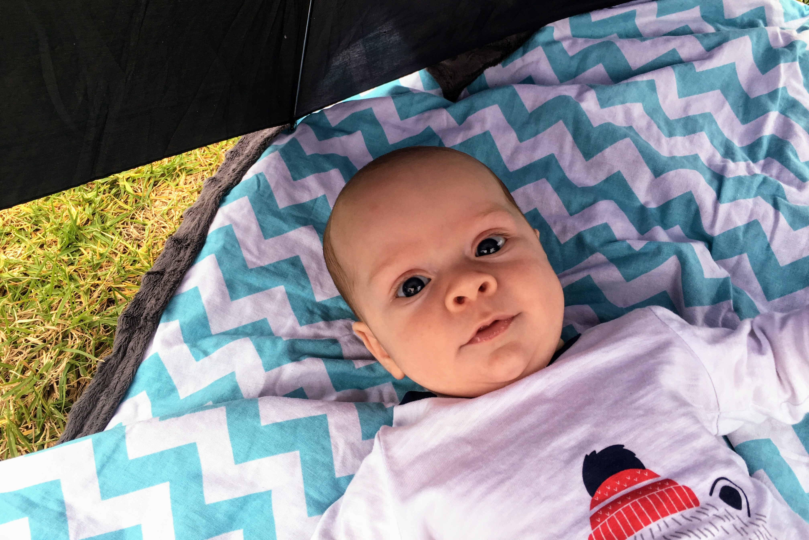

We also had some lovely get togethers. We had our annual Christmas BBQ at the Marsh’s. They kindly extended the invite to my family so we all went along and had a great time. Paige and Pete had fun in the pool and Bradley enjoyed meeting the whole gang. 
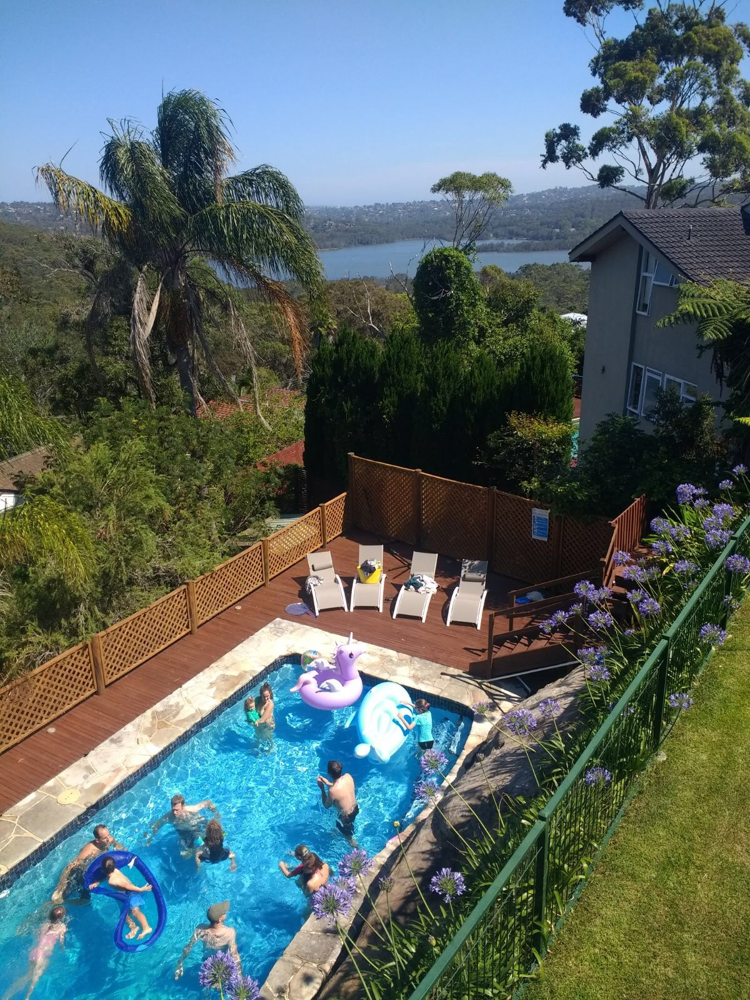
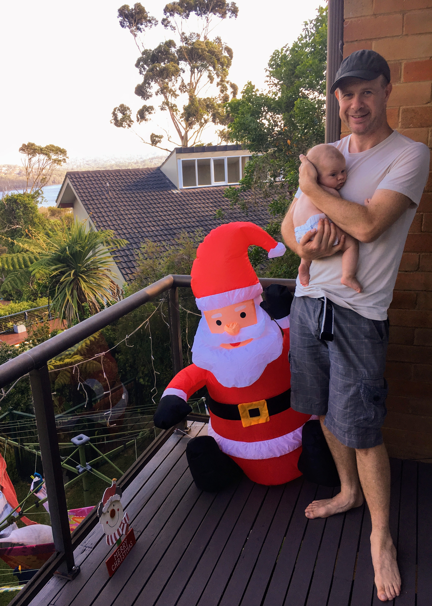

Pete’s family had a Christmas gathering too and Pete, Dad, Bradley and I went along to that. It was wonderful seeing all the family and finally getting to meet Georgina’s little Frankie. The BBQ was delicious and Bradley got spoilt with lots and lots of gifts! 
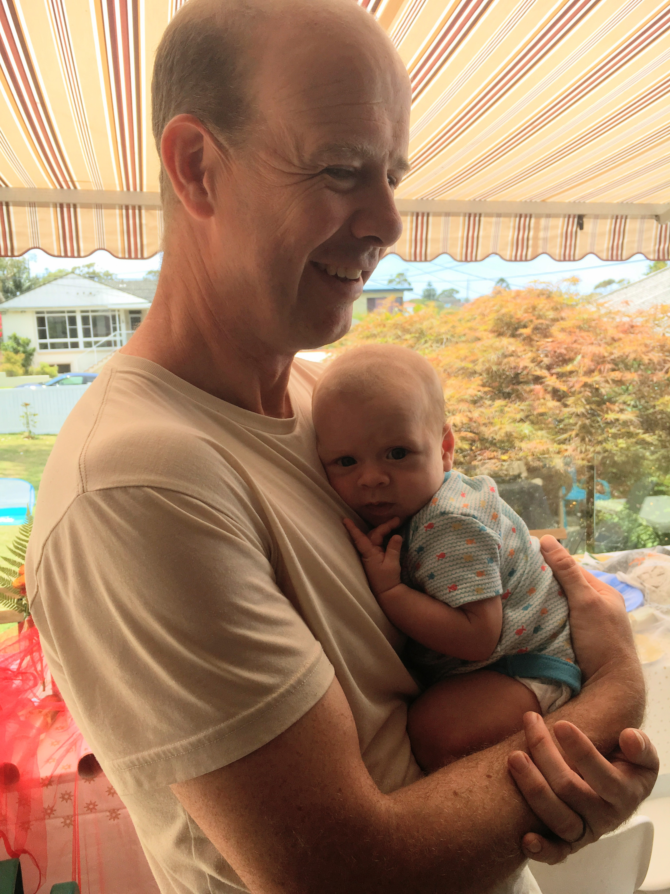

Dad, Donna, Paige, Doug, Pete and I had our Australia Christmas Day on Monday. The presents were all wrapped and placed under the tree the night before and both Paige and Doug were super excited to open them all! Bradley got spoilt again...by aunty Bob this time. He received a lovely puppet, microscope, baby toys, pram toys plus heaps of other gifts brought with bob on her arrival including an awesome puppet theatre! Bob received a lovely Manly hoodie and I got fun gladiator style inflatable toy for the pool. We had a nice little lunch with crackers followed by The Wizard of Oz and a mini sports day. I haven’t had a Christmas Day with the family in so so long (6 years?) so it was fantastic being able to have a little celebration with them.
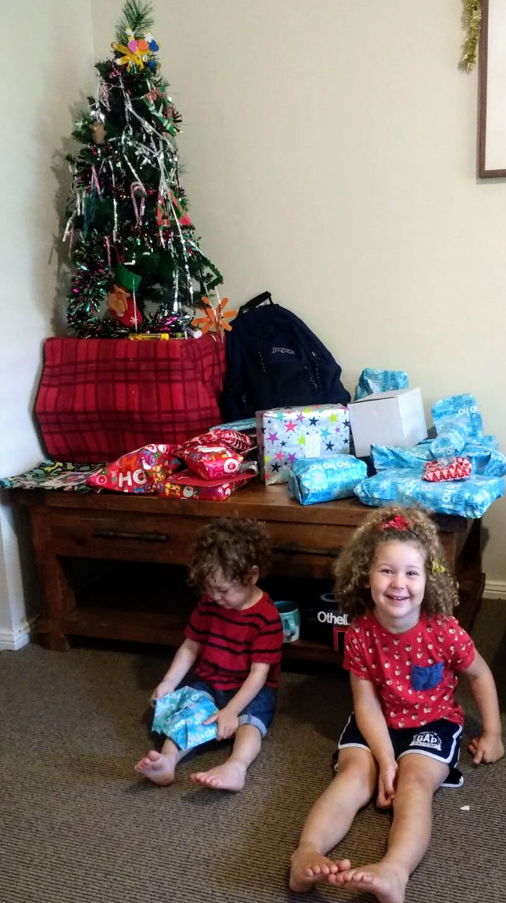
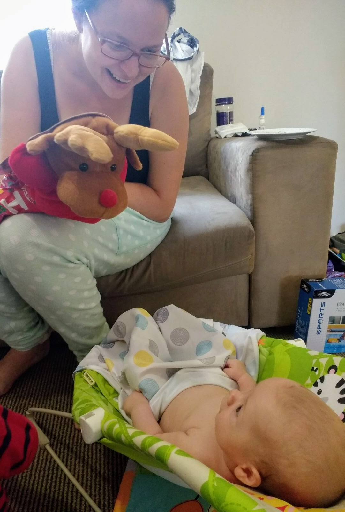
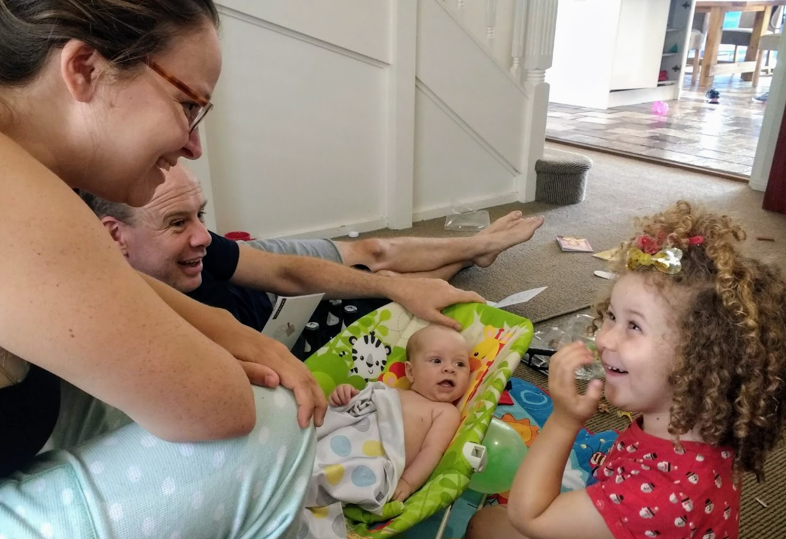
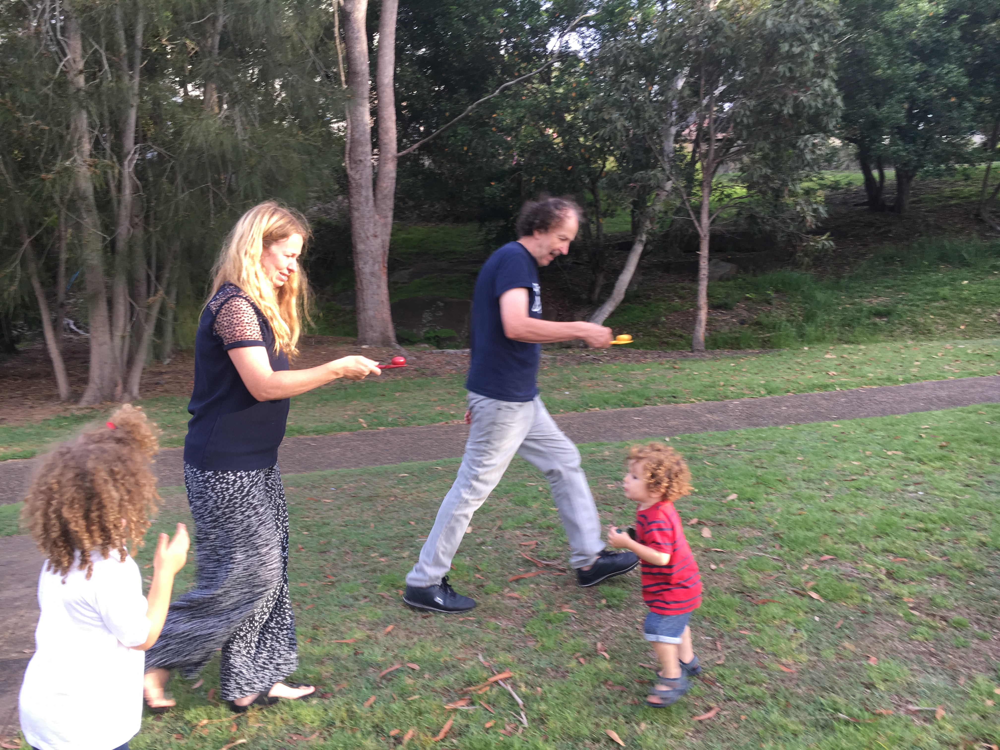

## BRADLEY'S FIRSTS
Bradley got his first cold on Monday. It was a little heartbreaking watching him sniffle and sneeze but he seemed surprisingly chirpy despite being a bit uncomfortable.
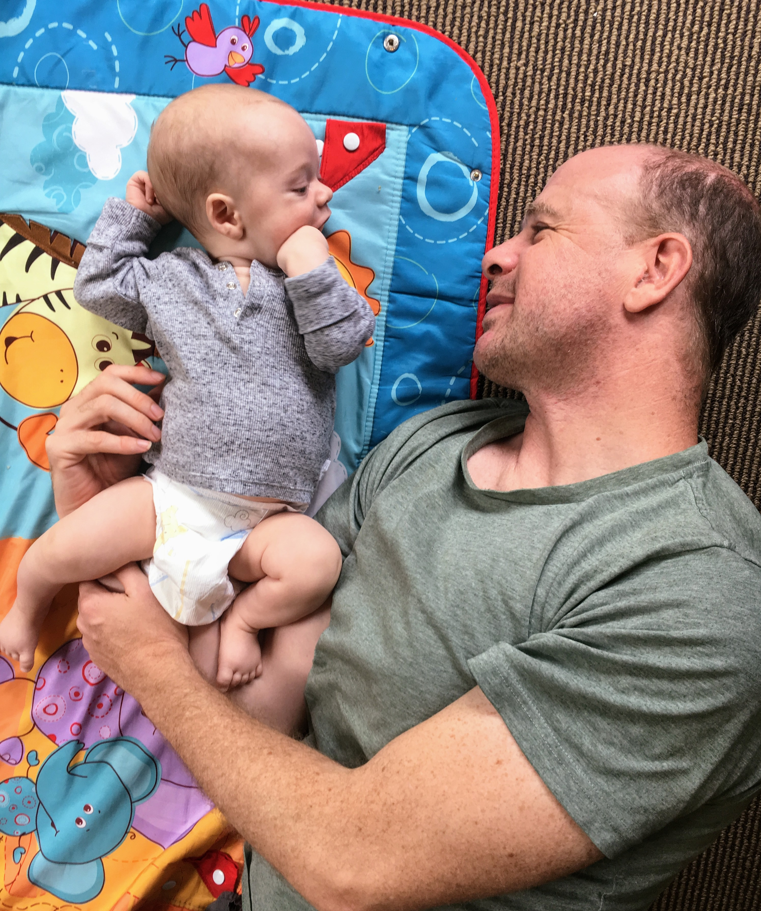

