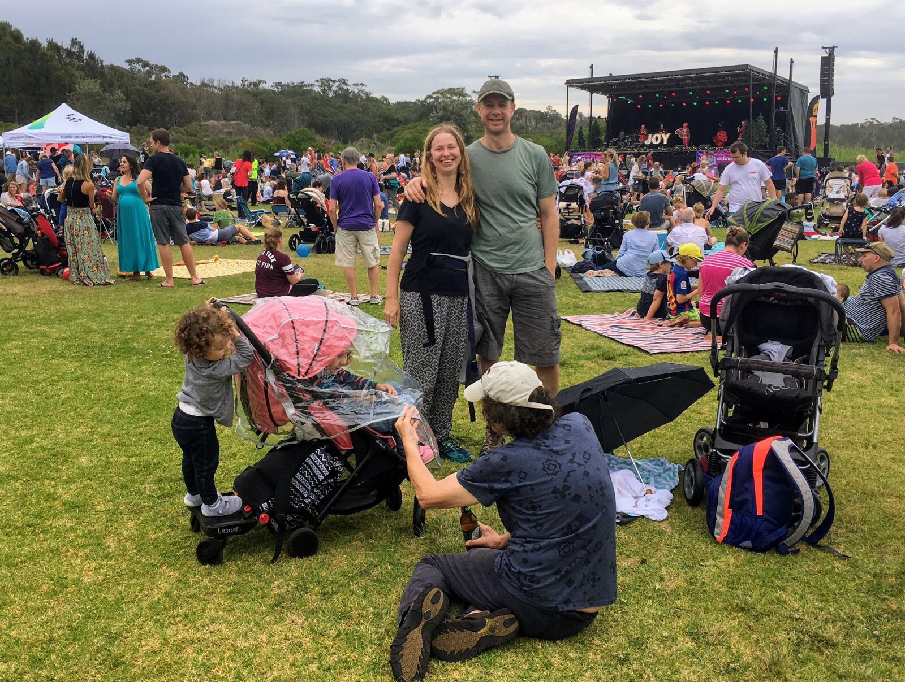
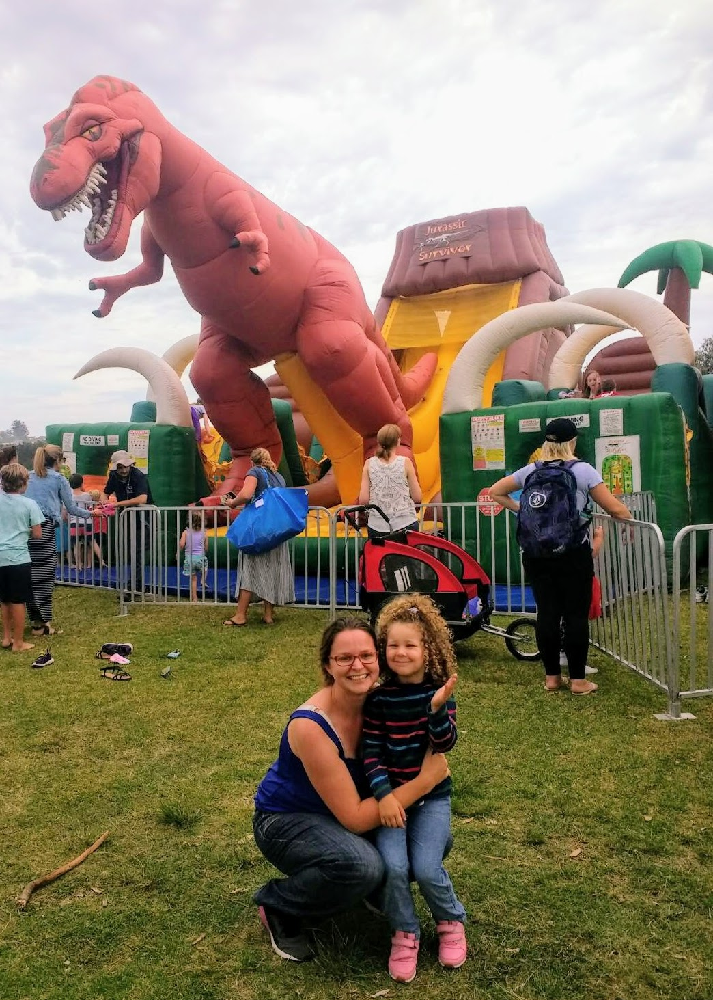
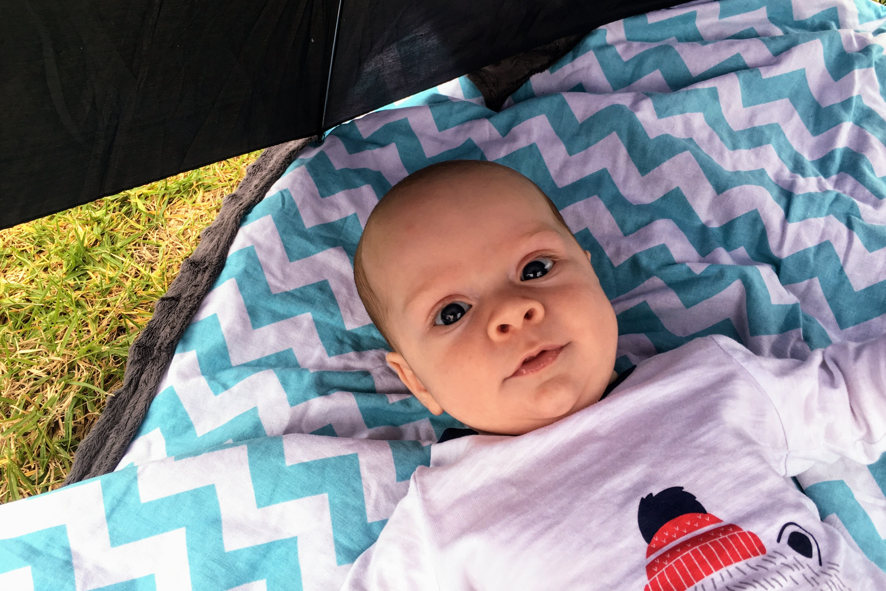

# WEEK 12 (26.12.17)
## A SAD FAREWELL
We sadly said farewell to the family at the very start of the week. We had a lovely last day together at home and were very sad to see them all go. 
After they’d gone, Pete discovered a humungous pile of presents that had been left for Bradley’s future birthdays and christmases. I ……. I mean Bradley….can’t wait to open them!
Pete, Bradley and I would like to say a HUGE thank you to Dad, Bob, Paige and Doug for visiting. We had an amazing time xxx

## BRADLEY'S FIRST CHRISTMAS
Bradley had his first Christmas gathering with Pete’s school friends. At this annual breakfast event, we swap unwanted items. I managed to get rid of a broken hula hoop but sadly picked up a huge suitcase with Bible stories inside. Not too happy about that!!! On the bright side, Bradley was calm and smiley most of the time so everyone warmed to him which was great to see.

.jpg "20171223_113536(0).jpg")

We had a delicious Christmas Eve lunch in Terry Hills with Vikki + Sal’s family. The only downside was that it was a whopping 41 degrees! Bradley’s hottest day so far! We kept him naked and in the shade most of the time…he coped so well. He did much better than mummy! 

Angela and George came over for Bradley’s first Christmas day. The day was quite overcast so we spent the whole time indoors. We were all happy about the change in weather! We opened a couple of presents, had burgers for lunch and then had fun dressing Bradley up in a festive outfit. So cute!

