# WEEK 13 (02.01.18)

## BRADLEY'S DEVELOPMENT
Bradley is now enjoying tummy time (for little bits at a time). He LOVES his brightly coloured animal book and is enjoying grasping at rattles, cups and scarfs. He is definitely starting to be a lot more interested in the world around him which is lovely to see. 
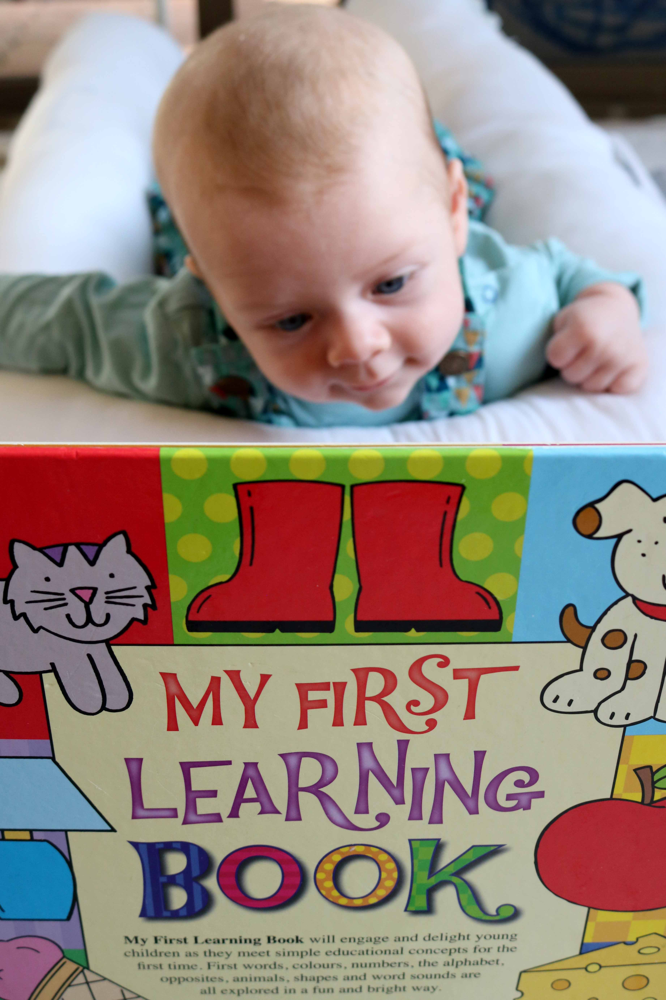
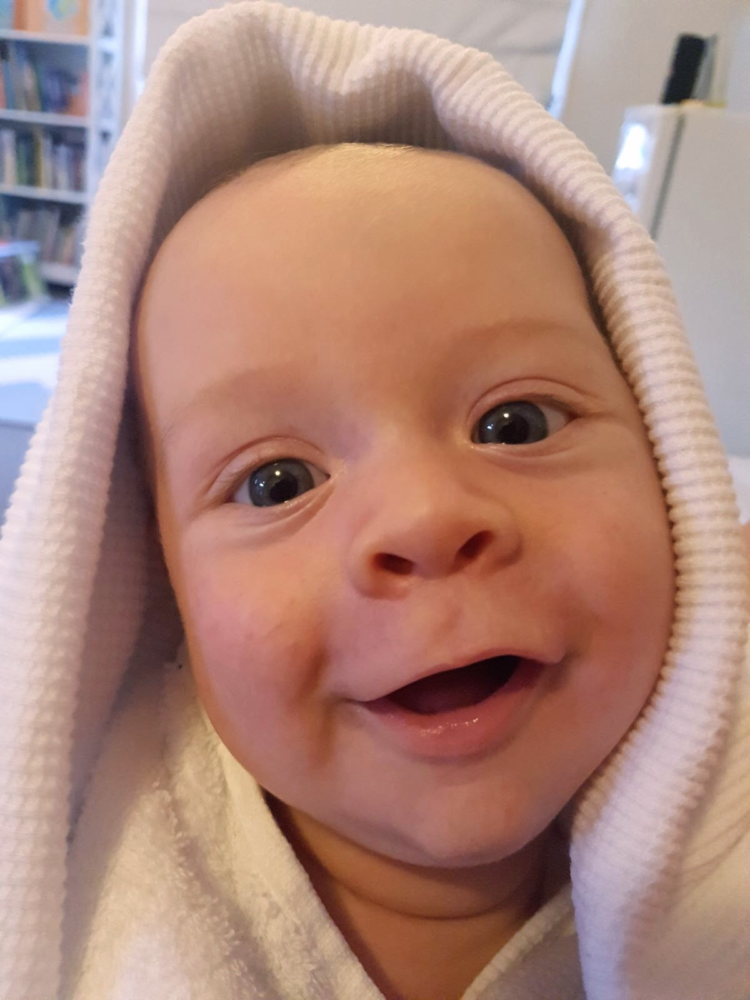
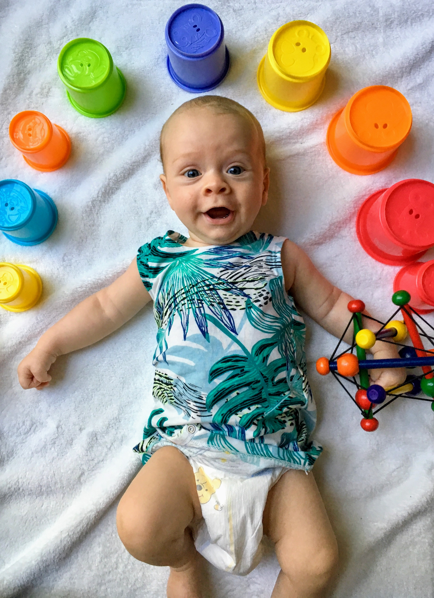
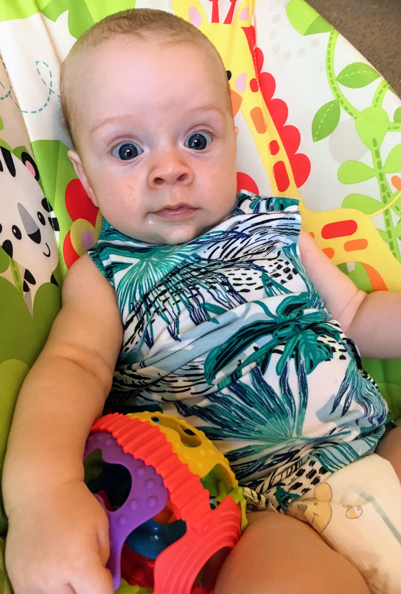

His speech is also coming along nicely. He makes A LOT of different sounds now and loves to have a natter. 
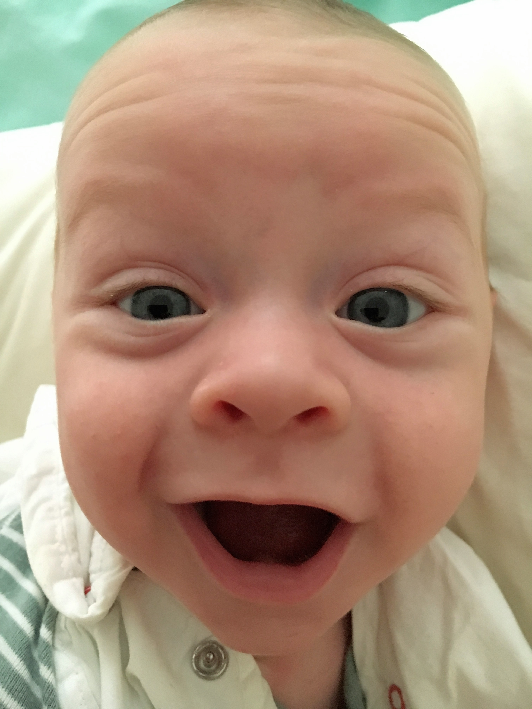

Bradley is now nearly three months old and I can't believe how much he has grown up already.
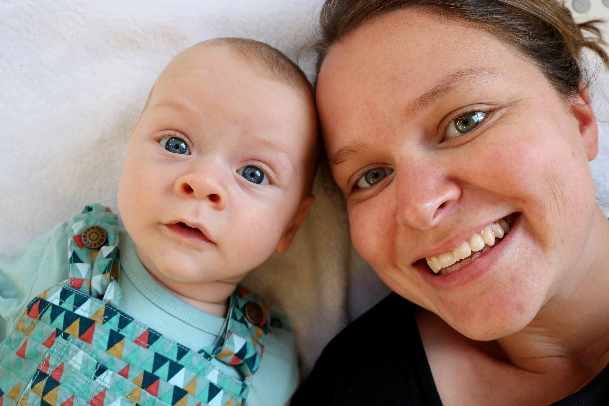

## BRADLEY'S FIRSTS
Bradley painted his first masterpiece this week. Look how proud he is!
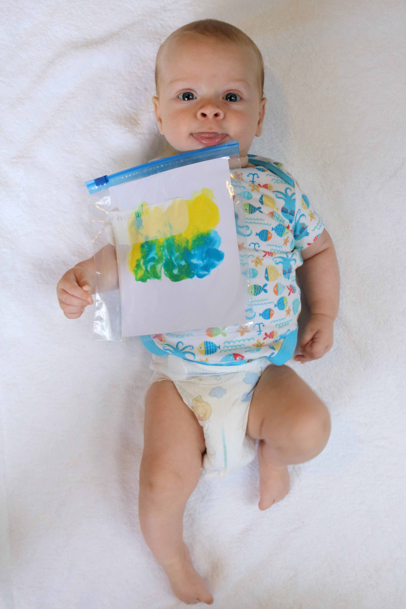

## ACTIVITIES WITH BRADLEY
Post Christmas, we have visited Manly, Shelley Beach (a first for Bradley) and Curl Curl Beach. George and Angela joined us on our expedition to Shelley Beach and have been a great help this week.
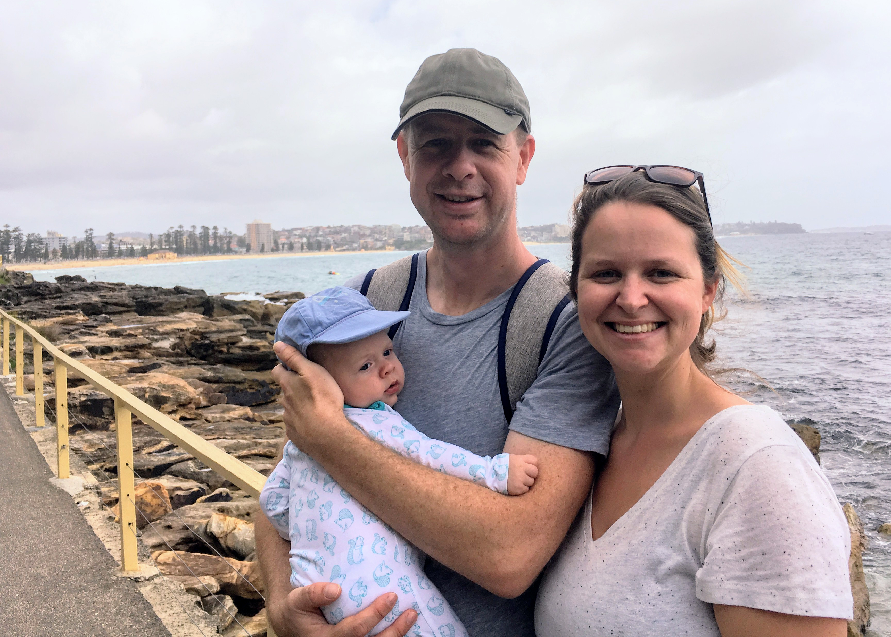
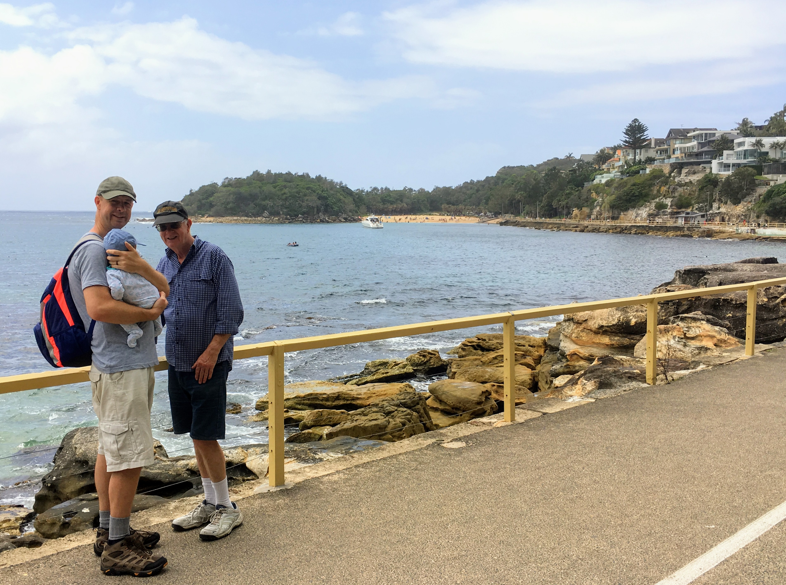
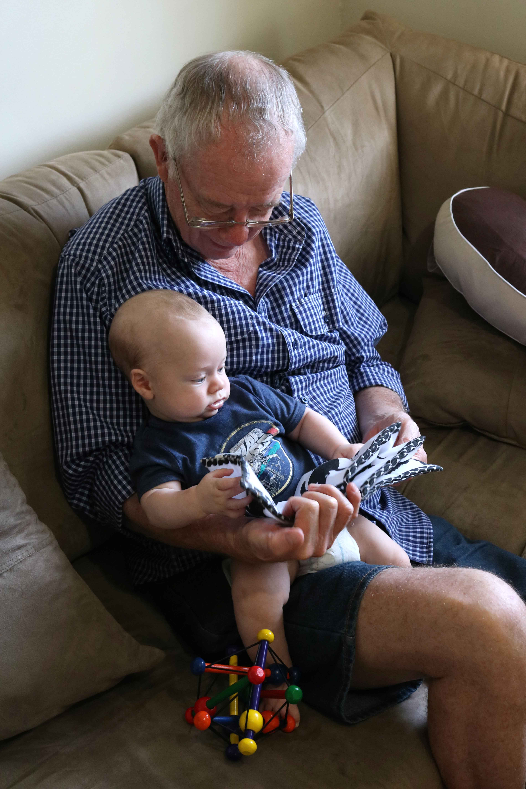

I’ve also enjoyed taking more ‘studio’ style photographs of Bradley. That’s been keeping me entertained.
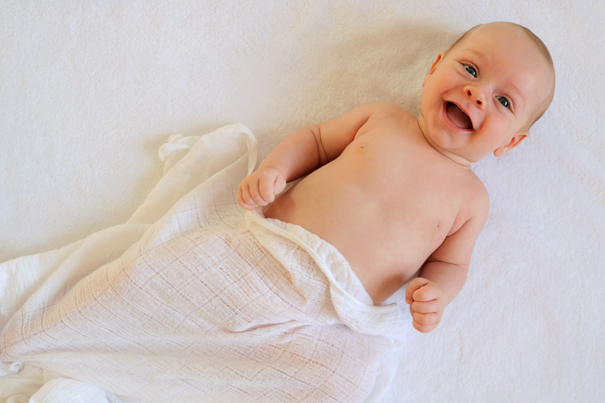
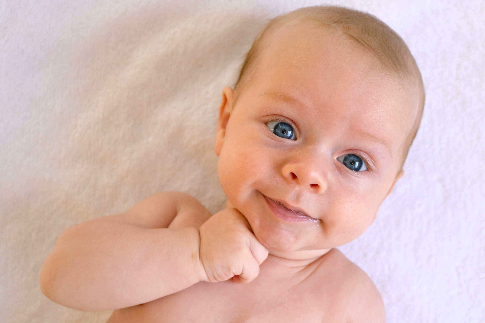
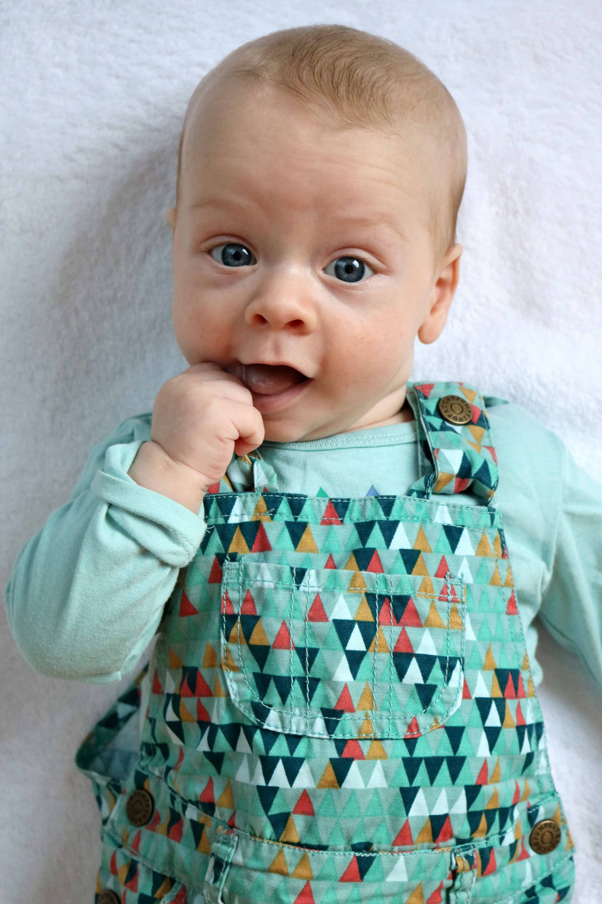
