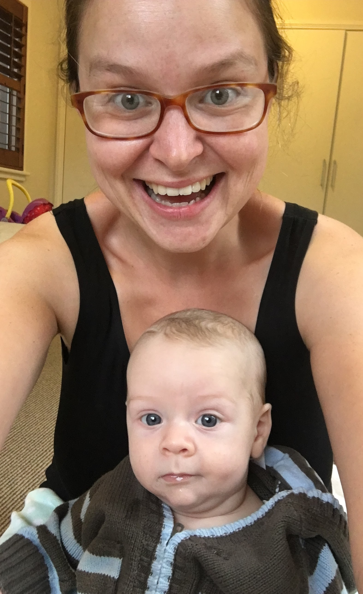
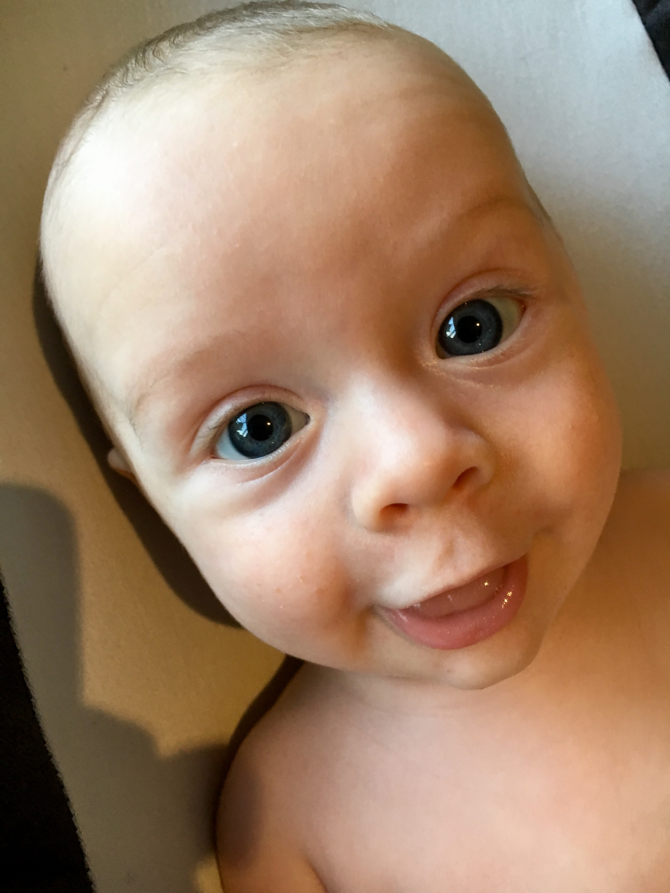
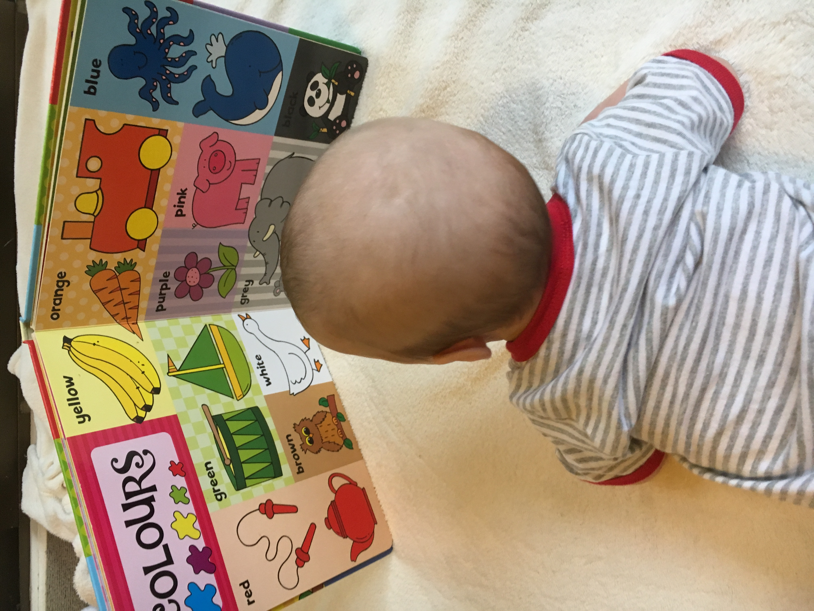
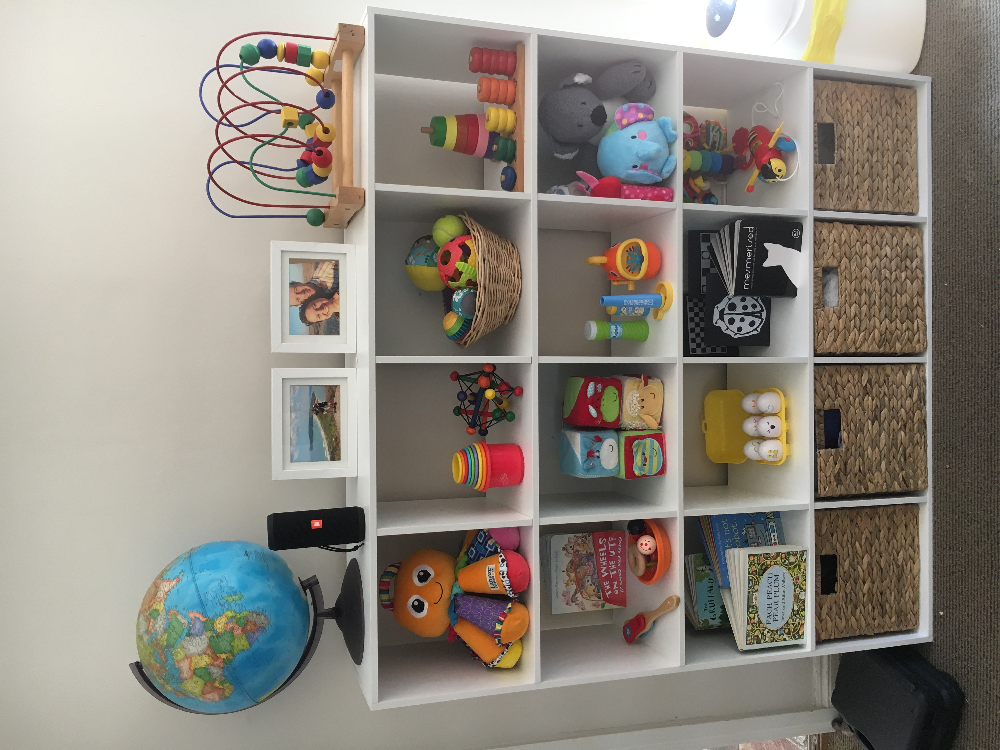

# WEEK 14 (02.01.18)

## BRADLEY'S DEVELOPMENT
Bradley is now three months old and weighed in at 6.72kg this week. I rely on my sling now to carry him around the house as I now find him too heavy without one. 

Bradley is getting great at grasping and picking up and continues to chat throughout the day. We are now getting into more of a routine with naps (4 a day) and bedtime (7.30-8pm). We are also learning more about what he likes. At the moment, he adores his butterfly teddy, bee tambourine and two big colourful books. He enjoys songs, stories, splashing in the bath and bouncing in his bouncer. He’s a true delight! 

## THIS WEEK WITH BRADLEY
As you may have seen in the news, Sydney has had a HOT week. We have been indoors most days and have kept cool in the swimming pool. George and Angela stayed at the weekend and did wonders in the garden. Weeds are gone. Hedges have been trimmed. It looks fantastic. They also helped a lot with little Bradley which gave me the chance to have a few swims! 

Pete and I also dabbled with DIY this week and made up a toy display for Bradley. I’m super happy with the result. I’m sure all the toys will be on the floor when he gets a little older so I’ll enjoy the neatness now whilst I can.

On one of the cooler days, we walked down to Manly from our place for the first time. It was a lovely stroll and it didn’t take too long. Bradley was calm or asleep all the way so it was a lovely pleasant outing for Pete and I. 

On a side note, Pete and I celebrated our 5 year meeting anniversary this week. We have ticked a lot of boxes in five years! Travel, unit, more travel, house and now baby. Feeling very happy and lucky x 
