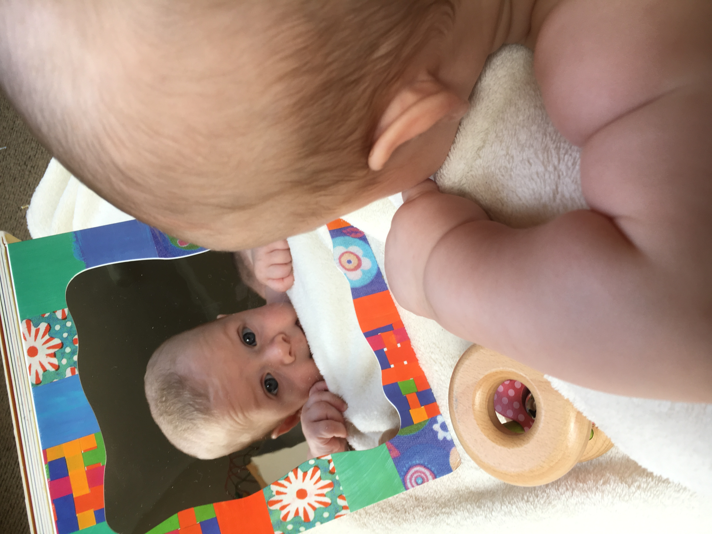
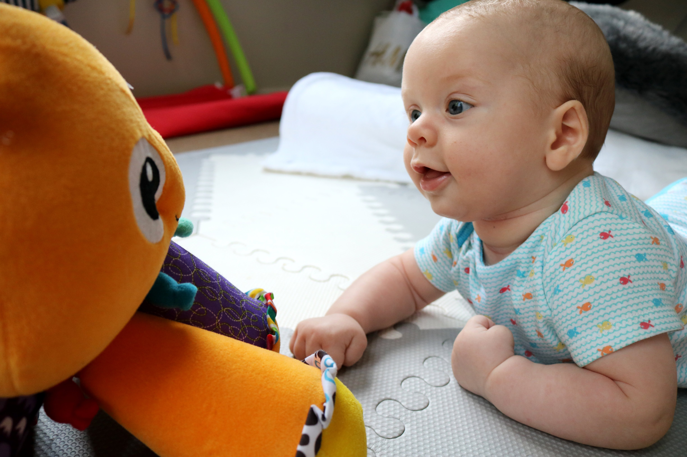
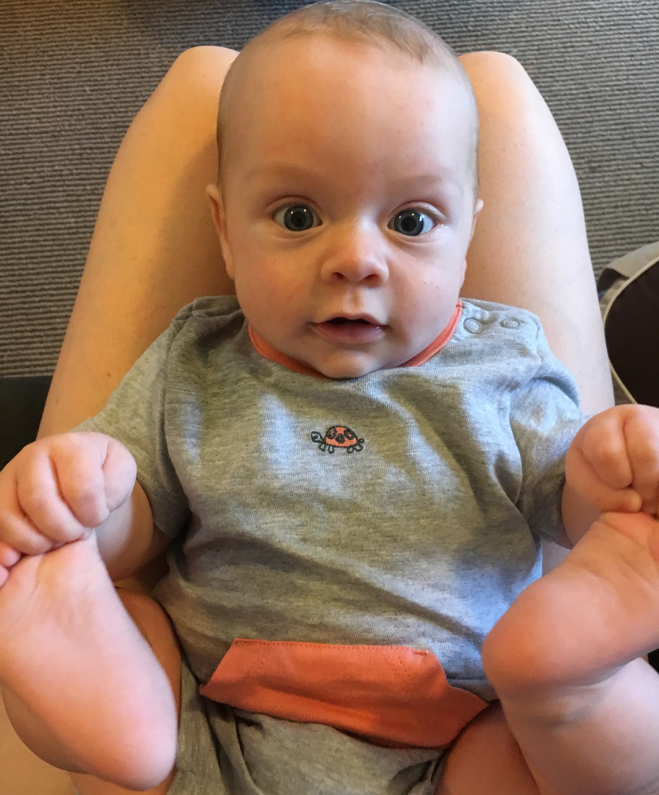
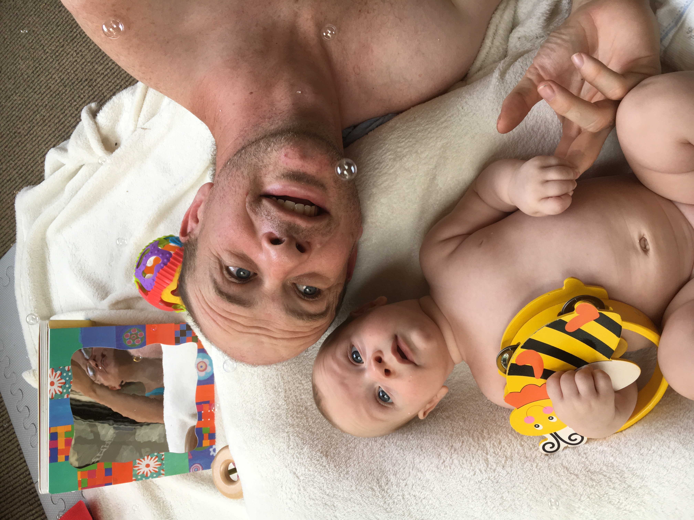
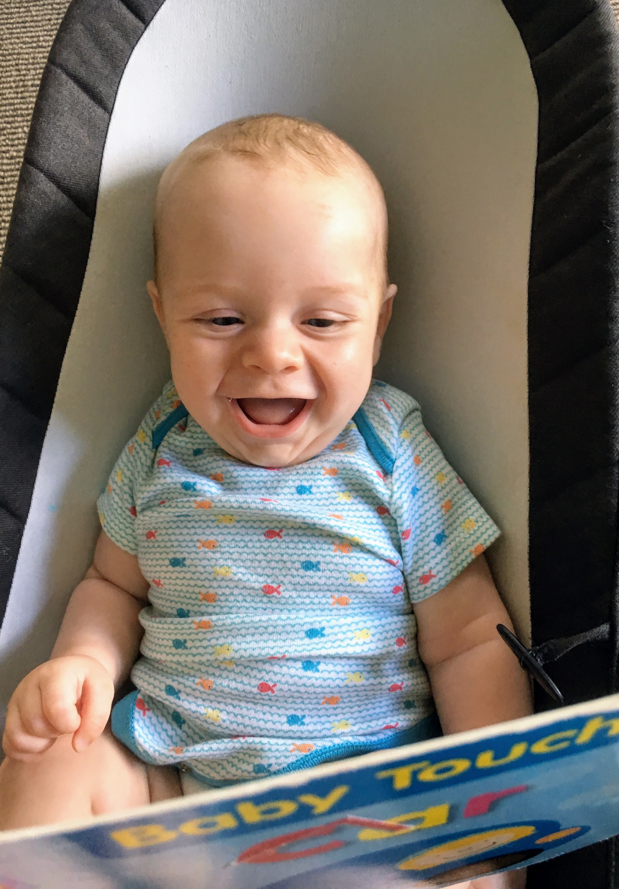
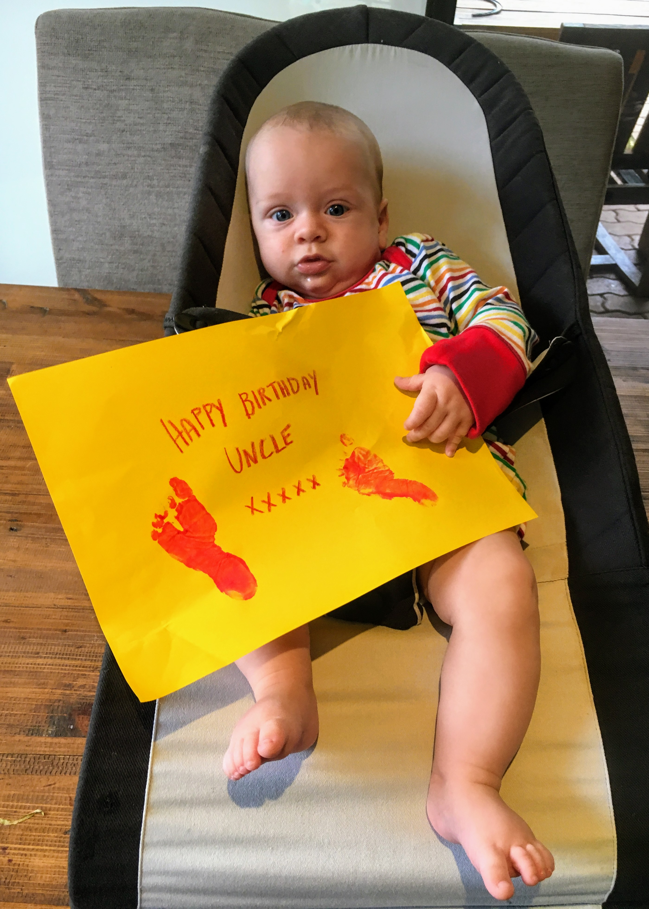
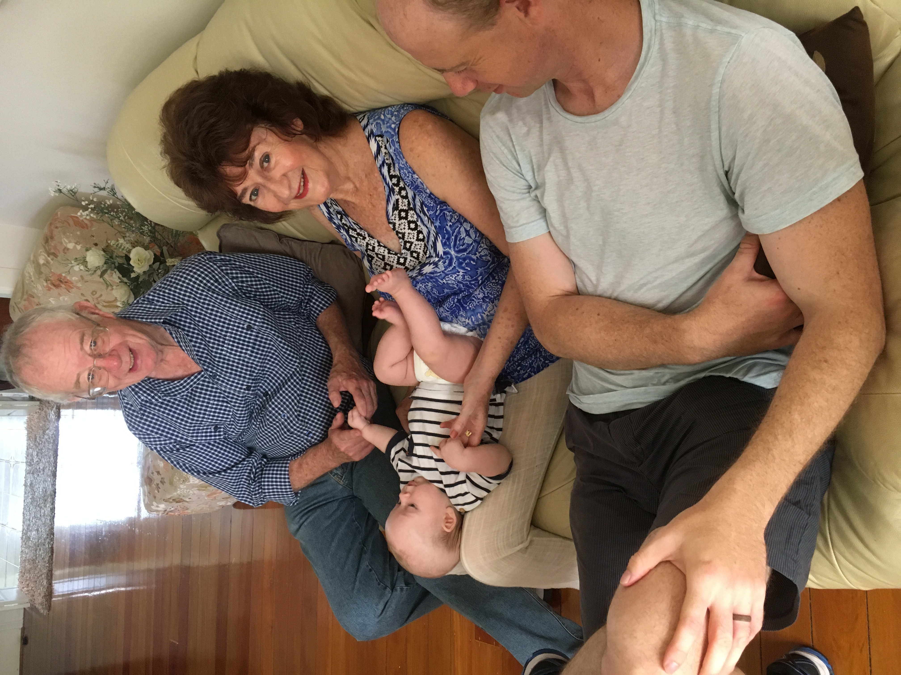
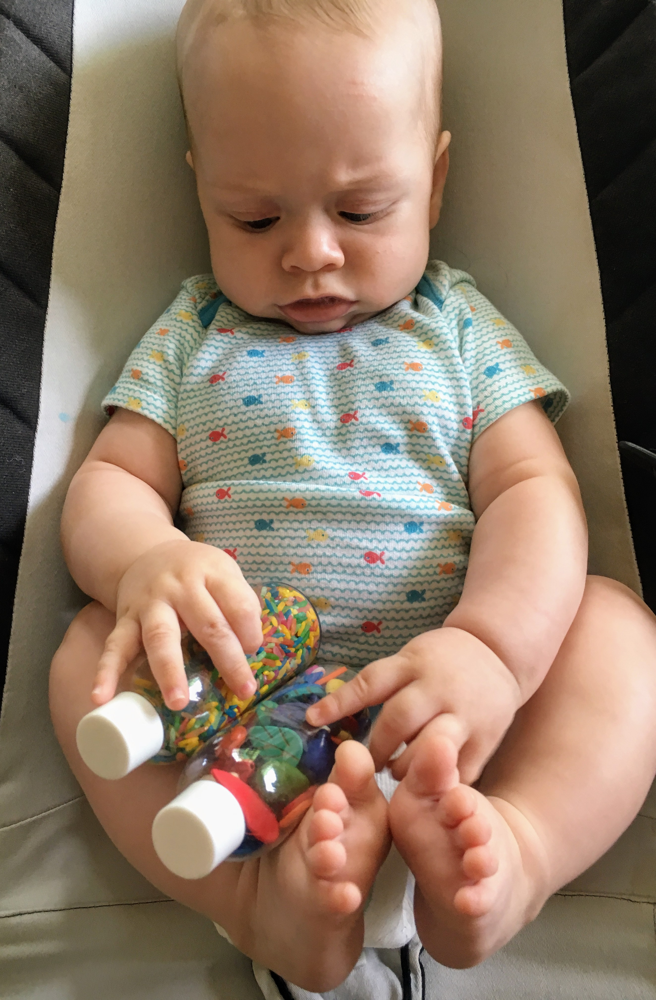

# WEEK 15 (09.01.18)

## BRADLEY'S DEVELOPMENT
This week Bradley did his first little laugh...at daddy. It was adorable! Bradley has also been doing more rolling onto his side and holding onto his feet. 

He is now taking notice of bubbles and really enjoys his colourful books at the moment so I popped out to the charity shop this week to get a few more. This touchy car book was an instant hit.

On a final note, I got an amazing 5 1/2 hour stretch of sleep this week. Amazing! It’s been a one off so far...not so amazing.

## THIS WEEK WITH BRADLEY
This week we celebrated Patrick’s birthday by going over to George and Angela’s. We had a little video chat with the birthday boy which was a lovely treat. We also attended Jean Paul’s birthday party and Bradley was his usual smiley self when he woke up. 

Over the past few days, I’ve been busy researching and making sensory toys for Bradley. I’ve made a couple of shakers so far which he seems to like and be interested in. I have a lot more to try in the weeks ahead. Thanks to Laura and Bob's homeschooling resources, I’ve also been researching activities that Bradley and I can do together when he gets a little older. I have programming tutorials and a space station role play pack ready to go. I can’t wait! 

