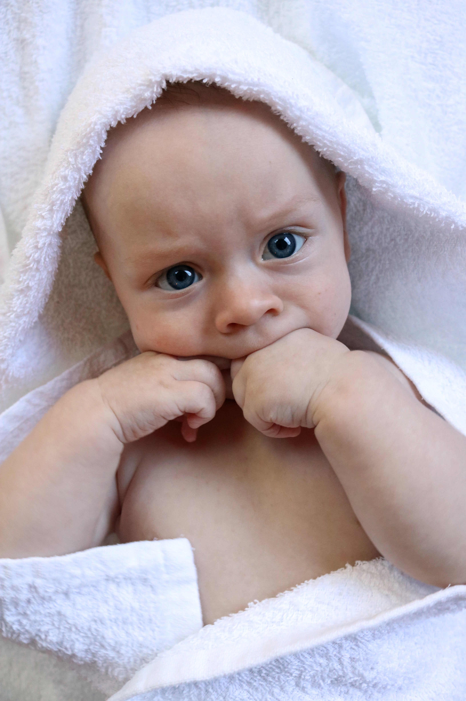
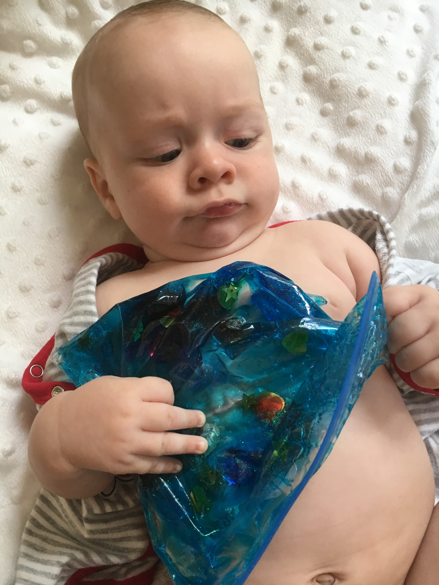
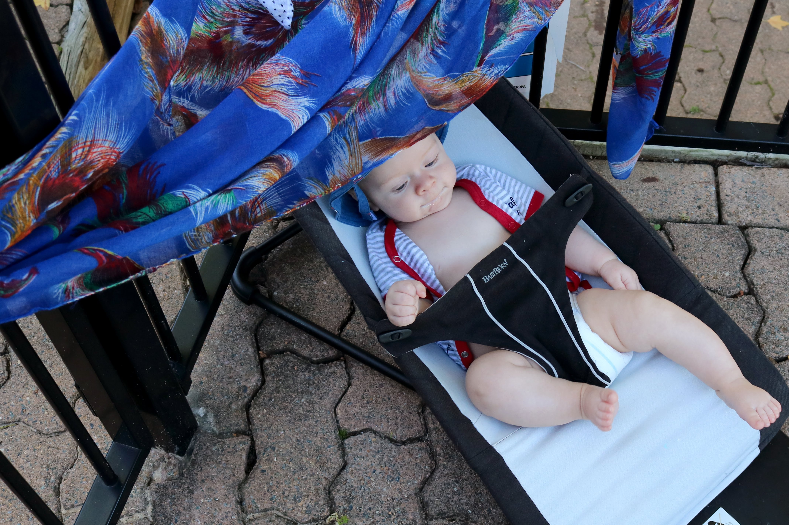

# WEEK 16 (16.01.18)

## BRADLEY'S DEVELOPMENT
Bradley is becoming very vocal now. He starts ‘talking’ as soon as he wakes up and shouts a fair bit now (happy shouts most of the time). Bradley’s hand eye coordination is also getting a lot better these days. He is able to swipe at toys and grasp them pretty well. 

## THIS WEEK WITH BRADLEY
I walked to Manly and back with Bradley and some other mums this week. It was quite a trek in the heat! Bradley also attended his first trail race at Manly Dam. He wasn’t that impressed (see photo). I tried and tested a few more home made sensory toys. I’m a little nervous about the glittery gel bags as I’m sure it won’t be long before he is able to rip them open. Eek!

Lastly, George and Angela stayed over on Friday and we all enjoyed some pool time together. Bradley seems very happy outdoors and is able to keep himself amused by looking around. 

