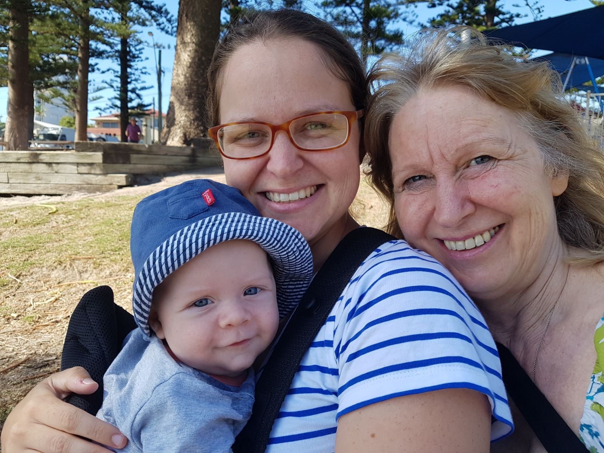
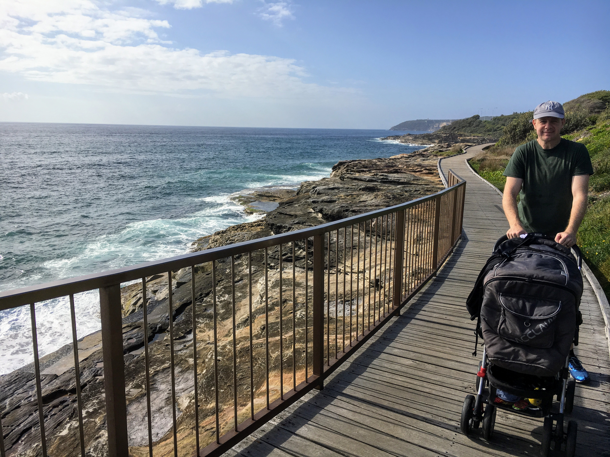

# WEEK 17 (23.01.18)

## BRADLEY'S DEVELOPMENT
Bradley is measuring 70cm tall this week which seems to be off the charts for babies at this age. He has sadly already grown out of a few 3-6 month clothes due to his height. Eek! He’s very nearly able to suck his toes and he amazingly flicked through pages of a board book with me the other day. I didn’t expect that! 

## THIS WEEK WITH BRADLEY
This week George and Angela visited and I had a few nice catch ups with other local mums from my mothers group. Bradley and I also had the most wonderful visitor….Mum! Mum arrived early on Sunday morning and we have already managed to squeeze in a few lovely walks/sights (Curl Curl, Dee Why, scenic walk in Manly) in addition to playing with Bradley at home. 

On a side note, Bradley and I would like to say a big thank you for the gifts from Mum, Liz, Grannie and Bob this week. Bradley adores the Spot book from Liz and loves the musical instruments from Grannie. We sing A LOT of songs every day so these instruments really help to brighten up the sing song sessions. The play thing for the bouncer is also a big hit so thank you for that Bob.

