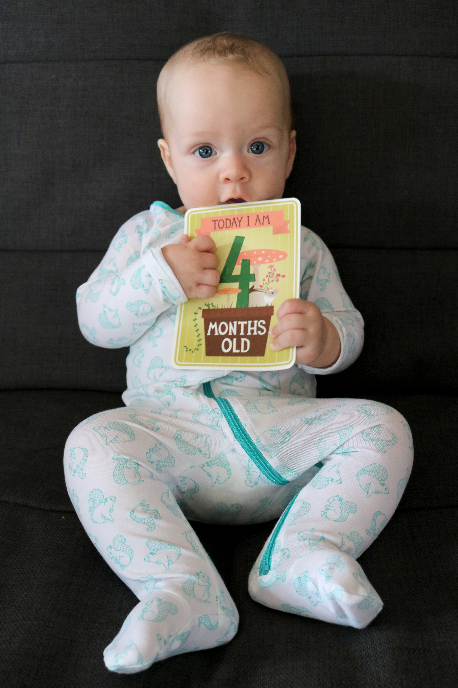
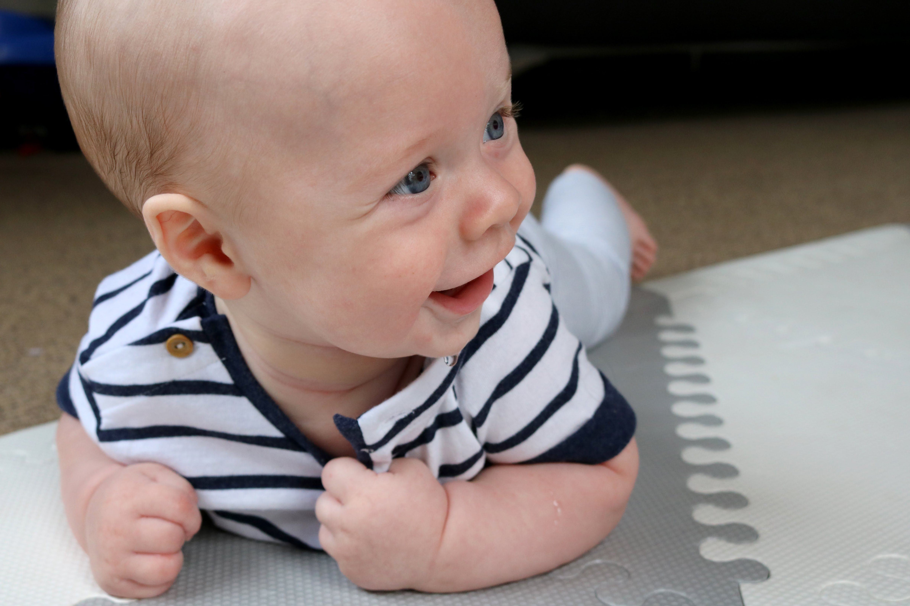
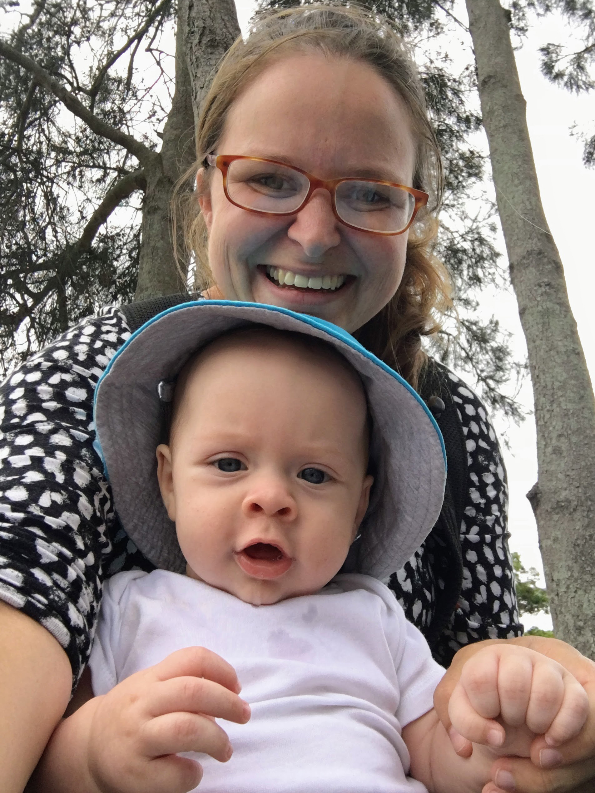

# WEEK 18 (30.01.18)

## BRADLEY'S DEVELOPMENT
Bradley is now four months old! Hooray!

Bradley weighed in at 7.45kg this week. Bradley also managed to reach two exciting milestones in his development before his four month birthday- sucking his toes and rolling over from back to front. We’re all very impressed this end. He really enjoys rolling over onto his front so his tummy time has increased dramatically. Win win! 

Bradley has had a stomach bug for a good part of the week so that’s not been much fun. Thankfully he seems to be on the up now. 

## THIS WEEK WITH BRADLEY
This week we visited Manly dam, Manly, Narrabeen market and lake. We also had a visit from George and Angela. 

