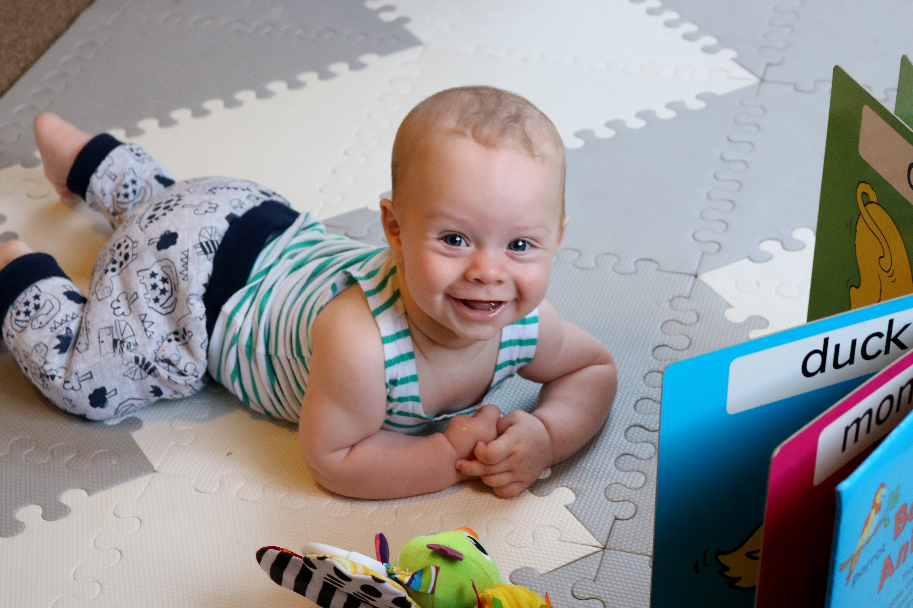

# WEEK 19 (06.02.18)

## BRADLEY'S DEVELOPMENT
Bradley had a rough start to the new week as he was still poorly. The doctors said it looked like he had one of the many childhood illnesses (perhaps roseola) as he had a fever and spotty rash. Luckily he was over it by the end of the week and was soon back to his normal happy self. 

Bradley is now getting better at holding his body up in a sitting position (with support still) and continues to love looking around at faces and nature (such as trees). I bought an outdoor mat for Bradley this week and we have had him doing tummy time by the pool. He absolutely loves it. He very content outdoors which is lovely to see. He takes after both his mummy and daddy :)

## THIS WEEK WITH BRADLEY
This week we visited Clontarf beach, Manly and Dee Why. We attended baby bounce and rhyme time at both Manly and Dee Why library and had a lot of fun. Bradley was a bit sleepy for both but it was still great checking them out and learning a few new songs. We also popped into lane cove national park and visited Petes parents. 

On a further note, mum has been working hard on her art and crafts with Bradley over the past few weeks. She has managed to make beautiful plaster casts like the one below. Bradley is not the easiest person to work with so she has done well to get such good results. Thanks mum! 

