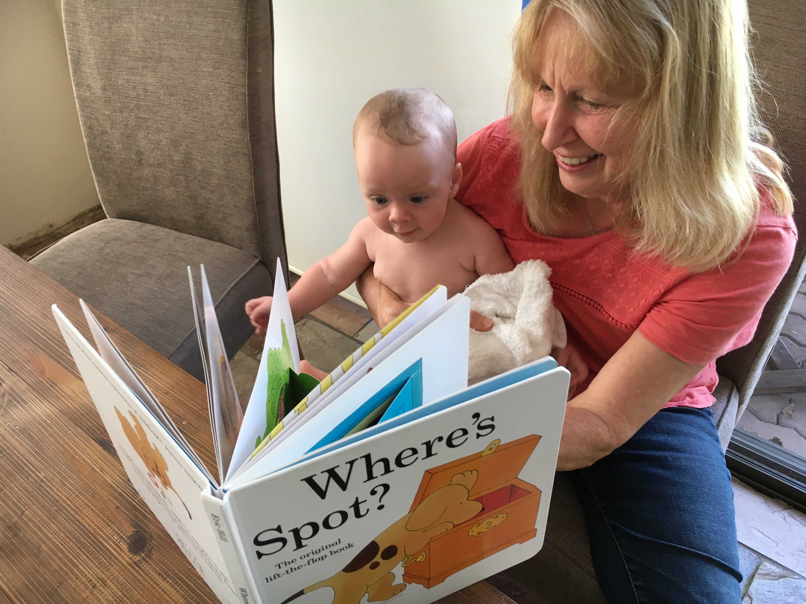

# WEEK 20 (13.02.18)

## BRADLEY'S DEVELOPMENT
This week Bradley had his four month jabs. Apart from the initial cries, he did so well. There was no fever this time round and he was pretty chirpy again quite soon after. The GP weighed and measured Bradley and he is still doing wonderfully. He is in the 98th percentile for height! The GP also said that we should consider introducing solids a little sooner than the normal recommended age of six months because Bradley is a lot bigger than the normal baby. Bradley is already showing a huge interest in food and has enjoyed a few licks of my apple this week. I think we will attempt feeding him purees in a few weeks time. How exciting! 

Bradley is really into his books at the moment, especially the Spot books. He squeals with delight when being read a Spot book. It’s pretty adorable. A big thanks again to Liz and Bob for the Spot books. 

Bradley had his first Bumbo seat experience this week. Sadly he is a little too chubby (leg wise) for it but manages to squeeze in without a nappy. Bless! 

## THIS WEEK WITH BRADLEY
Cousin Adam arrived this week on Valentine’s Day. We all met him at Manly wharf and showed him around Manly and Fairlight. On the following day we went to Watsons Bay and had a little walk and a dip. Mum and Adam marched onwards to the city and ticked off many sights there. I can only manage about four hours of activity before I feel like collapsing in a big heap. That’s especially true in this hot weather!!! 

After Adam left for Perth, we celebrated Angela’s birthday, did more exploring down at the Dam and Forty Baskets Beach. He also dipped his feet in the sea at Manly for the first time with his Daddy. 

Bradley still really enjoys his bath time. He is really kicky now so a lot of the water gets splashed out. He loves playing with his flannel, ducky and silver teapot. Thanks for those items Bob! 

