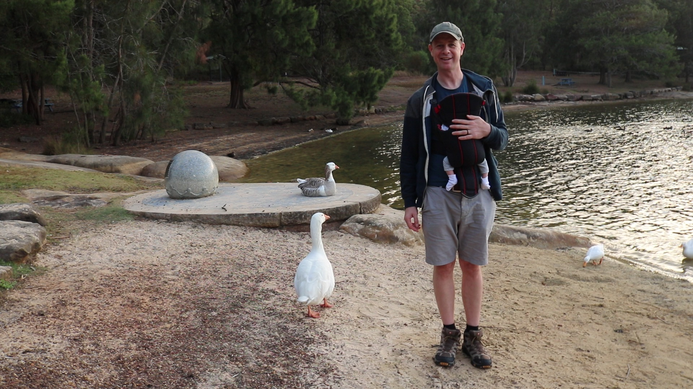

# WEEK 21 (20.02.18)

## BRADLEY'S DEVELOPMENT
This week Bradley started on solids! He’s now tasted apple, pear, banana, sweet potato, carrots, broccoli and avocado. His diet is better than mine! He didn’t seem too fond of banana or broccoli but did enjoy carrot, pear and sweet potato. He’s not had much more than a few little nibbles of each puree but it’s a start. 

He’s also started doing a superman flying pose on the floor. We believe it’s one more step towards crawling. I’ve started getting him to do it on the exercise ball and he really enjoys that. 

## THIS WEEK WITH BRADLEY
We said farewell to our two lovely visitors this week - Mum and Adam. Before they left, we had a lovely time exploring Palm Beach & Kuringai Chase National Park. Bradley went on his first proper bush walk to the ‘Red Hand’ cave (which has Aboriginal artwork) but it was close to his nap time so he was a little fussy. 

We also had a lovely last swim with Mum & Adam before Adam's flight and a sunny walk with Mum to the Dam before her flight....

