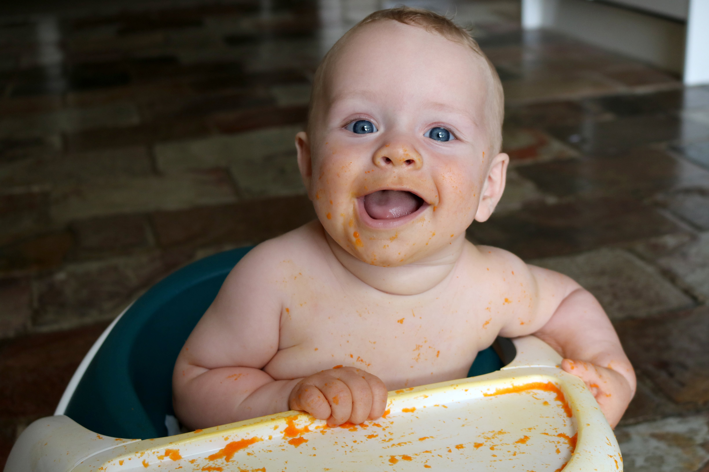
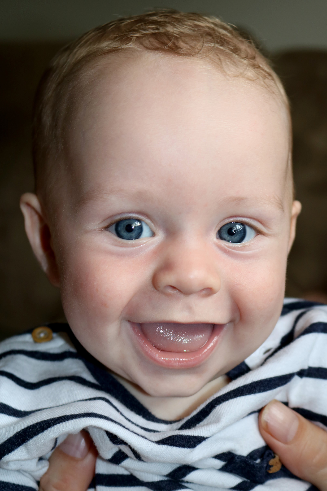
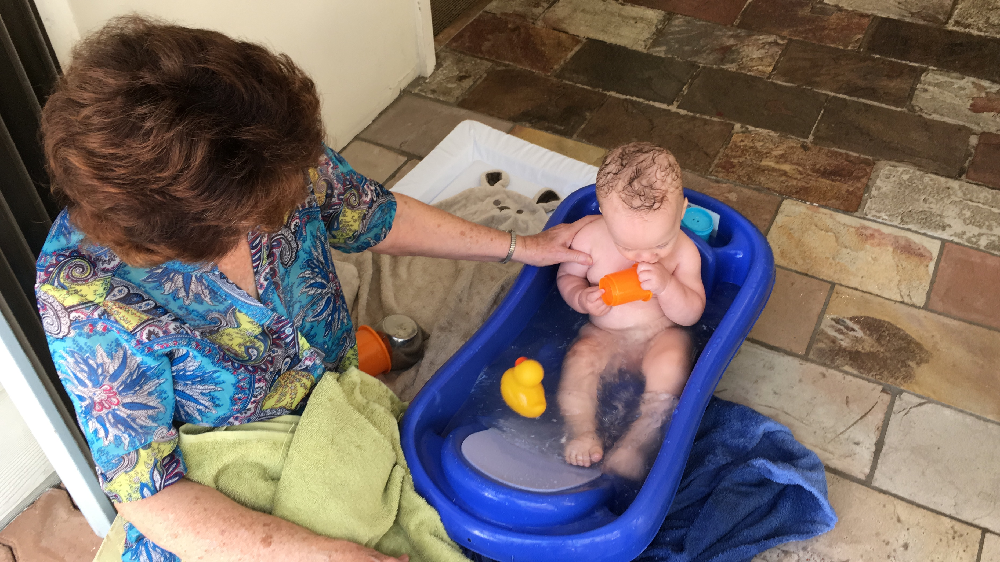
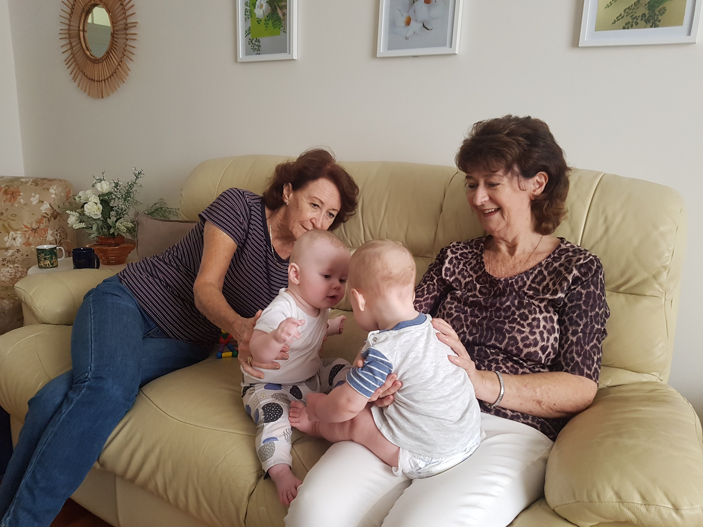
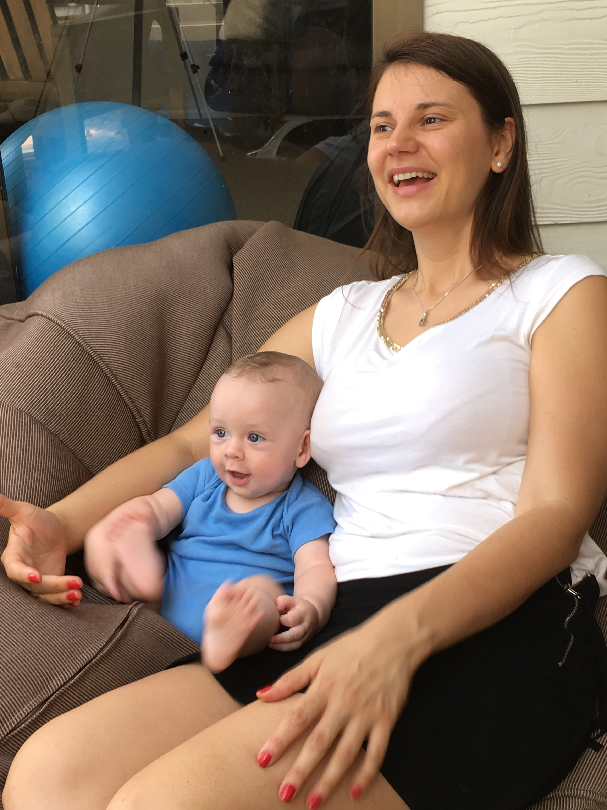

# WEEK 22 (27.02.18)

## BRADLEY'S DEVELOPMENT
Bradley turned five months this week! My little baby is growing up so fast. 

Bradley is now enjoying standing up (with assistance). He smiles and laughs every time he does it. He is able to take his weight but needs help balancing. 

Bradley is sadly getting bored of and a bit too big for his bouncer. He leans over to get out as soon as I put him in. I’m finding it a little tough as he’s not sitting yet and there is only so much lying down a baby can do. 

## THIS WEEK WITH BRADLEY
This week Bradley and I tried out the local Playgroup down the road. Bradley was the youngest baby by far but it was still nice meeting a few more local mums. We also had a lovely time visiting George and Angela. Marian and Georgina popped round too so it turned into a nice get together with the three kids. 

At the weekend, we had a wonderful time with friends. Amanda, Stacy and Helene visited. I hadn’t seen them in a year so it was great catching up again. Chris also kindly visited us. 

