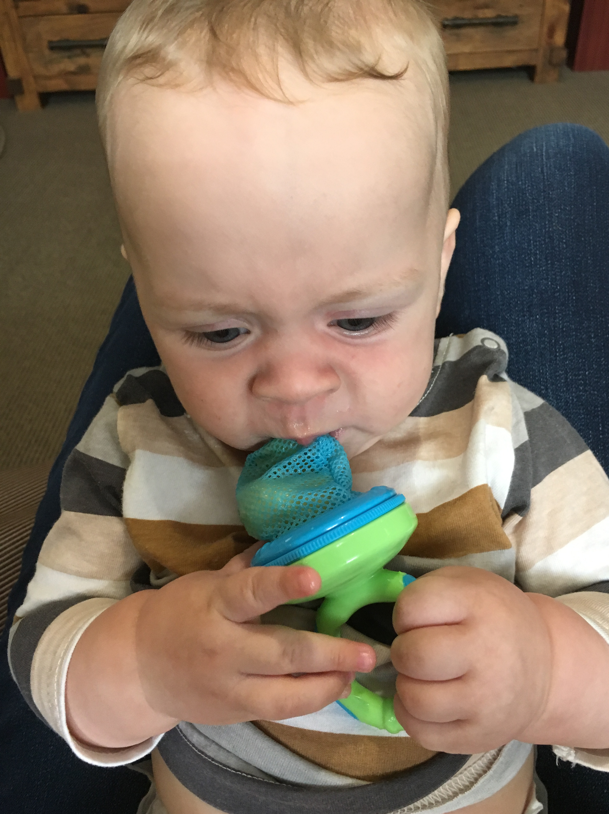
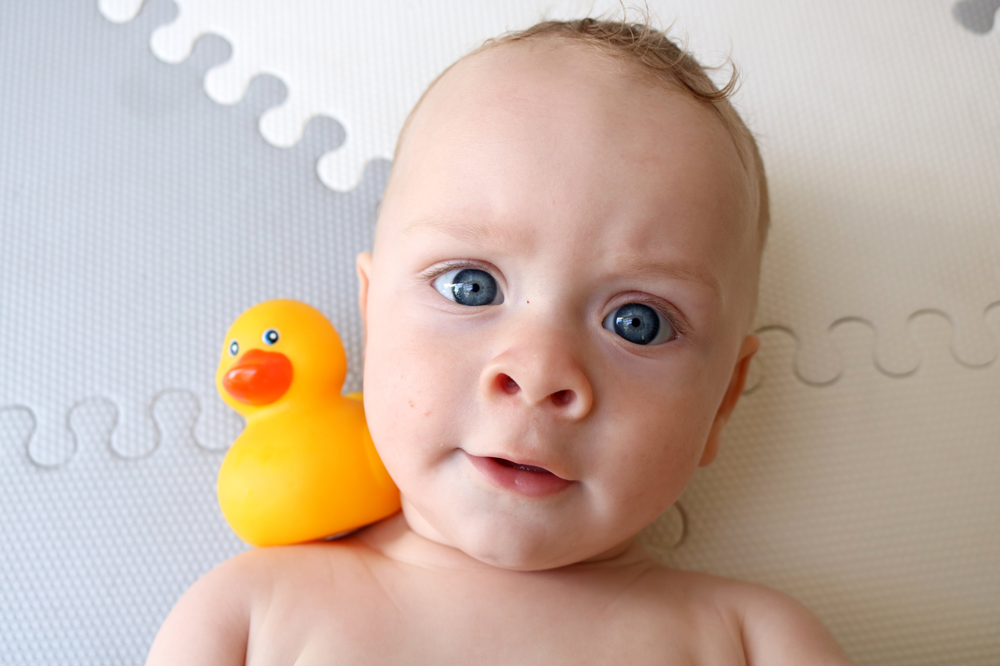
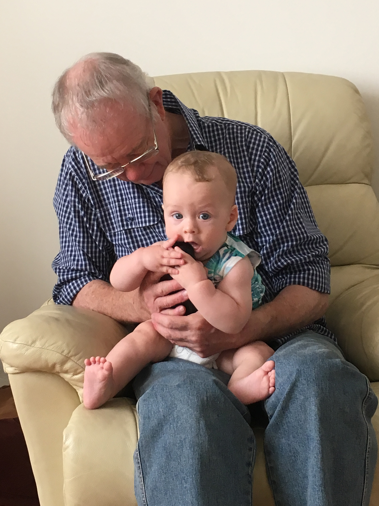
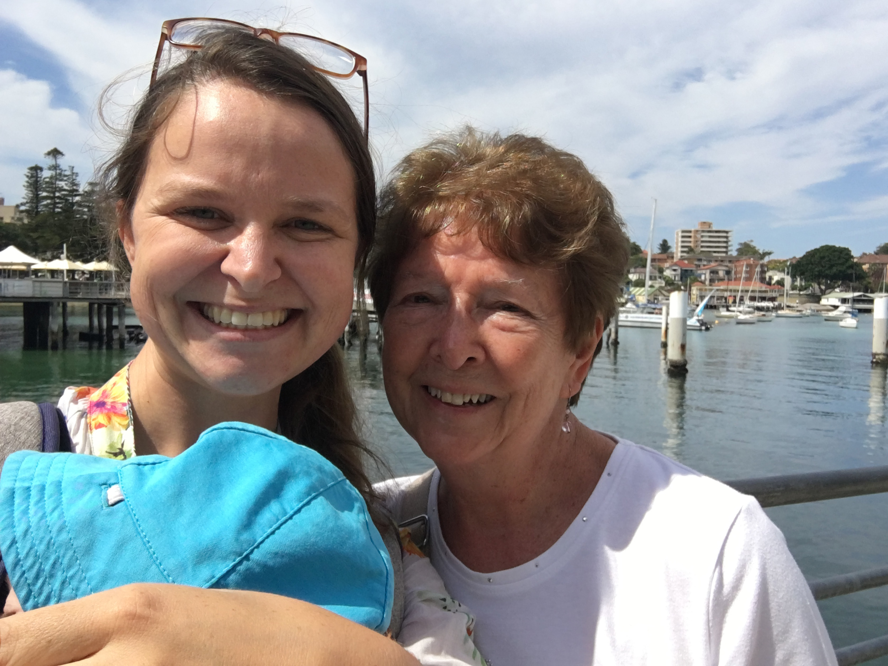

# WEEK 23 (06.03.18)

## BRADLEY'S DEVELOPMENT
This week Bradley sat unaided for the first time for a few minutes (11.03). Sitting practice with the feeding chair and cushion has helped a lot I think. His balance is definitely improving as he’s managed to stop himself toppling over to one side on a few occasions now.

Bradley also loves to have a giggle now and daddy makes him laugh the most! New things (like a new sound/word) make him laugh a few times before he gets used to it. Kissing him in his armpit and near his bottom makes him chuckle. Singing funny sounding words (achoo, boo, hiss) near his face can also get a giggle.

New foods this week include cauliflower, peas and green beans. All eaten! Banana in a bag was not a hit.

Bradley now bathes in the big adult bath! He was getting a bit too big and splashy for the baby bath. He enjoys splashing around with all the colourful cups and mummy likes not having mop up after very bath now. Haha. Mr Duck is his new favourite toy. 

## THIS WEEK WITH BRADLEY
Bradley and I attended a baby massage class with my mothers group this week. He seemed to quite like it so I’ve kept it up for about 5 minutes a day when he wakes and goes to sleep. 

At the weekend, Bradley got a new car seat. It’s a lot more roomy so he seems a little happier in it (although he still doesn’t like being in the seat for too long). We visited Carlos and Eszter as well as George and Angela this weekend too. Busy busy busy! 

Yesterday we had a lovely passing visit from Aunty Jean. We met her in Manly and had a sunny stroll down to Shelley beach. Bradley was his usual smiley self with her so that was great. 

