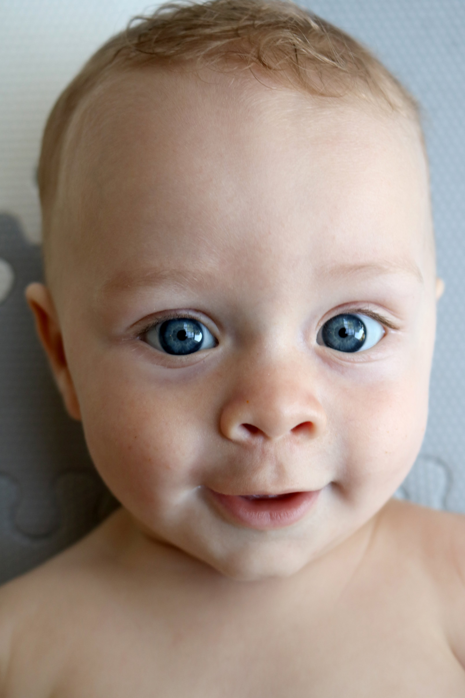
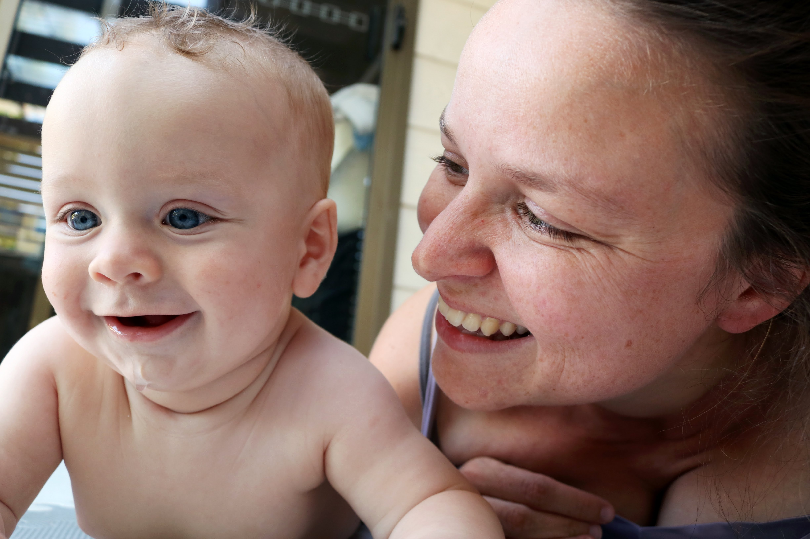
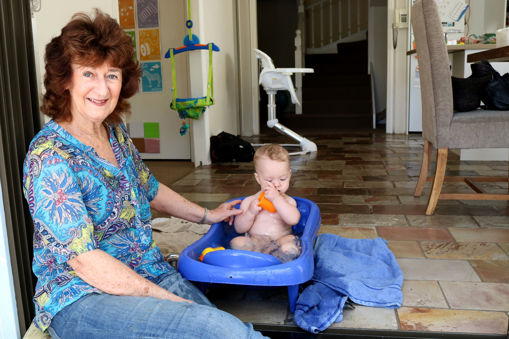
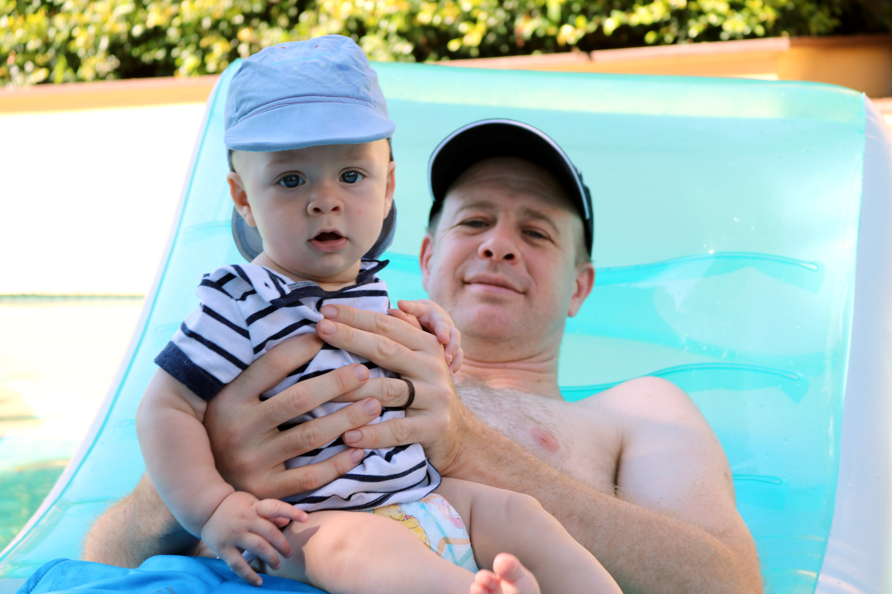

# WEEK 24 (13.03.18)

## BRADLEY'S DEVELOPMENT
This week Bradley has been working hard to perfect his sitting. He’s progressed so quickly. I nearly feel happy to leave him sitting alone. Bradley also really enjoys standing at the moment on Pete or me. He uses our fingers to balance but supports all his own weight. He loves it! 

I’ve started mixing foods this week to make Bradley’s menu a little more exciting. He’s enjoyed pea and pear as well as sweet potato, carrot and broccoli. I’ve tried a few more foods in that bag device and he’s not having any of it. I think it might be the bag rather than the food? Further testing needed! 

On a final note, it is clear that Bradley now recognises people like Dad. When Pete returns from work, his face lights up! It’s adorable! 

## THIS WEEK WITH BRADLEY
This week Bradley has enjoyed Angela and George’s company. He’s also had a lovely time with his Dad in the pool and other babies down in Manly.

I found some excellent toy bargains this week so play time at home has been a bit more entertaining. He really likes the stacking boxes and knocking down the towers I make. Nana introduced that fun game to him last month but he’s more into it now.
