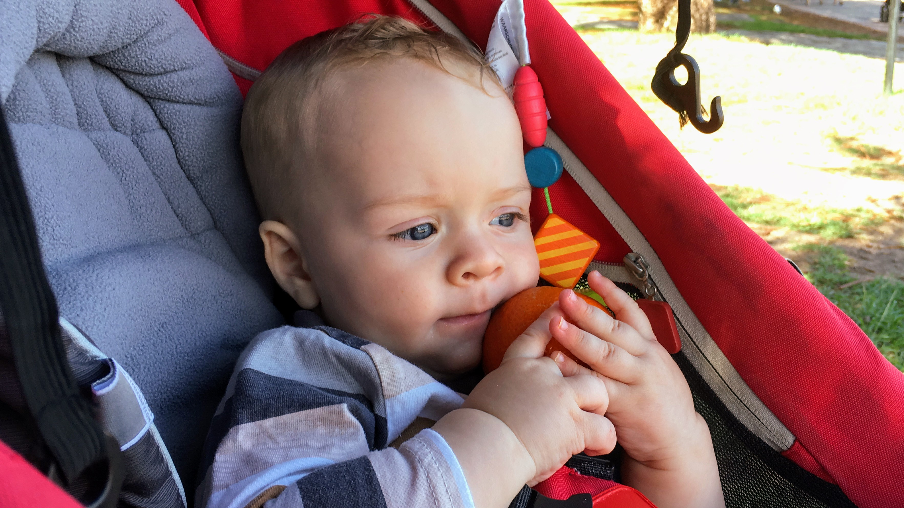
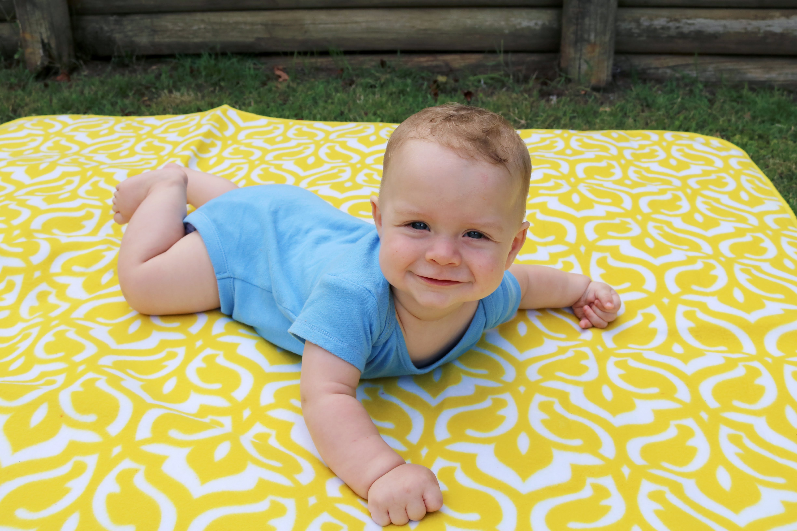
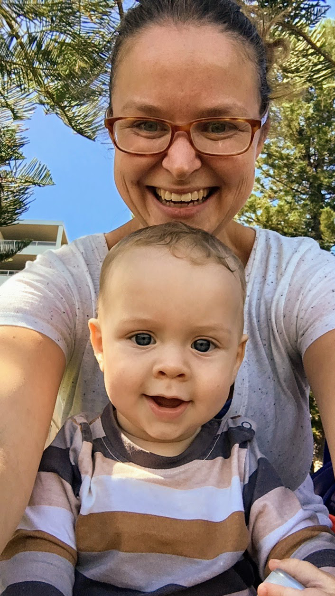

# WEEK 25 (20.03.18)

## BRADLEY'S DEVELOPMENT
This week Bradley is continuing to get better at sitting and standing. I created colour themed baskets for him and he is very content sitting up and sifting through them. We’ve only explored the green one so far so he’s got yellow and blue to look forward to. Its lovely watching his attention span and curiosity grow.

Bradley is starting to enjoy a little rougher play...not too rough. He giggles when bouncing up and down on my knees and other activities like that. 

He seems to be very interested in faces now. He loves looking at and touching my face and now clearly recognises the faces in his toys as he smiles and sometimes chuckles at them which he didn’t do before. 

On a final note, he’s moved over to a new (second hand) stroller for big boys. He has been super content and happy in it this week as he loves looking around and playing with his pram toy. It’s great as I get a little break this way.

## THIS WEEK WITH BRADLEY
This week Bradley and I attended the church Playgroup down in Manly. It was buzzing compared to other ones I’ve been too. It was a little ‘churchy’ but not too overbearing. We also went to two library sing song sessions and met a nice local mum through a Mum app. 

Pete had a mini long weekend away so I had a go at being single mum and it was hard work. Diet and hygiene went out the window! Nonetheless Bradley and I had lovely days out with walks and picnics. 

Angela and George visited yesterday. They took him out the house without me for the first time. He got a bit teary by the end but i guess thats to be expected.   
