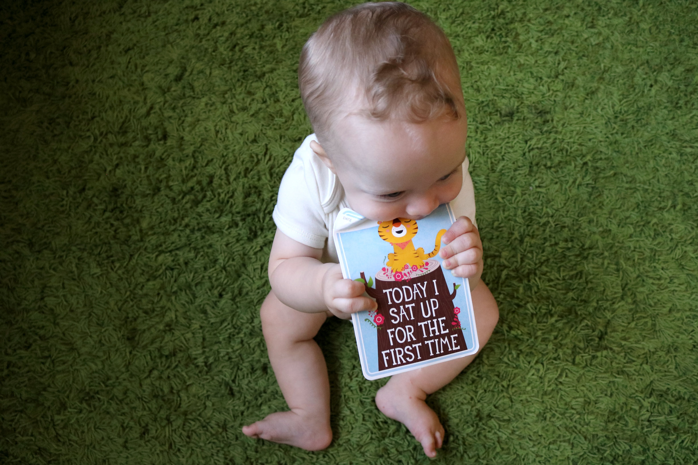
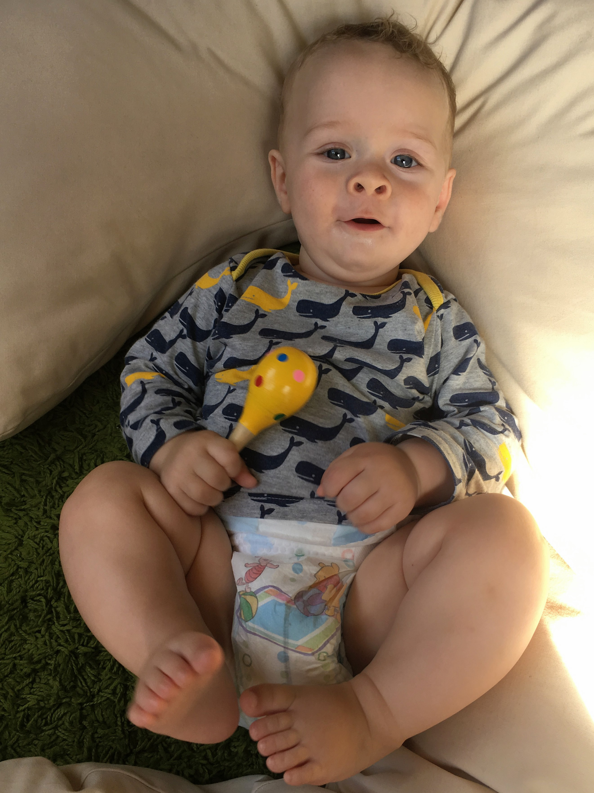
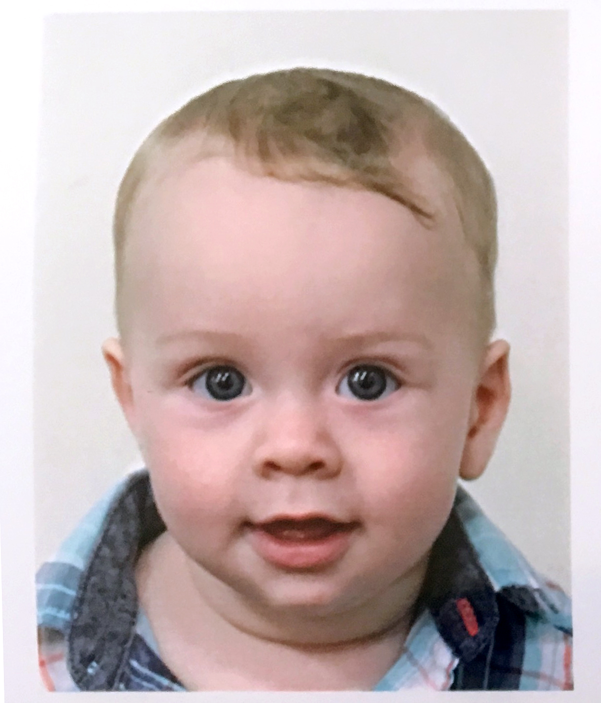

# WEEK 26 (27.03.18)

## BRADLEY'S DEVELOPMENT
Bradley can now confidently sit by himself. Hooray!

Bradley is great at shaking his rattles now too! I made him a few more shakers with bottles, rice and pom-poms and he’s getting very good at waving them around. He definitely enjoys making noise and loves banging the whisk on a bowl and tapping the computer keyboard too.

Bradley’s grasping skills have improved as well. His grasp is now very strong and quick! He goes for my glasses first thing in the morning (successfully most of the time) and George’s when he visits. On the up side, his little grasping hands make me feel like I am being hugged. It’s very sweet.

On a final note, Bradley cannot get enough of standing on mummy and daddy. He loves it! 

## THIS WEEK WITH BRADLEY
This week Bradley and I caught up with my mothers group, had a play date at home and enjoyed having Pete, George and Angela around over Easter. We ventured out to the beach by the wharf one day and Bradley had a lovely time exploring the sea and sand. He’s also quite fascinated by grass at the moment. 

We had a new first this week too. Bradley got his first passport photo taken. He did so well at sitting still. Post office staff were impressed. 

