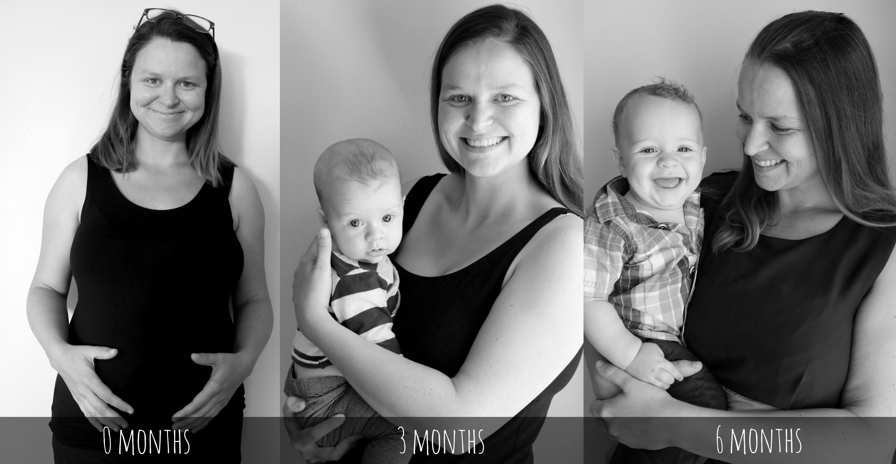
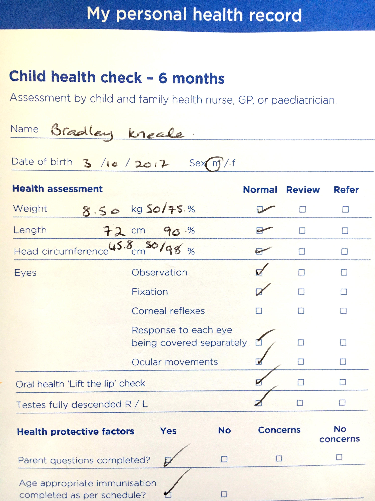
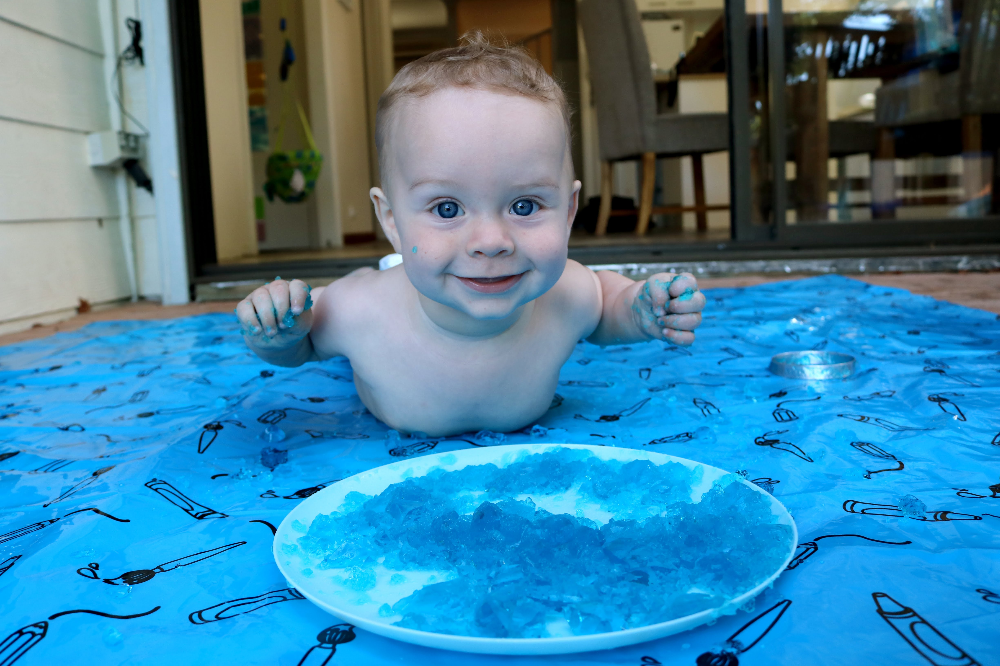
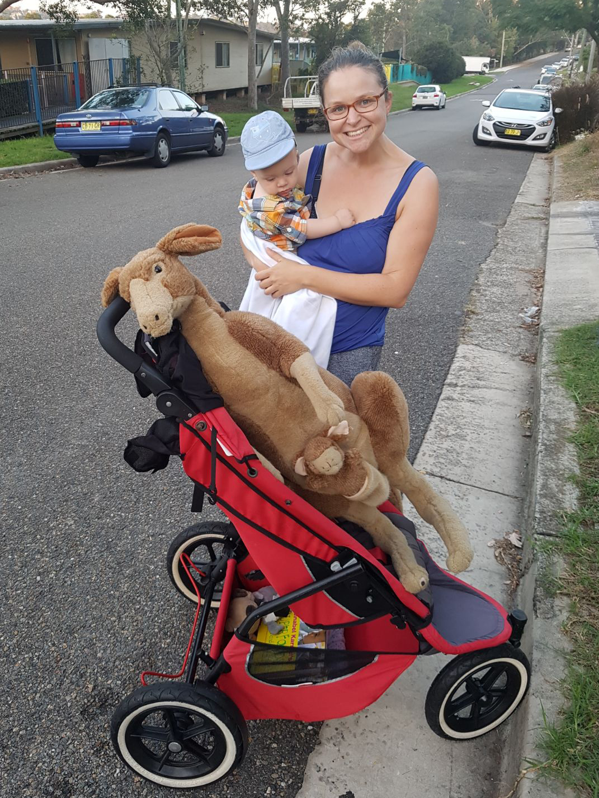

# WEEK 27 (02.04.18)

## BRADLEY'S DEVELOPMENT
Bradley turned six months this week!Look how far we've come....

We had our six months GP check and jabs and Bradley passed with flying colours. Bradley now weighs 8.5kg (1.3 Stones) and is 72 cm tall (he is in the 90th percentile for height). 

We celebrated by playing with blue jelly.

Bradley still seems happiest when standing. He just loves it! We now do couch standing every day. 

Bradley has started making more babbling noises in the last few days. More BaBa type noises. There’s no clear first word yet though. It feels really amazing how quickly everything is happening.

## THIS WEEK WITH BRADLEY
This week we went to a couple of rhyme times at local libraries and met a few new mums too. We also attended a friend's wedding at Bradley’s Head. Bradley started making noises at the beginning of the ceremony so I whisked him away quickly. We sadly didn’t see much of it! 

We also made our first trip to the city and met Pete on his lunch break. It’s still scorching hot down under so Bradley enjoyed splashing around in the Darling Harbour park.

Play wise, we have enjoyed playing with the computer keyboard and more colour themed baskets. We found Bradley an awesome FREE teddy during our local council cleanup too.

On a final note, I’ll be blogging on a monthly basis now so please come back in May for the April highlights x 
