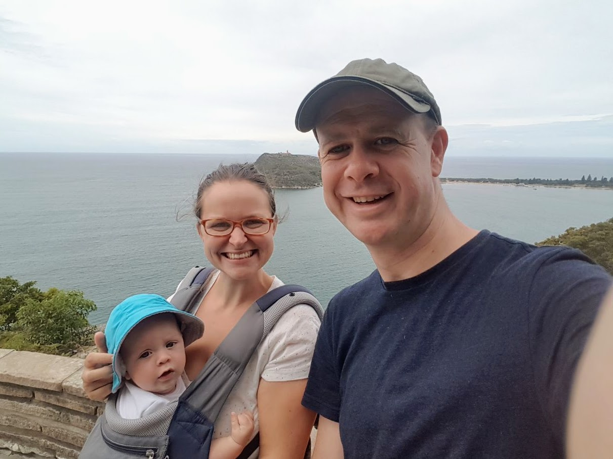

# WEEK 2
## Time has flown by this past week! We can't believe he's already two weeks old. 
## BRADLEY'S FIRSTS
Bradley had his first visit to both Manly dam and Manly this week. He seemed to enjoy the pram and fresh air. Pete and I enjoyed getting out of the house too!! Bradley also had his first visit from Aunty Marian and Uncle Frank. 

## ACTIVITIES WITH BRADLEY
Well...there is not too much you can do with such a young baby. Aside from Bradley's firsts, we have been doing tummy time, book time, bath time and music time (me singing to him) on a daily basis. He's also been busy feeding, sleeping and Skyping family back in UK. 

