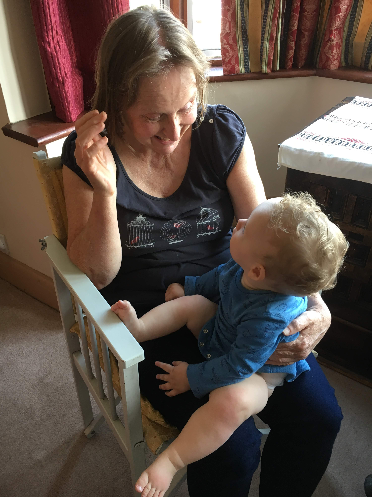
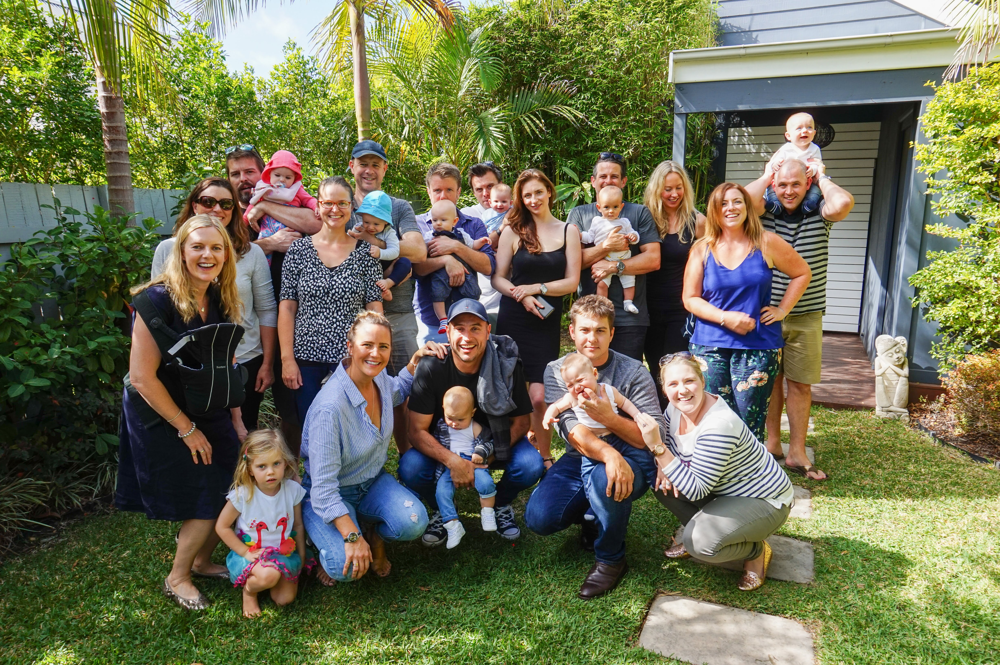
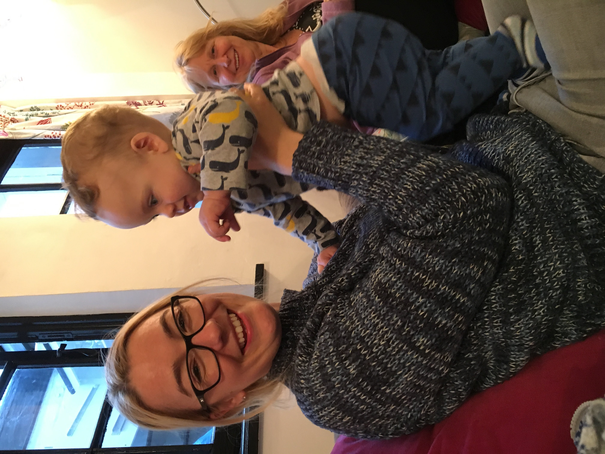

# MAY

## BRADLEY'S DEVELOPMENT

This month Bradley turned seven months.

Bradley has shown real progress this month. Bradley is now very mobile. He started crawling on 6th May and became quite fluid by 13th. He’s now super fast (by 20th) so you have to keep your eyes on him! 

Bradley can now stand without my help. He lifted himself up using the bed on 26th May and stood for about 10 seconds. He can’t stand completely unaided yet.

Bradley is now a lot more vocal. His DaDa’s are now very clear and frequent and he has managed a clear MaMa too (a lot less frequent). 

Bradley’s clapping has also developed. He claps along to songs and often claps when asked. Very sweet.

Bradley loves to play games such as peekaboo, where is Bradley (he’s under a see through scarf!) and chase me. 

Bradley now has two bottom teeth. Second one poked through on 7th May. He loves munching on wafers and chewing anything hard. He had a bad teething period at the end of the UK trip so perhaps another one is due to poke through soon. 

Bradley now has a bigger appetite for food and can easily eat one whole sachet of food per meal. He adores yogurt at the moment and seems happy to eat most things. 

Bradley sadly got bronchiolitis at the start of the month. He had a really chesty cough but luckily none of the other horrible symptoms (fever, off food).

## ACTIVITIES THIS MONTH
Wow what a month! Once Bradley’s bronchiolitis cleared, I flew across the world with Bradley to the UK to surprise the family. Although I was intending the fly one week prior (had to postpone because of his illness), it actually work out really well landing on the Friday in time for Doug’s birthday party at granny’s. I first surprised granny and then every other guest that came (Liz, Susie, Dad, Chris, Donna and co). All were very surprised! Especially because I was hiding behind a curtain...a bit scary! Mum led Paige and Doug on a treasure hunt to find the treasure (i.e me) with the clue ‘The first clue begins with B, go to the next room to see’. Paige opened the curtain and looked very shocked. Bless! ‘This is the best surprise ever’. Doug’s party was really lovely. Great company and food!

We did SO many activities this month. I’ll list some of the key ones with photos below. 

Godstone Farm

Hornimans Museum 

Coombe Woods

Soft Play

Mini Gym

The Royal Wedding on TV

Park fun

Mcaleer Family visits 

Cobbald Family visits 

Brecknock Family visit

Friend visits

Paige and Doug were delightful cousins to Bradley. Paige sang Bradley songs (twinkle twinkle) and played endless games of peekaboo. On a further note, Dougie seemed to enjoy being bigger than someone. Haha.

I just want to say a big thank you to everyone for having us at such short notice. You helped make this trip a memorable one. We had a fabulous time thanks to you. 
Mum and Dad - Thanks for hosting.
Bob - Thanks for entertaining and feeding us. 
Granny - Thanks for your company and for all the cups of tea!  

Bradley and I miss you all already x
