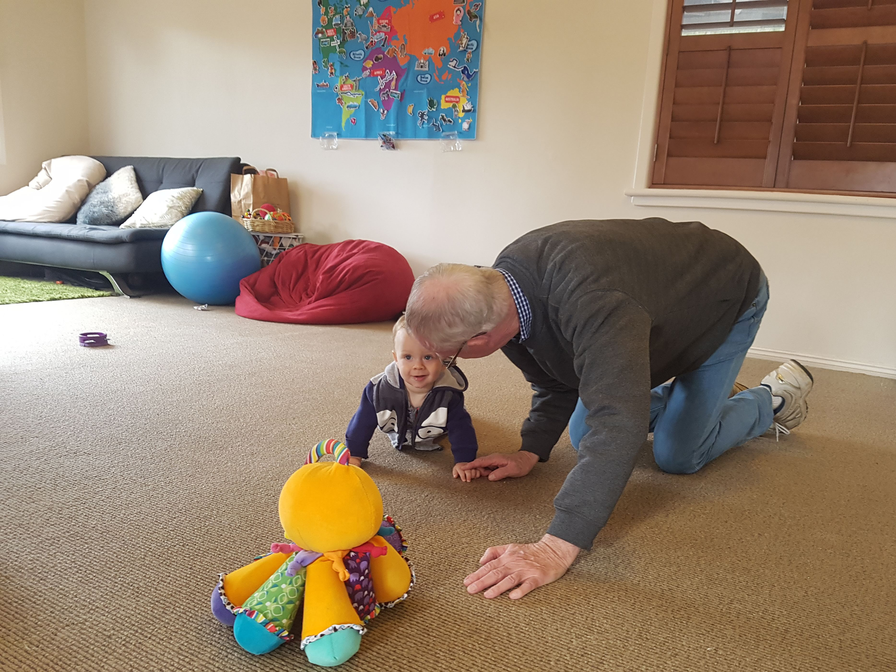
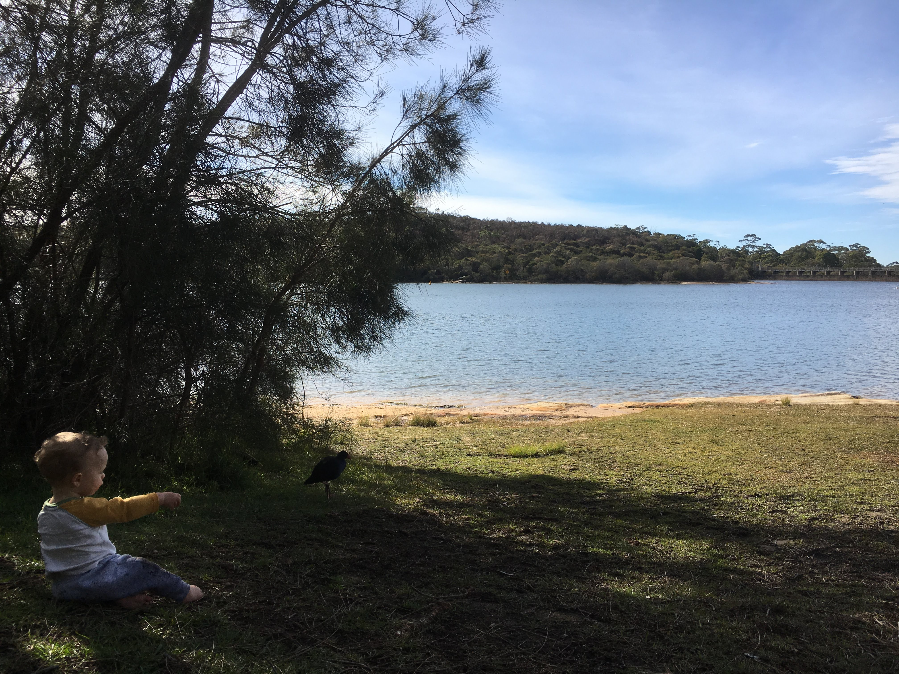
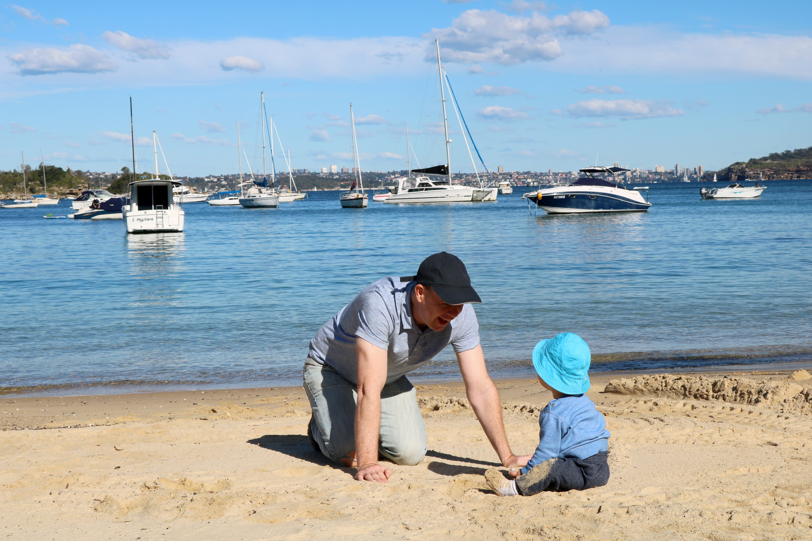
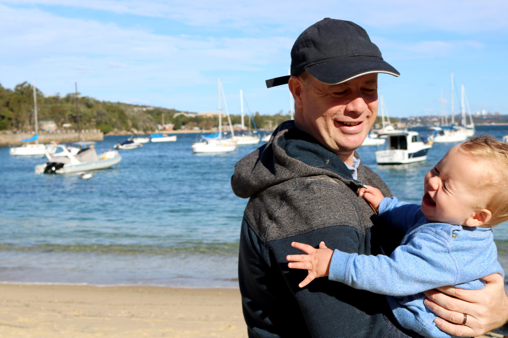
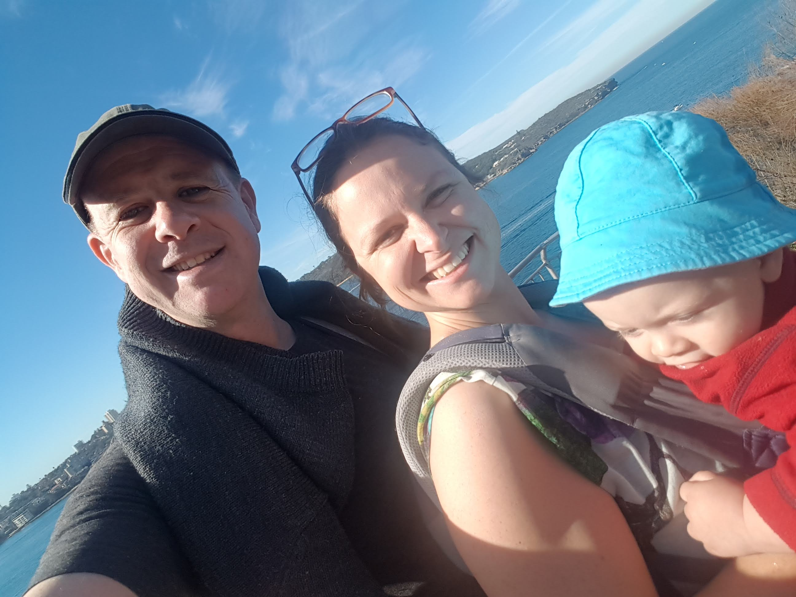

# JUNE

## BRADLEY'S DEVELOPMENT

This month Bradley turned eight months!

Bradley is now a very fast crawler. He is confident on his feet and happily walks by himself using the couch and can now climb stairs too. 
We’ve tried getting Bradley to crawl through a play tunnel but he’s not too keen on that just yet. He’s managed to go through a few times but needed A LOT of encouragement. 

Bradley’s vocabulary has improved. He can now say a ‘gat’ sound in addition to ‘DaDa’ and uses this most often when pointing. Yes...pointing. Bradley has learnt to point and loves to point at anything that interests him. It’s lovely to see him communicating and showing an interest in the world around him. 

Bradley is also getting a lot better as observing and copying. After seeing us, he used his own finger to wobble his lips to make a noise (28.06). It was adorable. 

## ACTIVITIES THIS MONTH
Bradley and I arrived back in Sydney from the UK in the middle of winter. Brrrrrr. So this month we wrapped up warm and visited local beaches (Little Manly, Dee Why, Manly, Clontarf), parks, the zoo (now members) and soft play. 

Pete has managed to work from home one day a week so it’s been lovely having lunches with him down at the beach.

We also managed our first proper bush walk with Pete. We all did the Manly to Spit Bridge walk (10km) and Bradley did well in the sling. He had a lovely play on the beach at the other end so everyone was happy.

On a side note, we purchased a parent facing pram this month and this has done wonders for my back! I’ve used it quite a few times now and it definitely makes Me feel less tired.

Tune in next month xxx
