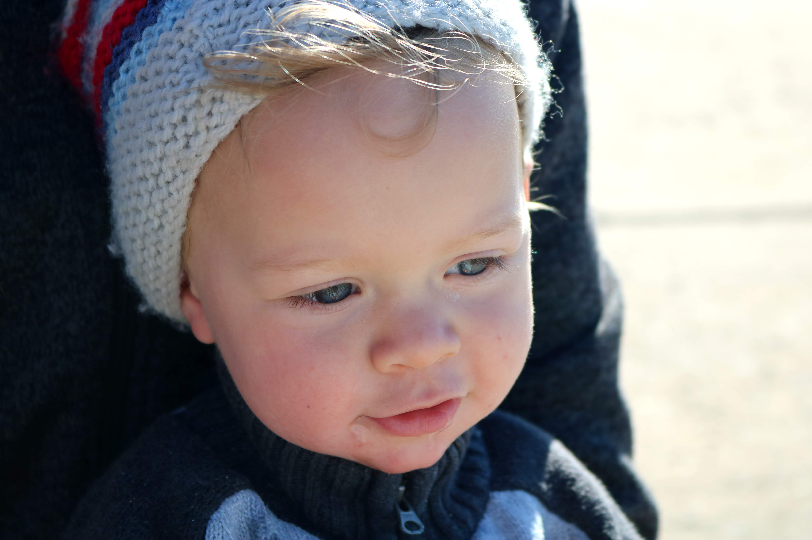

# AUGUST

This month Bradley turned ten months!

## BRADLEY'S DEVELOPMENT

## LANGUAGE

Bradley’s comprehension continues to improve. Here is the latest list of words that he understands; 

- Dada, Mama, Bradley, dog, lion, ball, clap, Gruffalo, wave, tree, point, up and belly button were his first words. He clearly pointed to Dad, Mum and himself when asked to on the 9th.

- Star, water, banana, elephant, crocodile, duck, eye, bee, bear, cuddle, kiss (16.08). 

- Butterfly, leaf, car, ear, sky, sun, cheese (26.08).

His speech is also becoming more varied. He now says a croc sounding word for crocodile. 

## MOVEMENT

Bradley is now a lot more agile. He has become a super fast crawler and is great at climbing onto and off the sofas (29.08), over cushions and through tunnels. 

Bradley has not walked unaided yet but it doesn’t feel far off. He has managed to walk without my hands the other day (29.08) whilst leaning on my legs as I edged backwards. 

## PLAY

I think the main improvement this month has been Bradley’s ability to play and even initiate games. He loves to find hidden toys (09.08) and play peekaboo games with scarves/container lids. He is great at starting peekaboo games himself (23.08)...even though it's very easy to see him. He often likes to put the items over his head like below.  

He’s also just recently starting playing hide and seek (28.08) by hiding under the table, behind chairs and climbing frames in the playground. He sits very still and smiles a lot until found. It’s very sweet.

 
On a final note, Bradley is now able to amuse himself a little bit now. It’s wonderful. The little windows of time now allow me to make lunch for myself! Amazing! I found Bradley an activity table this month for $5 and that has helped a lot. He can put his toys in it and it is the perfect height for leaning on.

## INTERESTS

It’s been delightful to see Bradley’s interests growing. 

Bradley’s little eyes light up if we read a book about or point to a picture/toy of a lion, crocodile or the Gruffalo. Bradley has also grown quite attached to a little frog and hedgehog teddy. His favourite at the moment though is a big pink teddy which Angela initially bought for Paige and Doug on a previous visit. It’s the first thing he wants to see and kiss in the morning. He will happily kiss teddy but not mummy or daddy. Grrr! 

Bradley has shown a huge interest in rolling things this month (18.08). We have spent many hours rolling film rolls, cars, tubes etc.

Bradley also discovered holes this month! He initiated putting sticks through a hole in the park playground on 20th and there has been no turning back. He has now mastered and enjoys posting small toys in baby wipe box (29.08).

In addition to teddies, rolling things and holes, Bradley is very interested in people. It is quite easy these days to take him out and about on the buses. He will start waving to people as we get on and makes a lot of friends that way! 

## ACTIVITIES THIS MONTH

We have all been fairly poorly this month so we’ve not been as active as usual. However we have enjoyed attending library sing along sessions and going to the zoo, beaches and parks. We go out everyday for at least a couple of hours otherwise we go a little potty. Bradley is happiest outdoors just like me. He loves pointing to the trees and playing in the sand and dirt. 

Pete turned 41 this month. We went along to a pop up petting zoo and had a beautiful beach walk to celebrate. Pete got many gifts. Homemade vouchers, clothes, baby books and a homemade card too. 

George and Angela have helped out a lot over the month, especially when we’ve been ill so that’s been a big help. 

## HELLO PLAYTIME

As mentioned last month, Bradley and I also have a lot of fun indoors. Feeling keen to share and document my play ideas with Bradley, I decided to make a baby activity website called Hello Playtime. It is now LIVE so please check it out and send through your feedback. 

HelloPlaytime.com

xxxx

Bye for now

xxxx
