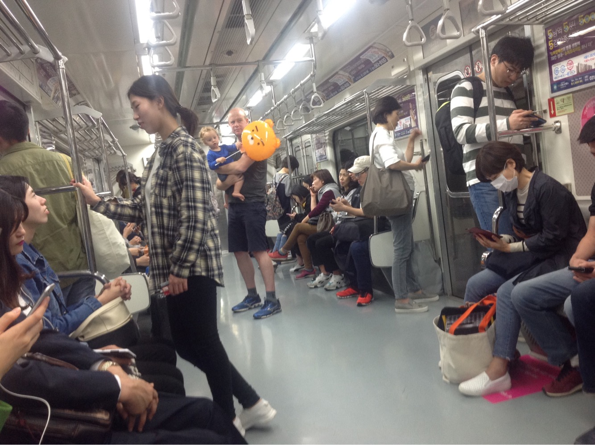

# SEPTEMBER

This month Bradley turned eleven months!

## BRADLEY'S DEVELOPMENT

Bradley did well getting his 12 month jabs this month before we headed off to Seoul and London. The nurse weighed and measured him too. He is still tall for his age and a little lighter than expected. They asked if he was an active baby and I said a big ‘YES’. She wasn’t concerned. 

## LANGUAGE

Bradley has learnt how to say ‘Uh Oh’ and often uses it at the right time. For example he might say it when he drops something from the high chair. Bradley has also learnt how to say car (07.09) and clock. 

He continues to understand new words too even though he cannot say them yet. Words include bus, plane, helicopter, moon, Star, hole, up and down.

## INTERESTS

Bradley is especially interested in the moon, planes and helicopters this month and points them out in the sky (13.09).

He also seems to enjoy the fine detail in books. For example, he will point out illustrations of small butterflies and bugs. 

## MOVEMENT

Bradley is now able to crawl all the way down the stairs on his front (12.09). He hasn’t made any steps.

## ACTIVITIES THIS MONTH

Bradley had his first proper splash in the sea at Little Manly on 14th September.

We had our first road trip with Bradley to the Blue Mountains (07.09). He slept in the car for some of the way (lucky us) and enjoyed pointing out the parrots and hens at the accomodation. We swam whilst it rained and had a great time rolling apples down hills in the Botanical Gardens. It was a successful first little family outing. 

 

We then embarked on a much bigger outing to Seoul on 21st September. Bradley did really well on the flight and coped with all the sight seeing and family visits. He was a little shy at times and had a few minor melt downs on the longer days but that was to be expected.

Bradley most enjoyed pointing out the buses, clocks and doors as they opened and closed on the tube. He also liked being carried by Pete, playing on the grass outside of town (we did not find any in the city) and climbing all over Patrick and Sue’s coffee table when he got the chance! 

The family highlight was of course Patrick and Sue’s wedding. We all got dressed up in traditional gear and attended the beautiful ceremony in one of Seoul’s historic temples. It was a fantastic day. 

On a final note, Bradley was a hit in Seoul and received lots of smiles, waves, balloons and even money! 

Bye for now

xxxx
