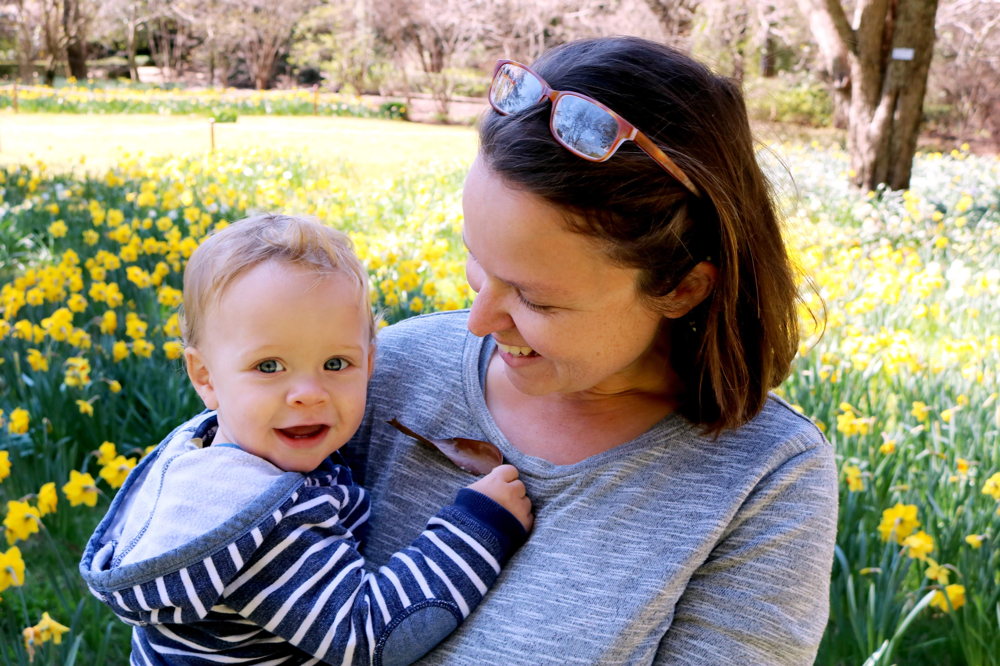
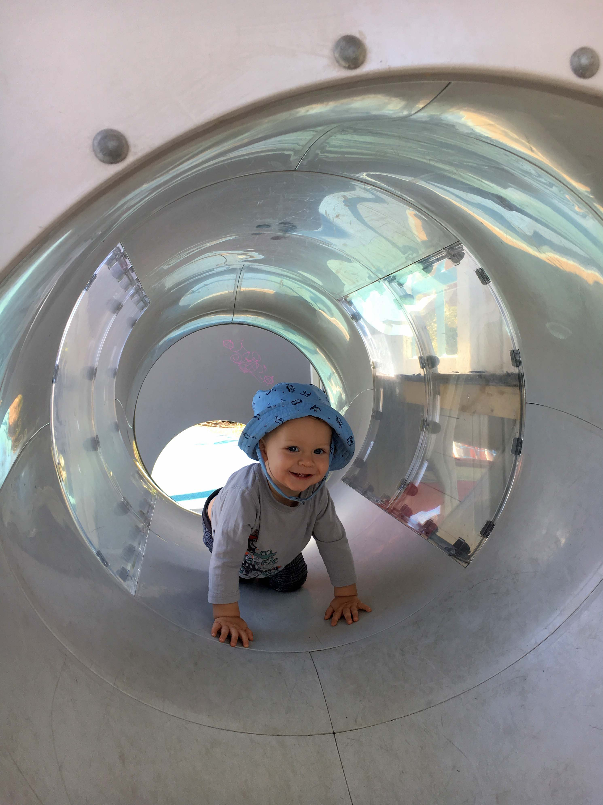

# OCTOBER

This month Bradley turned eleven months!

## ACTIVITIES THIS MONTH

We’ve made it to one year! Well done Bradley and well done us as parents :)

Bradley’s activities

We were lucky enough to spend most of this month in sunny (yes sunny) England. It was a wonderful visit filled with fun activities. Here are the highlights….

Bradley’s 1st Birthday Parties x 2
- Donna and Mum did really well organising such lovely parties for Bradley. Thank you! 
- Bradley coped with all the new faces and merrily played with his cousins (without me) at the second party
- He got spoilt with lovely gifts and enjoyed the cake and trifle on offer. Yum! 
- It was great catching up with aunts, uncles and cousins.

Centre Parcs 
- We had a lovely five day break in Centre Parcs with Mum, Dad, Donna, Craig, Paige and Doug. 
- Bradley loved splashing around in the warm swimming pools. He had a blast. He also enjoyed squirrel watching with Dougie 
- I enjoyed a three hour spa break with Mum. Bradley didn’t notice I was gone thanks to Donna, Dad and Craig.

Halloween
- Mum put together an amazing early Halloween party for the family. We all loved it especially Paige. 

Family time
- Bradley adored Paige. His face lit up every time he saw her
- Grandad and nana made him laugh a lot. Lucky Bradley. 
- Bradley enjoyed visiting Granny. He made his first real steps to Granny and had fun rolling her coasters and playing with the farm animals
- Bradley was able to point out each family member when asked. I didn’t expect that at all
- Doug called him ‘naughty baby’ for a while but warmed to him by the end. Bradley kept trying to hug Doug on our last morning there. It was very sweet and Doug found it funny after a while. 
- We had a lot of lovely park visits including Crystal Palace Park, Kelsey Park and Coombe Woods. We also had a fab day out to Dulwich Park with Granny.

Friend time
- We were lucky enough to see Anna, Tanya and Saira on this trip. We managed to tie in London sightseeing too. It’s always a treat visiting the massive London parks. 

## BRADLEY'S DEVELOPMENT

## MOVEMENT

Newsflash! Bradley walks! His first tiny steps (5 steps) were on 5th October at Dads house between me and Dad. They were so tiny that it didn’t feel like he officially walked. He then did a few more at his birthday party on 7th.
His first real walking steps (8 steps) were at Granny’s house on 24th October. He couldn’t resist the painted eggs rattling around in a bowl on granny’s lap. He was then able to repeat the 8 steps later on. It was a lovely moment. 

## LANGUAGE

Dad and Andrew were convinced he said Grandad whilst pointing to Grandad at his first birthday party. I missed this sadly. 

He also clearly said Nanna in front of dad and I (for banana) at the end of the trip. 

## NEW TRICKS

This month Bradley learnt to cross his fingers (19.10), play peekaboo from behind the sofa arm (20.10) and blow bubbles with his mouth (22.10). The peekaboo game made me laugh so much I cried. 

Bradley is now happy to hug and initiate hugs. This is especially true first thing in the morning and when he gets tired at night. Bradley also puts his head on the pillow when you ask him to or say ‘Time for sleep’. It’s adorable. 

Bradley loves to dance. He swings his arms around side to side and up and down if nursery songs start playing. He puts his arms up for Incy Wincy Spider.  

Bye for now

xxxx
