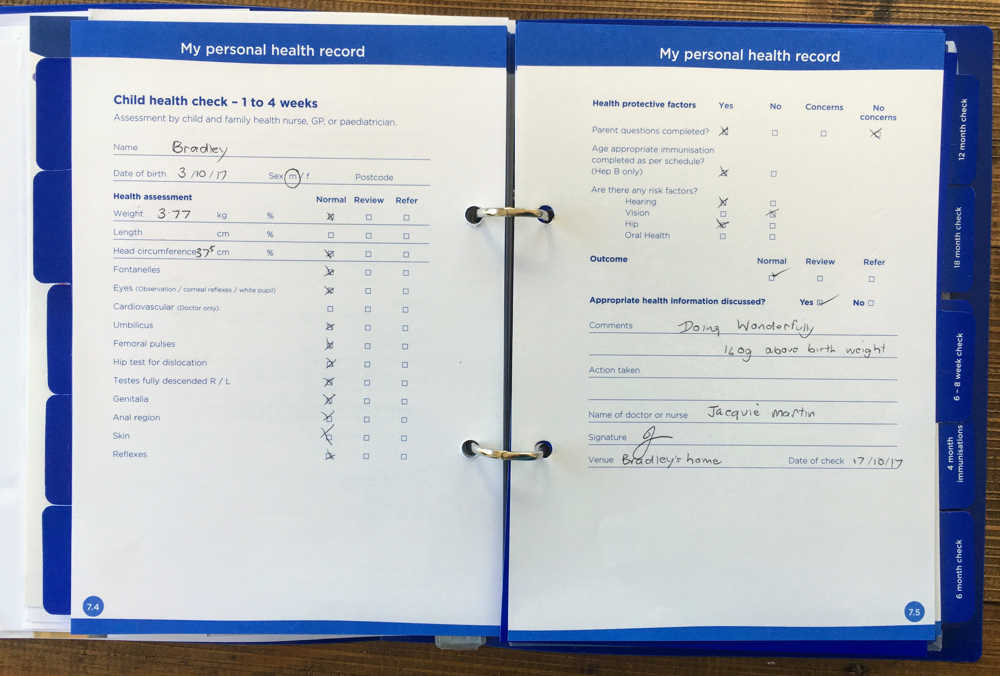
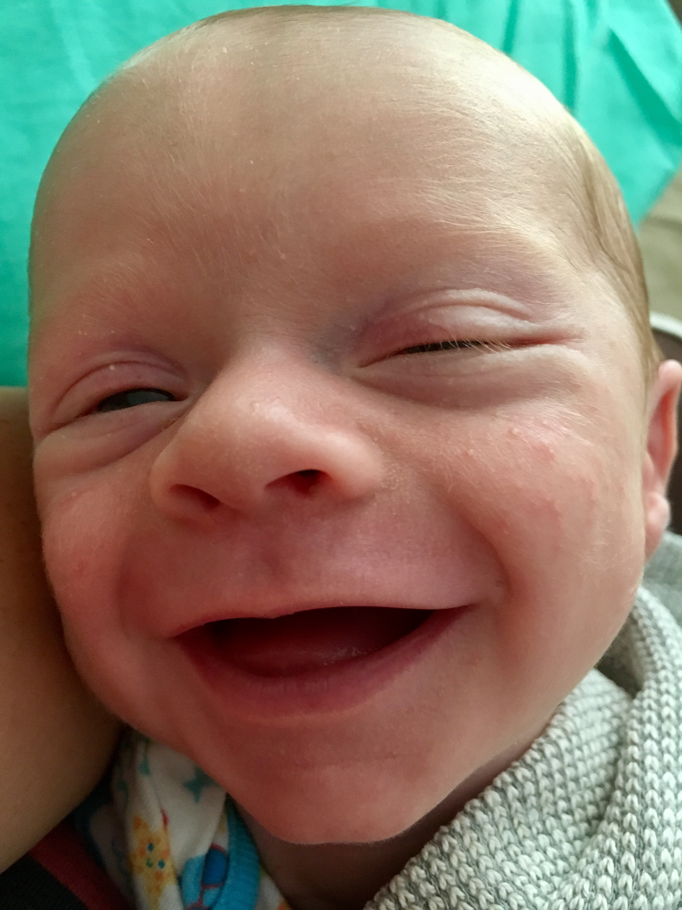
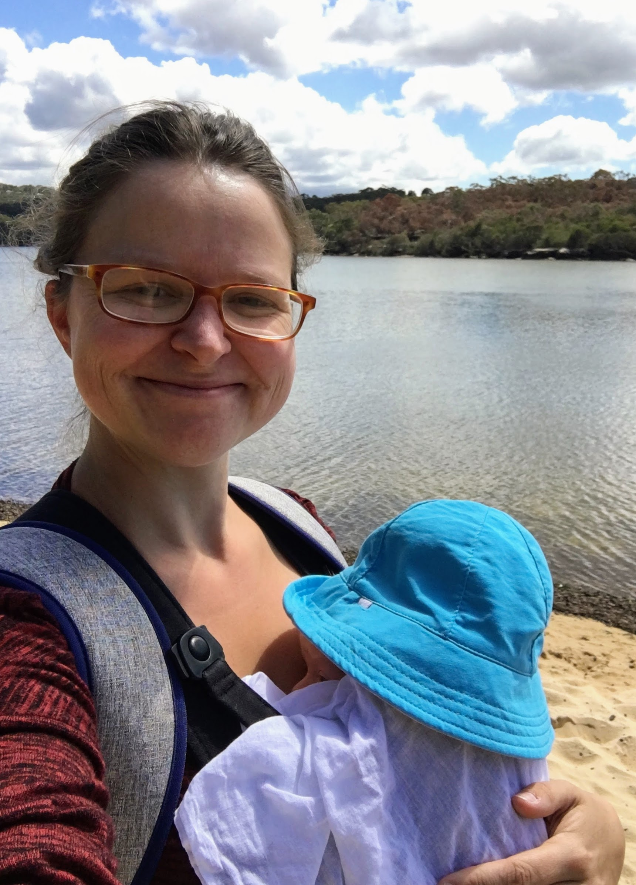
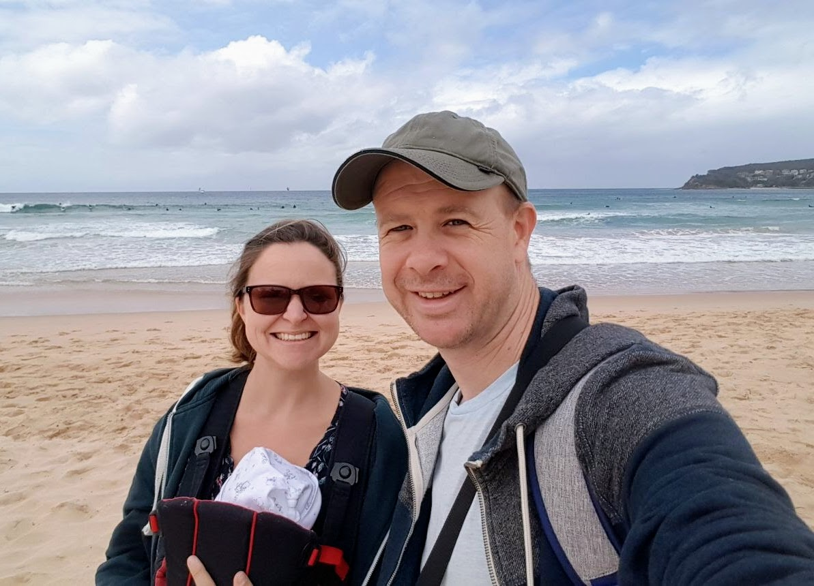

# WEEK 3
## BRADLEY'S DEVELOPMENT
Bradley had his first check-up this week and he passed with flying colours. We were so happy to see that he had put on a good amount of weight (now 3.77kg). Well done Bradley! Although no major changes this week, we have noticed that he is taking more interest in the black and white pictures we have. He is also able to do tummy time for a bit longer and his neck muscles are getting stronger as a result.

## BRADLEY'S FIRSTS
Bradley had his first sling outing with me this week and went to his first post office, supermarket and charity shop! He also got on his first bus! Go us! I enjoyed getting out of the house and Bradley seemed to enjoy sleeping throughout most of it. At the weekend, Pete and I took Bradley to Manly beach for the first time. Again... he slept for most of the outing! Bradley was also lucky enough to have his first visit from Pete, Victor, Erin, Paul and little Spencer this week.

