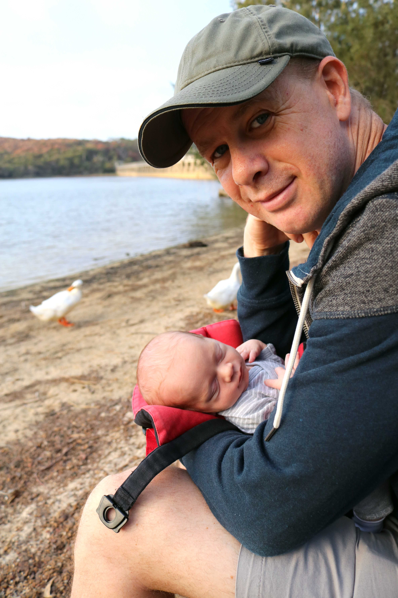

# WEEK 3
## BRADLEY'S DEVELOPMENT
Bradley had his first check-up this week and he passed with flying colours. We were so happy to see that he had put on a good amount of weight (now 3.77kg). Well done Bradley! Although no major changes this week, we have noticed that he is taking more interest in the black and white picture we have. He is also able to do tummy time for a bit longer and his neck muscles getting stronger as a result.

## BRADLEY'S FIRSTS
Bradley had his first sling outing with me this week and went to his first post office, supermarket and charity shop! He also got on his first bus! I enjoyed getting out of the house and Bradley seemed to enjoy sleeping throughout most of it. Haha! Pete and I took Bradley to Manly beach for the first time this weekend too. Again... he slept for most of the outing but Pete and I had a lovely walk up and down the beach. Bradley was lucky enough to have his first visit from Pete, Victor, Erin, Paul and little Spencer this week as well.

