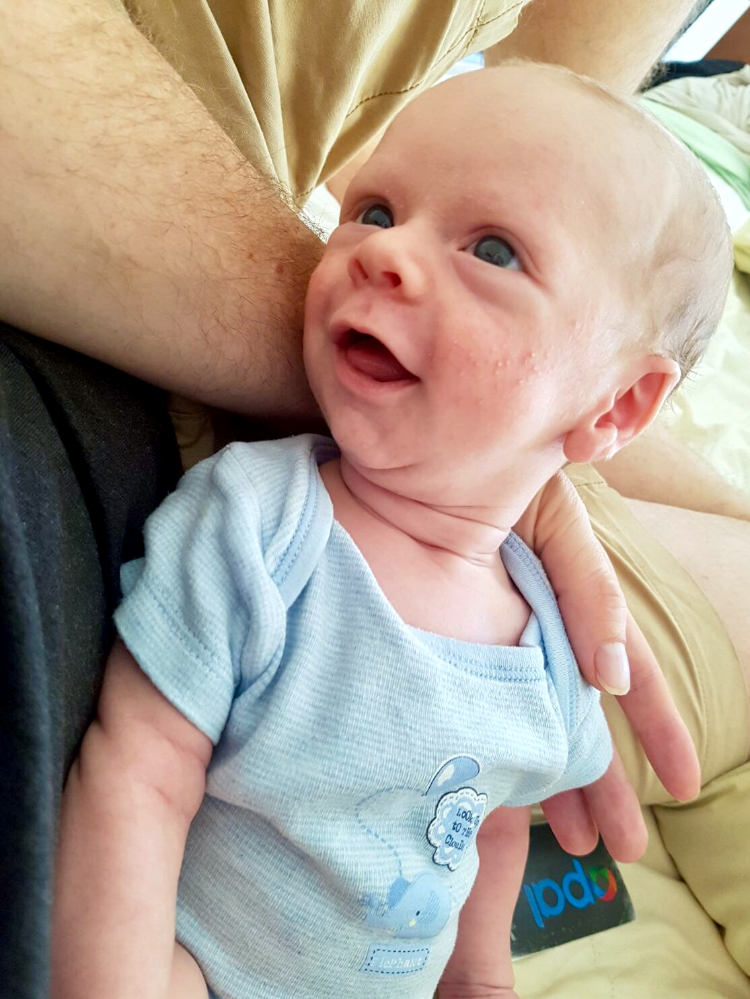
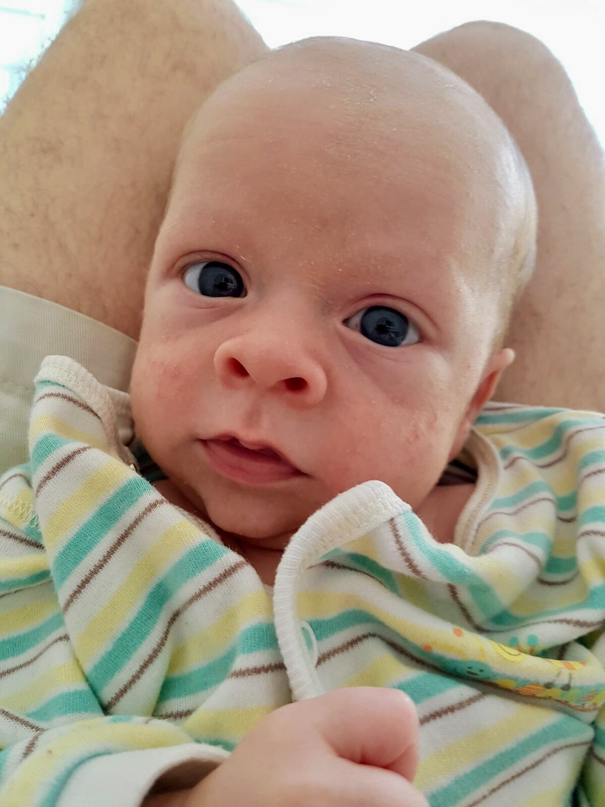
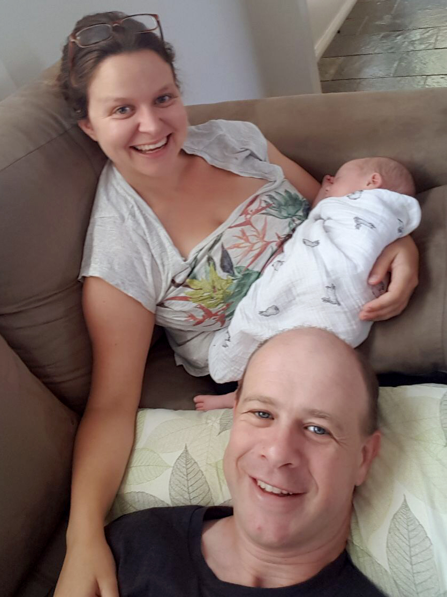
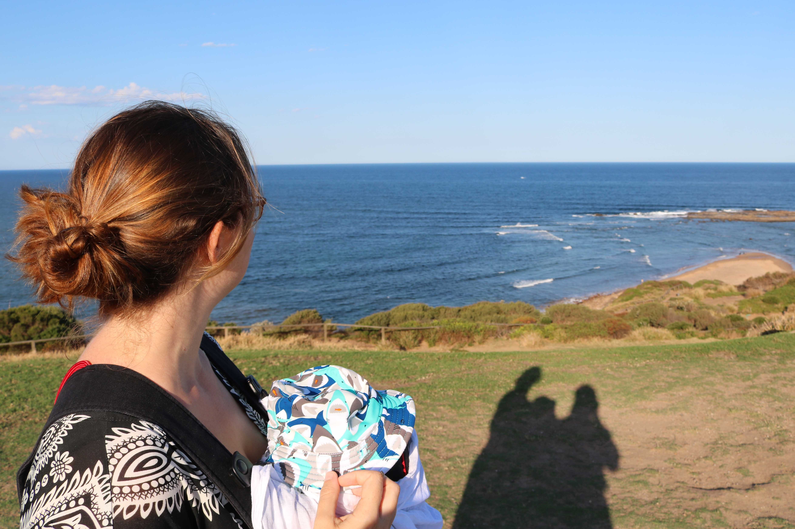
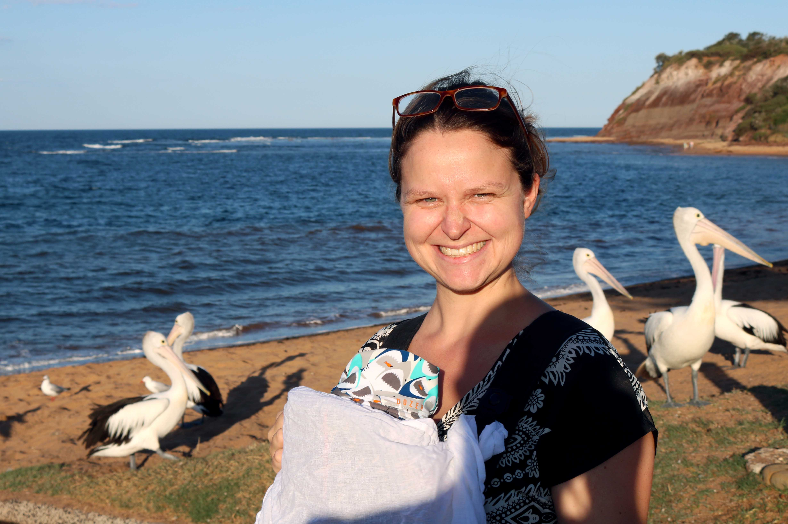

# WEEK 4
## BRADLEY'S DEVELOPMENT
Bradley has continued to do well this week. Bradley is now more alert, is better at tracking objects and faces and has started making more noises. He has also continued to gain more weight which is fantastic. We weighed him on Friday and he is now a whopping 4.2kg (up from the 3.77kg the previous week). Mum and dad are super happy he's on track. 

## BRADLEY'S FIRSTS
Bradley went on a few more adventures this week and is definitely taking after both parents as he seems to enjoy the great outdoors. He visited Clontarf beach and Long Reef for the first time and saw his first pelicans and whale! Check out the photo below for the tiny whale splash in the distance. On a side note, Pete is getting used to having a little baby in the car now and Bradley usually nods off after a few minutes so journeys are pretty pleasant at the moment. 

## BRADLEY SAYS THANK YOU
We'd like to say a BIG thank you for all the cards and gifts this past month. We really appreciate all the effort people have gone to, especially those overseas! 
