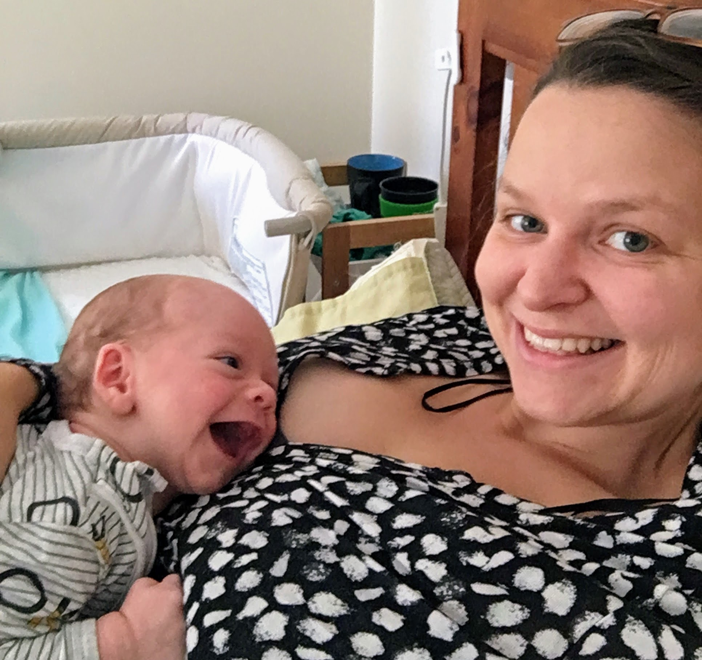
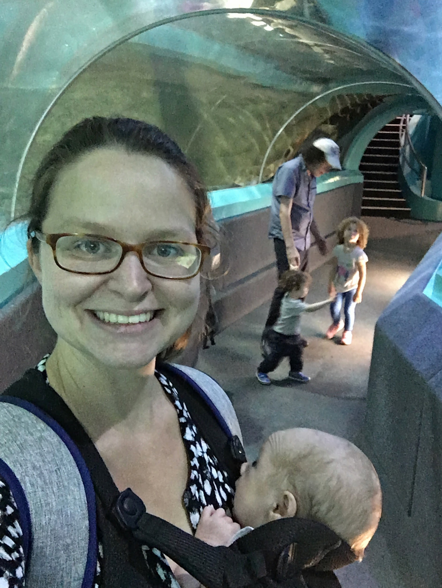
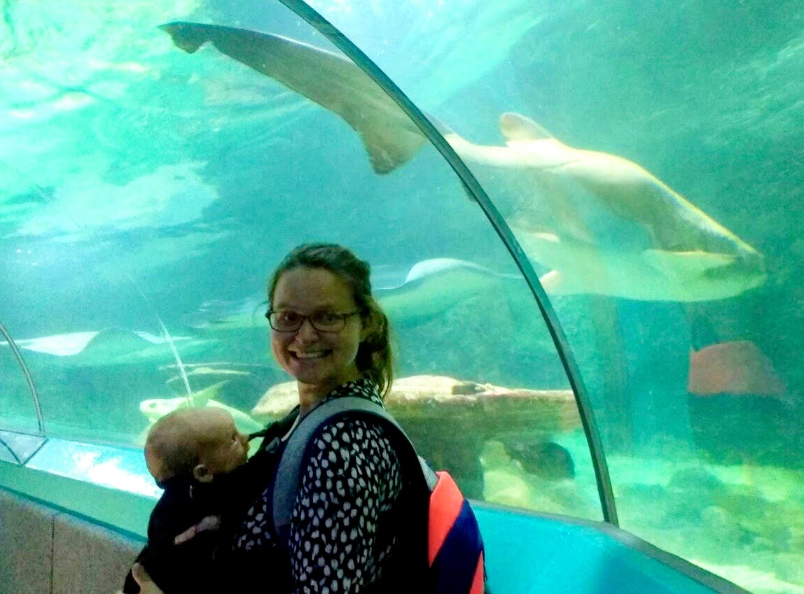
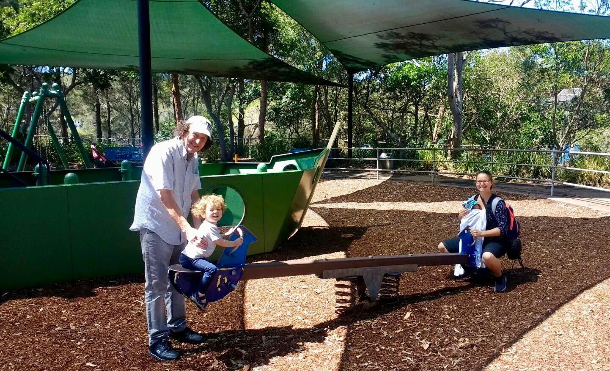
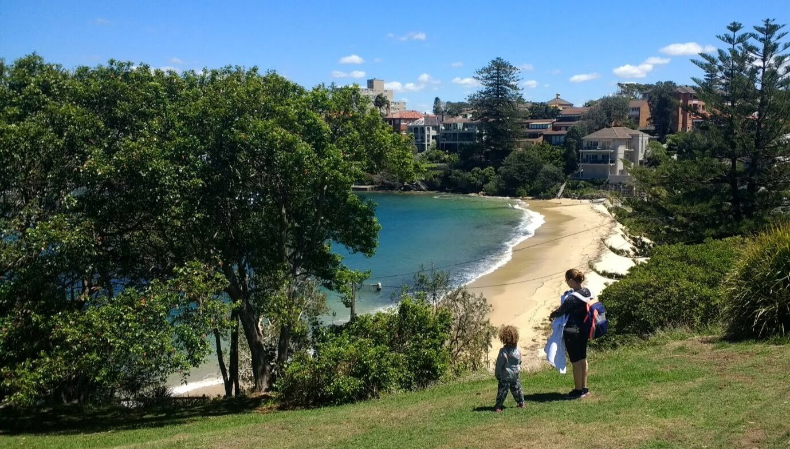
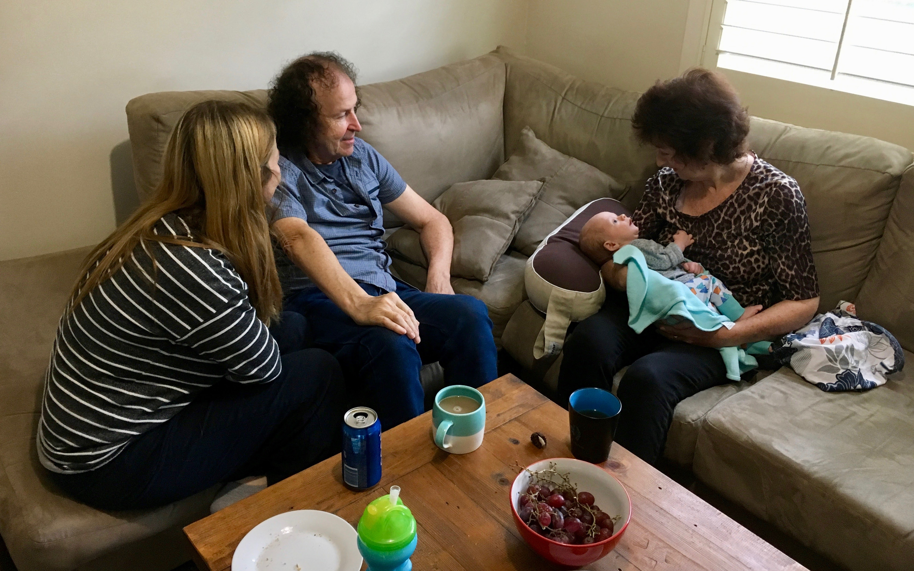
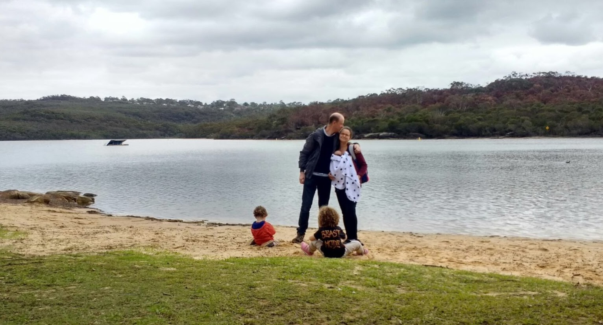

# WEEK 5
## BRADLEY'S DEVELOPMENT
Bradley is now making more eye contact and has even started to smile which brightens up my day. The nights are also getting a little easier now that he settles down after a feed a little quicker.

## BRADLEY'S FIRSTS
This week Bradley had his first visit from GrandDave, Aunty Donna and cousin Paige and Doug. They arrived early on Friday and despite the awful jet lag, we've already managed to take Bradley to his first aquarium and park with a seesaw (Little Manly).

## FAMILY INTERACTIONS
Both cousins are quite mesmerised by Bradley which is lovely to see. Doug points a lot at Bradley and is on the verge of being able to say baby. Paige loves to stroke him and has said cute sentences such as "Oh he's so gorgeous isn't he" and "He's so cute. Especially when he cries".
## ACTIVITIES WITH BRADLEY
Aside from the activities mentioned already, Bradley had two lovely visits from Petes parents and went on another trip to the Dam this week. He's been a busy boy!

