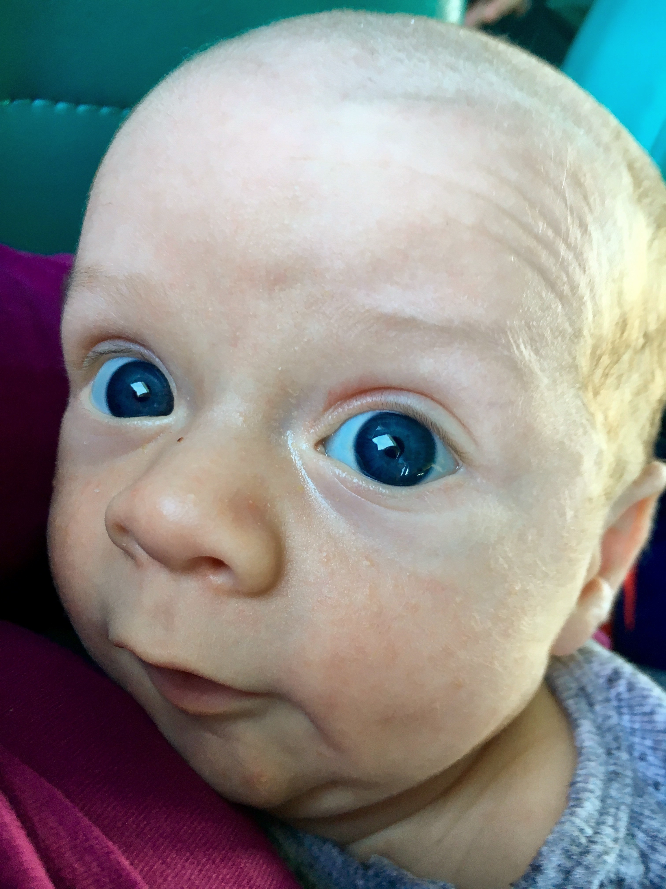
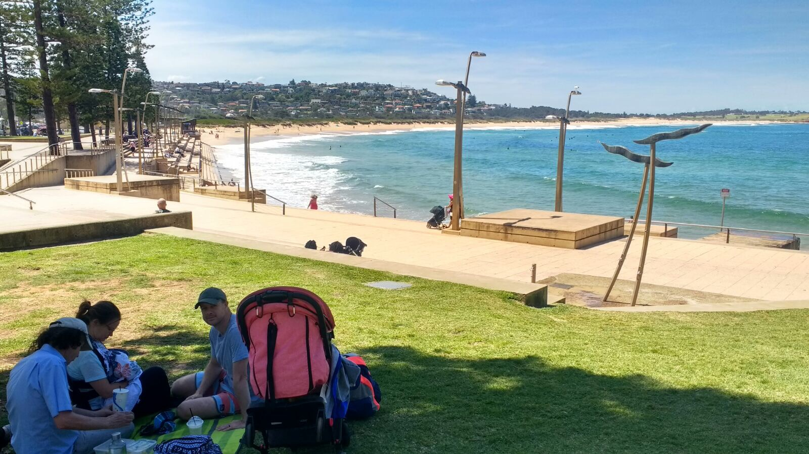
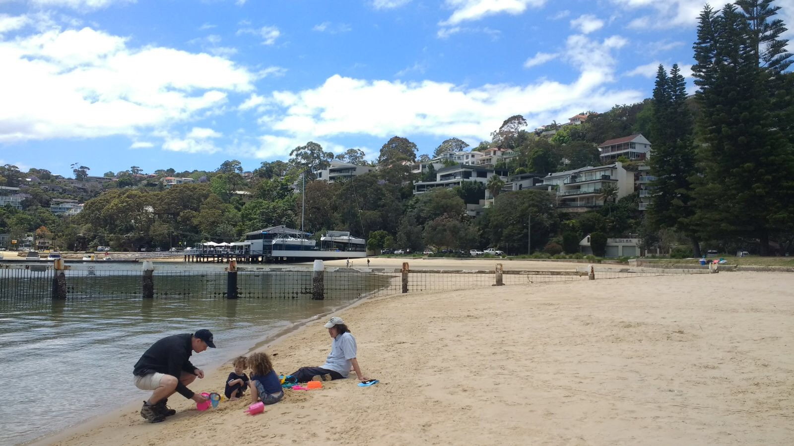

# WEEK 6
## BRADLEY'S DEVELOPMENT
We had Bradley's six week checkup this week with our local nurse. He's grown 5cm from birth and has put on another 0.4kg (now 4.6kg). He is now the same weight Doug was at birth! I can defiantly see him having more weight around his cheeks and chin. So it was another successful checkup despite Bradley having a wee on both the nurse and I halfway through.

## BRADLEY'S FIRSTS
This week Bradley visited Dee Why beach for the first time. Bradley and I also had our first Mothers group in Balgowlah. A lot of the other mum's had baby problems that they wanted to discuss so I felt pretty lucky that we don't have any major issues yet. I'm sure some will pop up though!!!

## ACTIVITIES WITH BRADLEY
We've all Enjoyed having a few days at home this week. It's been great being finally able to use the pool. We've now all been in apart from little Bradley. We have also enjoyed visiting Clontarf Beach. Paige had a whale of a time collecting Jellyfish and Bradley did well relaxing in his pram most of the time.

