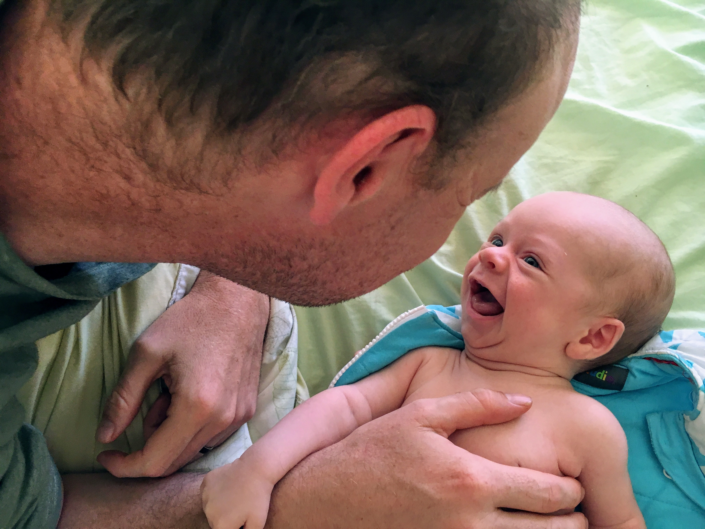
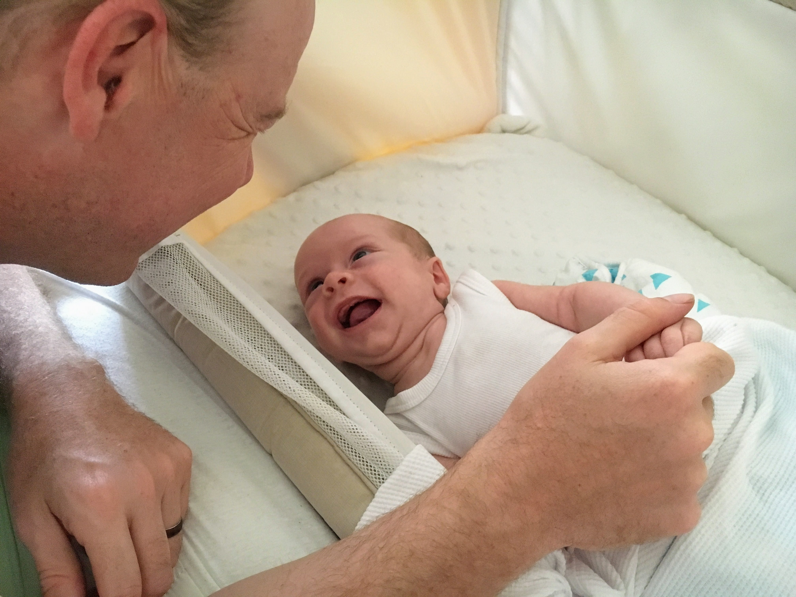
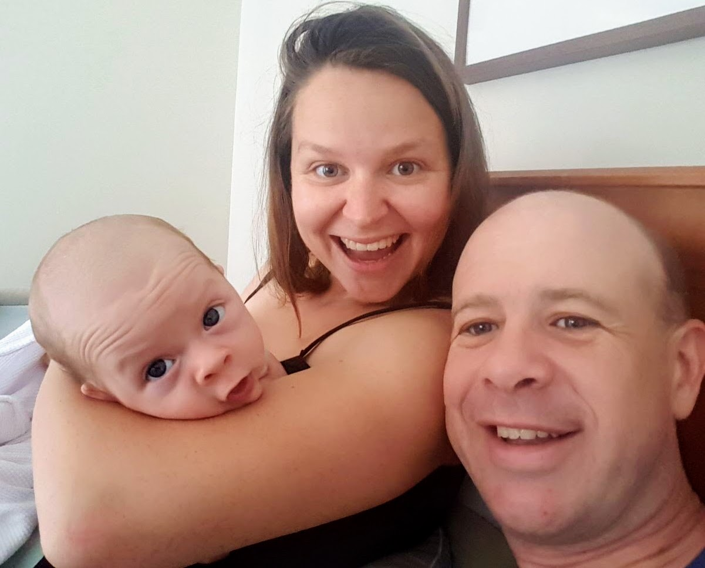
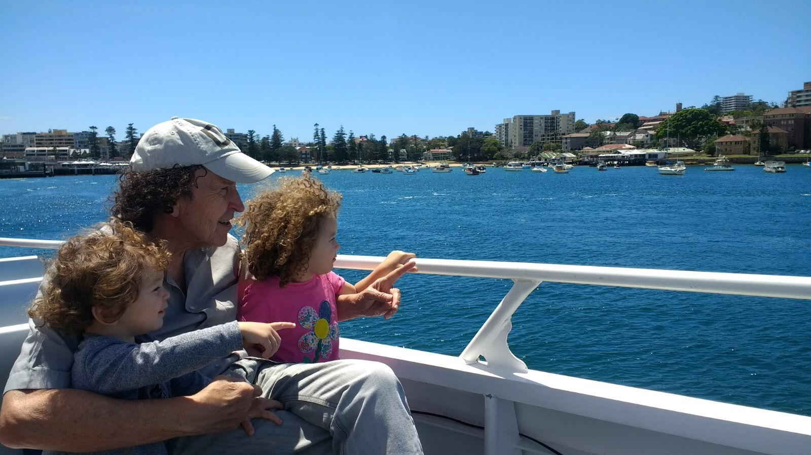
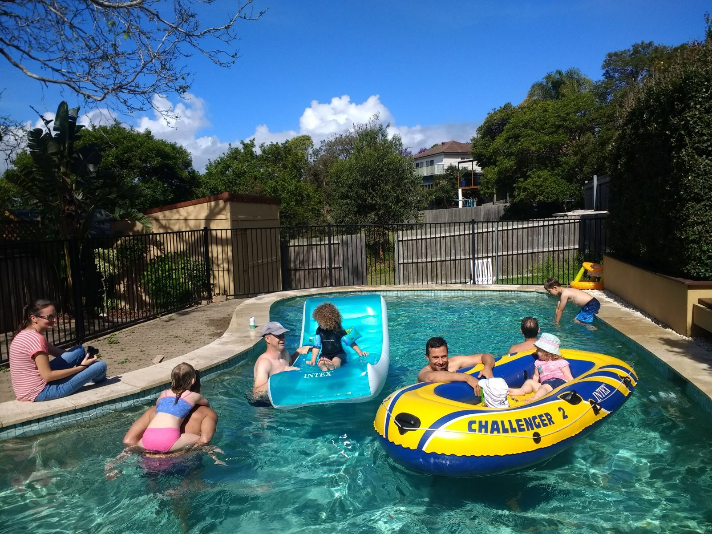
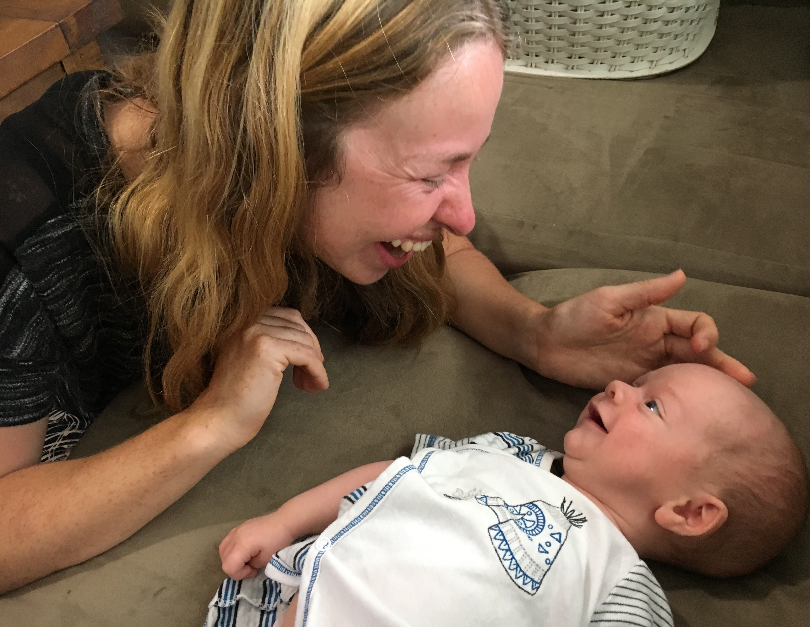
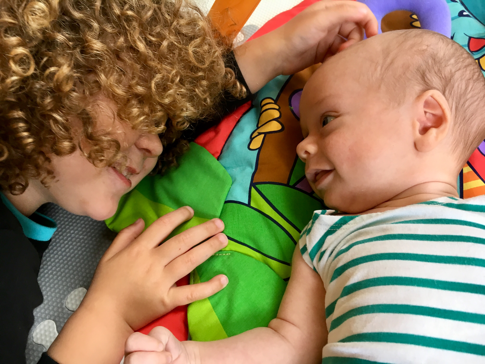
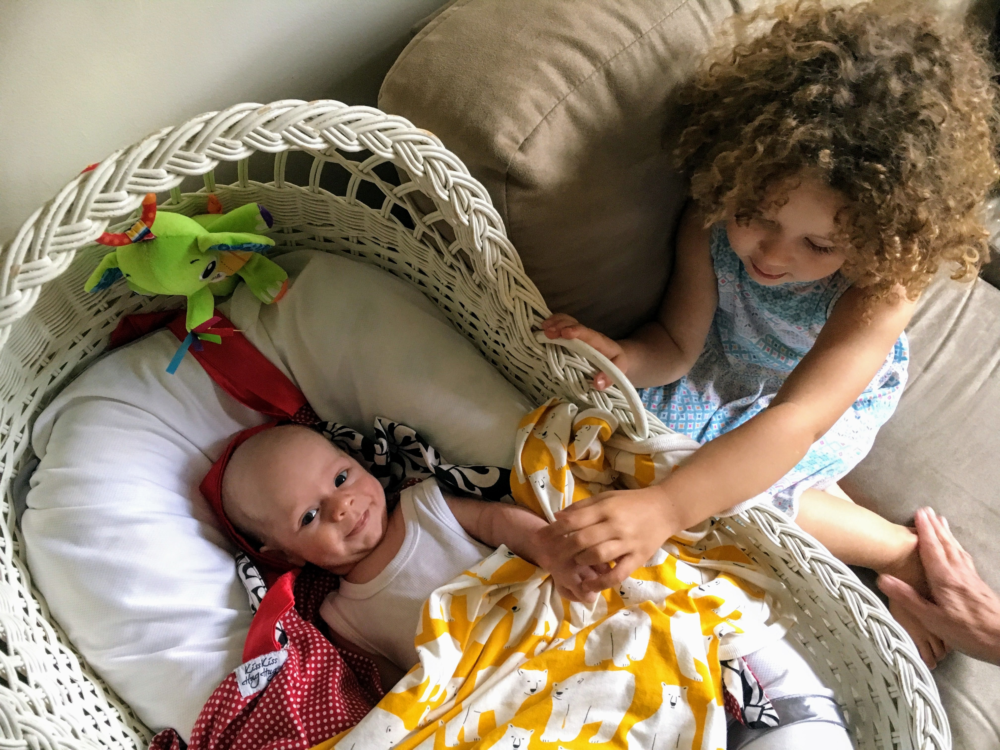
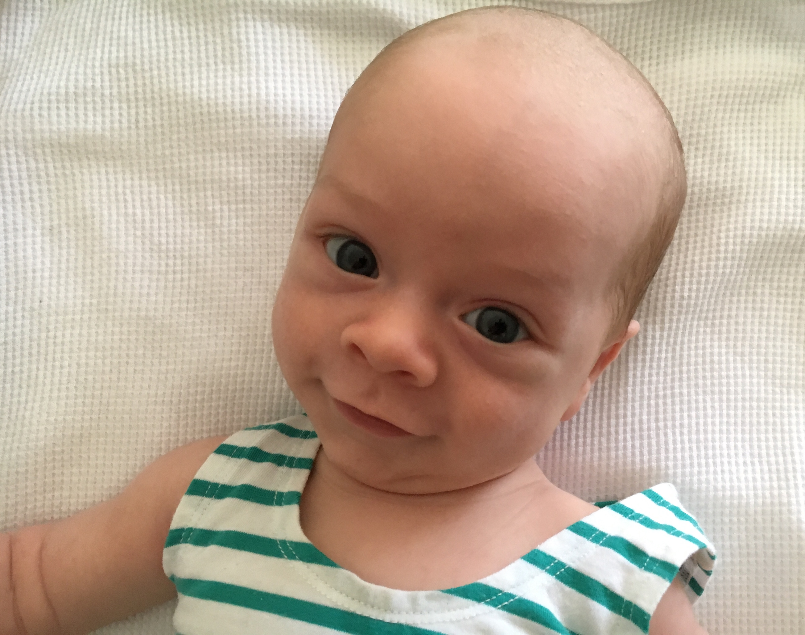

# WEEK 7
## BRADLEY'S DEVELOPMENT
Bradley had his first check up at the local GP this week. He is now 61cm tall (grown 8cm from birth) and 5kg (11 pounds). He also had some jabs which he absolutely hated. I’d never seen him so red and upset before. Poor thing! On a happier note, Bradley is now smiling a lot more especially in the mornings. See photos below! 

## BRADLEY'S FIRSTS
This week Bradley went on his first ferry to Watson’s Bay. He seemed pretty relaxed on both journeys and Paige had a fab time too. She happily declared “I LOVE this” whilst out on top on the boat. Very sweet. Pete's mum Angela met us there and we all enjoyed the scenic park and beach. 

 
Bradley also had his first pool party. Our friends came over to meet the little guy for the first time and Bradley was ever so spoilt with cards and gifts. Bradley did ever so well with all the noise and people and slept through a lot of it. Paige did really well in the pool with the other kids and swam two laps alone (with arm bands). 
 

The family no longer have a cold so Bradley finally got his first proper cuddle from Bob.

## BRADLEY AND PAIGE
Bradley has really enjoyed looking at Paige this week. Paige is still showing an interest in him and has been a great cousin this week by giving him lots of gentle strokes and pats.

## BRADLEY SAYS THANK YOU
We just want to say a big thanks for all the kind gifts this week. We would like to say an extra special thanks to Janet for her amazing handmade knitted gifts. We love them to bits.

