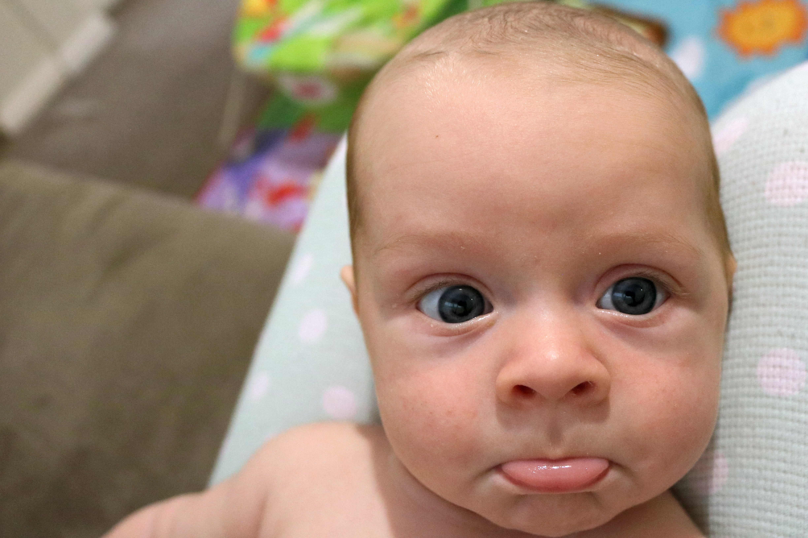

# WEEK 8
## BRADLEY'S DEVELOPMENT
Bradley is continuing to put on more weight. He is getting chubby around the cheeks and now fits the baby bath tub a lot better. He is starting to make more sounds (apart from crying) and has made attempts to converse with Pete and I in his baby language. Very sweet!

## BRADLEY'S FIRSTS
Bradley attended his first Volleyfest event this week in Manly. He also had his first visit from Uncle Chris and Aunty Mish.

## ACTIVITIES WITH BRADLEY
This week we have all had a lot of fun sailing at Manly Dam, playing at Clontarf Beach and splashing around in the pool at home. 

